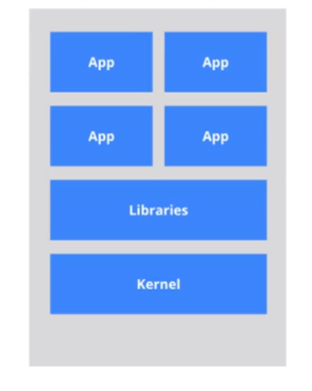
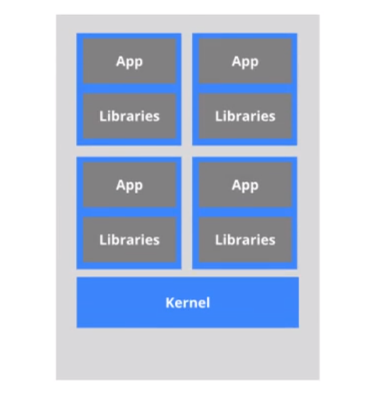
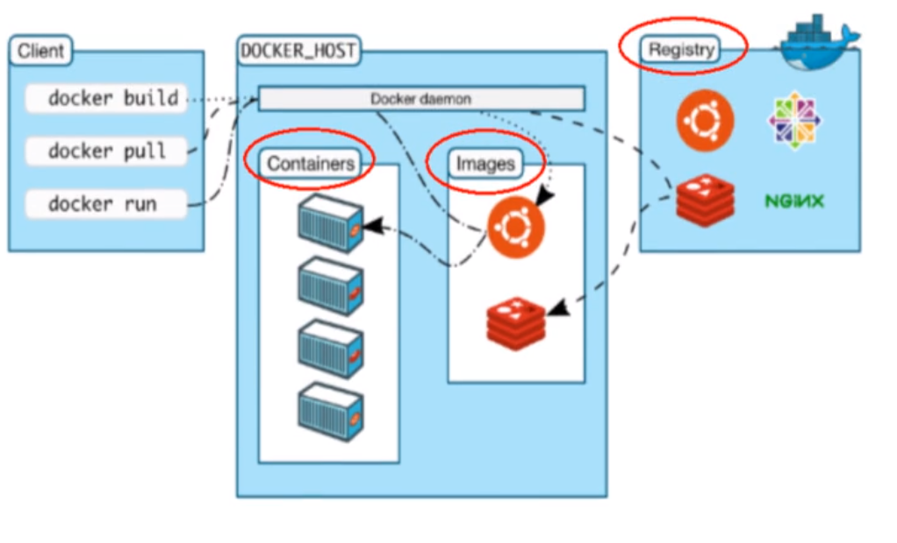
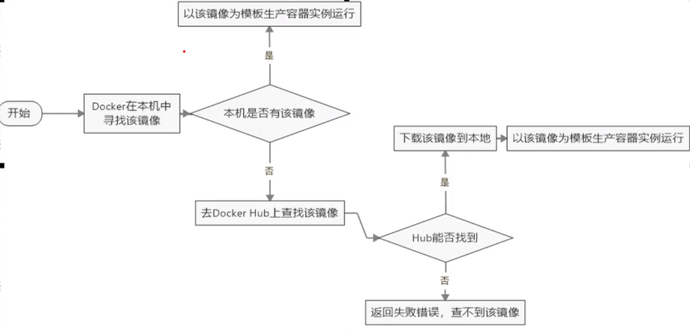
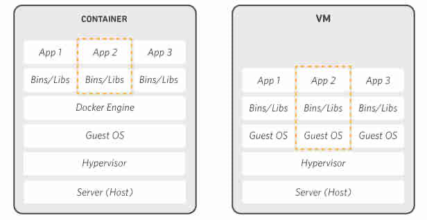
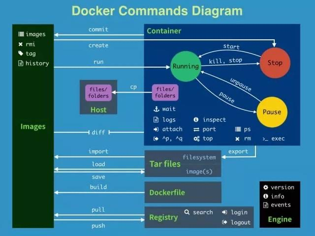

## 一、Docker概述

### 1. 什么是Docker?

> Docker 是一个开源的应用容器引擎，让开发者可以打包他们的应用以及依赖包到一个可移植的镜像中，然后发布到任何流行的 Linux或Windows 机器上，也可以实现虚拟化。容器是完全使用沙箱机制，相互之间不会有任何接口。

### 2. Docker解决的问题

 一款产品从开发到上线，从操作系统，到运行环境，再到应用配置。作为开发+运维之间的协作我们需要关心很多东西，这也是很多互联网公司都不得不面对的问题，特别是各种版本的迭代之后，不同版本环境的兼容，对运维人员都是考验Docker之所以发展如此迅速，也是因为它对此给出了一个标准化的解决方案。环境配置如此麻烦，换一台机器，就要重来一次，费力费时。很多人想到，能不能从根本上解决问题，软件可以带环境安装？也就是说，安装的时候，把原始环境一模一样地复制过来。开发人员利用 Docker 可以消除协作编码时“在我的机器上可正常工作”的问题。 之前在服务器配置一个应用的运行环境，要安装各种软件，就拿尚硅谷电商项目的环境来说吧，Java/Tomcat/MySQL/JDBC驱动包等。安装和配置这些东西有多麻烦就不说了，它还不能跨平台。假如我们是在 Windows 上安装的这些环境，到了 Linux 又得重新装。况且就算不跨操作系统，换另一台同样操作系统的服务器，要移植应用也是非常麻烦的。 传统上认为，软件编码开发/测试结束后，所产出的成果即是程序或是能够编译执行的二进制字节码等(java为例)。而为了让这些程序可以顺利执行，开发团队也得准备完整的部署文件，让维运团队得以部署应用程式，开发需要清楚的告诉运维部署团队，用的全部配置文件+所有软件环境。不过，即便如此，仍然常常发生部署失败的状况。Docker镜像的设计，使得Docker得以打破过去「程序即应用」的观念。透过镜像(images)将作业系统核心除外，运作应用程式所需要的系统环境，由下而上打包，达到应用程式跨平台间的无缝接轨运作。 

### 3. Docker理念

Docker是基于Go语言实现的云开源项目。Docker的主要目标是“Build，Ship and Run Any App,Anywhere”，也就是通过对应用组件的封装、分发、部署、运行等生命周期的管理，使用户的APP（可以是一个WEB应用或数据库应用等等）及其运行环境能够做到“一次封装，到处运行”。Linux 容器技术的出现就解决了这样一个问题，而 Docker 就是在它的基础上发展过来的。将应用运行在 Docker 容器上面，而 Docker 容器在任何操作系统上都是一致的，这就实现了跨平台、跨服务器。只需要一次配置好环境，换到别的机子上就可以一键部署好，大大简化了操作.

简而言之, Docker解决了运行环境和配置问题软件容器，方便做持续集成并有助于整体发布的容器虚拟化技术。

### 4. 虚拟机技术与容器虚拟技术

#### (1) 传统虚拟技术

虚拟机（virtual machine）就是带环境安装的一种解决方案。它可以在一种操作系统里面运行另一种操作系统，比如在Windows 系统里面运行Linux 系统。应用程序对此毫无感知，因为虚拟机看上去跟真实系统一模一样，而对于底层系统来说，虚拟机就是一个普通文件，不需要了就删掉，对其他部分毫无影响。这类虚拟机完美的运行了另一套系统，能够使应用程序，操作系统和硬件三者之间的逻辑不变。 

虚拟机的缺点：

1. 资源占用多
2. 冗余步骤多
3. 启动慢 

虚拟机原理图:

.

#### (2)容器虚拟技术

由于前面虚拟机存在这些缺点，Linux 发展出了另一种虚拟化技术：Linux 容器（Linux Containers，缩写为 LXC）。Linux 容器不是模拟一个完整的操作系统，而是对进程进行隔离。有了容器，就可以将软件运行所需的所有资源打包到一个隔离的容器中。容器与虚拟机不同，不需要捆绑一整套操作系统，只需要软件工作所需的库资源和设置。系统因此而变得高效轻量并保证部署在任何环境中的软件都能始终如一地运行。 比较了 Docker 和传统虚拟化方式的不同之处：传统虚拟机技术是虚拟出一套硬件后，在其上运行一个完整操作系统，在该系统上再运行所需应用进程；而容器内的应用进程直接运行于宿主的内核，容器内没有自己的内核，而且也没有进行硬件虚拟。因此容器要比传统虚拟机更为轻便。每个容器之间互相隔离，每个容器有自己的文件系统 ，容器之间进程不会相互影响，能区分计算资源。 

容器虚拟技术原理图:

.

### 5. Docker的特点

1. 更快速的应用交付和部署
2. 更快速的升级和扩缩容
3. 更简单的系统运维
4. 更高效的计算机资源利用

### 6. Docker三要素

#### (1) 镜像

Docker 镜像（Image）就是一个只读的模板。镜像可以用来创建 Docker 容器，一个镜像可以创建很多容器。 

将一个系统中各种环境打包, 就成为了一个镜像.

#### (2) 容器

Docker 利用容器（Container）独立运行的一个或一组应用。容器是用镜像创建的运行实例。 它可以被启动、开始、停止、删除。每个容器都是相互隔离的、保证安全的平台。 可以把容器看做是一个简易版的 Linux 环境（包括root用户权限、进程空间、用户空间和网络空间等）和运行在其中的应用程序。容器的定义和镜像几乎一模一样，也是一堆层的统一视角，唯一区别在于容器的最上面那一层是可读可写的。 

#### (3) 仓库

仓库（Repository）是集中存放镜像文件的场所。仓库(Repository)和仓库注册服务器（Registry）是有区别的。仓库注册服务器上往往存放着多个仓库，每个仓库中又包含了多个镜像，每个镜像有不同的标签（tag）。 仓库分为公开仓库（Public）和私有仓库（Private）两种形式。最大的公开仓库是 Docker Hub，存放了数量庞大的镜像供用户下载。国内的公开仓库包括阿里云 、网易云 等 . 

Docker Hub上面有许多的镜像, 每一个镜像也有帮助文档, 如果对某一个镜像的使用有疑问, 可以在Docker Hub上参考对应镜像的使用文档。

**总结:** 需要正确的理解仓储/镜像/容器这几个概念:  Docker 本身是一个容器运行载体或称之为管理引擎。我们把应用程序和配置依赖打包好形成一个可交付的运行环境，这个打包好的运行环境就似乎 image镜像文件。只有通过这个镜像文件才能生成 Docker 容器。image 文件可以看作是容器的模板。Docker 根据 image 文件生成容器的实例。同一个 image 文件，可以生成多个同时运行的容器实例。 image 文件生成的容器实例，本身也是一个文件，称为镜像文件。一个容器运行一种服务，当我们需要的时候，就可以通过docker客户端创建一个对应的运行例，也就是我们的容器至于仓储，就是放了一堆镜像的地方，我们可以把镜像发布到仓储中，需要的时候从仓储中拉下来就可以了。 

### 7. Docker架构



### 8. Hello World

通过Docker官方文档完成安装

通过阿里云文档完成镜像加速配置

通过`docker run hello-world`完成第一个容器运行

docker run的执行细节:



### 9. Docker底层原理

#### (1) Docker是如何工作的?

Docker是一个Client-Server结构的系统，Docker守护进程运行在主机上， 然后通过Socket连接从客户端访问，守护进程从客户端接受命令并管理运行在主机上的容器。 容器，是一个运行时环境，就是我们前面说到的集装箱。 


#### (2) 为什么Docker比VM快?

1. docker有着比虚拟机更少的抽象层。由亍docker不需要Hypervisor实现硬件资源虚拟化,运行在docker容器上的程序直接使用的都是实际物理机的硬件资源。因此在CPU、内存利用率上docker将会在效率上有明显优势。
2. docker利用的是宿主机的内核,而不需要Guest OS。因此,当新建一个容器时,docker不需要和虚拟机一样重新加载一个操作系统内核。仍而避免引寻、加载操作系统内核返个比较费时费资源的过程,当新建一个虚拟机时,虚拟机软件需要加载Guest OS,返个新建过程是分钟级别的。而docker由于直接利用宿主机的操作系统,则省略了返个过程,因此新建一个docker容器只需要几秒钟。

图解: 




## 二、Docker 命令

### 1. 帮助命令

+ `docker version` : 查看docker版本信息
+ `docker info` : 查看详细的docker信息
+ `docker --help` : docker帮助信息

### 2. 镜像命令

+ `docker images` : 列出本地镜像信息
    + `docker images -a` : 列出本地所有镜像信息(包含中间映像层)
    + `docker images -q` : 只显示镜像ID
    + `docker images -qa` : 显示所有镜像的ID(-qa这是options组合方式)
    + `docker images --digests` : 显示镜像的摘要信息
    + `docker images --no-trunc` : 显示完整镜像信息
+ `docker search 镜像名` : 在仓库中查询对应镜像
    + `docker search 镜像名 --no-trunc` : 显示完整镜像描述
    + `docker search 镜像名 -s xx` : 只显示start数不小于xx的镜像
    + `docker search 镜像名 --automated` : 只显示能自动构建的镜像
+ `docker pull 镜像名[:tag]` : 从仓库中下载指定镜像, 版本标签为可选项, 默认为:latest
+ `docker rmi 镜像名/镜像ID` : 删除对应镜像
    + `docker rmi -f 镜像ID/镜像名` : 强制删除对应镜像, 即使它在运行状态
    + `docker rmi -f 镜像名1:tag 镜像名2:tag` : 批量删除
    + `docker rmi -f $(docker images -qa)` : 删除全部镜像

### 3. 容器命令

+ `docker run image` : 创建并启动容器
    + `docker run --name NAME image` : 给启动的容器命名
    + `docker run -d image` : 后台运行容器, 并返回容器ID(启动守护式容器). 注意: 我们通过`docker run -d centos`运行了容器后, 使用`docker ps`并没有查看到有该进程, 这是由于Docker内部机制造成的, 当后台启动后, 前台并没有什么事情可做, 所以docker自动杀掉了该进程. 最好的解决办法就是在前台运行容器.
    + `docker run -i image` : 以交互式方式运行容器, 常与-t同时使用
    + `docker run -t image` : 为容器重新分配一个输入终端
    + `docker run -P image` : 随机端口映射
    + `docker run -p image` : 指定端口映射, 如:`docker run -p 8888:8080 tomcat `第一个端口号为docker对应容器访问端口号, 后一个端口号为tomcat的端口号, 创建容器后, 我们需通过8888端口进行访问, docker会自动映射到对应的8080端口, 为了方便, 通常将两个端口号设置为相同的.
    + `docker run -e key=value` : 配置参数, 如在mysql中, 通过`docker run -e MYSQL_ROOT_PASSWORD=12345`来设置初始密码
+ `docker ps` : 列出当前正在运行的容器
    + `docker ps -a` : 列出当前正在运行的容器和历史上所有运行过的容器
    + `docker ps -l` : 显示最近创建的容器
    + `docker ps -n x` : 显示最近创建的x个容器
    + `docker ps -q` : 静默模式, 只显示容器ID
    + `docker ps -no-trunc` : 显示完整容器信息
+ `exit` : 停止容器并退出(在linux容器中才行, 相当于在容器中执行exit将其关闭)
+ `ctrl+P+Q` : 不停止退出容器
+ `docker attach 容器ID/容器名` : 进入正在运行的容器并以命令行的方式交互
+ `docker exec -it 容器ID/容器名 shell代码` : 在容器中执行指定shell, 但是不会以交互形式进入容器(如果是bin/bash命令则会进入)
+ `docker start 容器名/容器ID`  : 启动容器
+ `docker restart 容器名/容器ID` : 重启容器
+ `docker stop 容器名/容器ID` : 停止容器
+ `docker kill 容器名/容器ID`  : 强制停止容器
+ `docker rm 容器名/容器ID`  : 删除容器(已停止)
    + `docker rm -f $(docker ps -a -q)` : 强制删除所有容器
    + `docker ps -a -q | xargs docker rm` : 删除所有容器
+ `docker logs -f -t --tail x 容器名/容器ID` : 查看容器日志 -t加入时间戳 -f表示实时更新 --tail x表示只显示最近的x条日志
+ `docker top 容器名/容器ID` : 查看容器内运行的进程
+ `docker inspect 容器名/容器ID` : 查看容器内部细节
+ `docker cp 容器ID:文件路径 主机文件路径` : 将容器中的文件拷贝到主机上
+ `docker cp 主机文件路径 容器ID:文件路径` : 将主机文件拷贝到容器中

### 4. 命令图集



**Tips:** Docker也有可视化工具Portainer。

## 三、Docker镜像

### 1. UnionFS(联合文件系统)

UnionFS（联合文件系统）：Union文件系统（UnionFS）是一种分层、轻量级并且高性能的文件系统，它支持对文件系统的修改作为一次提交来一层层的叠加，同时可以将不同目录挂载到同一个虚拟文件系统下(unite several directories into a single virtual filesystem)。Union 文件系统是 Docker 镜像的基础。**镜像可以通过分层来进行继承，基于基础镜像（没有父镜像），可以制作各种具体的应用镜像。** 特性：一次同时加载多个文件系统，但从外面看起来，只能看到一个文件系统，联合加载会把各层文件系统叠加起来，这样最终的文件系统会包含所有底层的文件和目录 

### 2. Docker镜像加载原理

docker的镜像实际上由一层一层的文件系统组成，这种层级的文件系统叫UnionFS。

bootfs(boot file system)主要包含bootloader和kernel, bootloader主要是引导加载kernel, Linux刚启动时会加载bootfs文件系统，在Docker镜像的最底层是bootfs。这一层与我们典型的Linux/Unix系统是一样的，包含boot加载器和内核。当boot加载完成之后整个内核就都在内存中了，此时内存的使用权已由bootfs转交给内核，此时系统也会卸载bootfs。 

rootfs (root file system) ，在bootfs之上。包含的就是典型 Linux 系统中的 /dev, /proc, /bin, /etc 等标准目录和文件。rootfs就是各种不同的操作系统发行版，比如Ubuntu，Centos等等。 。 平时我们安装进虚拟机的CentOS都是好几个G，为什么docker这里才200M？？对于一个精简的OS，rootfs可以很小，只需要包括最基本的命令、工具和程序库就可以了，因为底层直接用Host的kernel，自己只需要提供 rootfs 就行了。由此可见对于不同的linux发行版, bootfs基本是一致的, rootfs会有差别, 因此不同的发行版可以公用bootfs。  

### 3. 为什么docker镜像采用这种分层结构?

最大的一个好处就是**共享资源** 

Docker镜像都是只读的, 当容器启动时，一个新的可写层被加载到镜像的顶部。这一层通常被称作“容器层”，“容器层”之下的都叫“镜像层”。

当有多个镜像都从相同的 base 镜像构建而来，那么宿主机只需在磁盘上保存一份base镜像，同时内存中也只需加载一份 base 镜像，就可以为所有容器服务了。而且镜像的每一层都可以被共享。 

比如创建一个Tomcat容器, Tomcat镜像的内层就包含了java镜像, 所以后续需要依赖java环境的其它容器就可以和该容器共享该java镜像.

### 4. 创建自己的镜像

当我们pull了一个镜像, 并创建了容器, 并在容器中进行了自己的配置后, 我们可以将这个配置后的容器制作成一个新的镜像, 这个镜像会保留我们自己的配置.

`docker commit -m="提交信息" -a="作者名" 容器ID 要创建的镜像名:tag`

### 5. 提交镜像

**提交镜像到DockerHub:**

1. `docker login -u username`
2. `docker push author/imageName:tag`

**提交到阿里云镜像:**

1. 登录阿里云
2. 找到容器镜像服务
3. 创建命名空间
4. 创建镜像仓库
5. 进入镜像仓库, 参考操作指南

## 四、Docker容器数据卷

有时候, 我们需要保存我们容器中的数据, 这时候就需要用到容器数据卷.

容器数据卷的作用就是实现容器持久化和容器间集成与共享数据

### 1. 命令方式实现持久化

`docker run -it -v /宿主机绝对路径目录:/容器内目录 镜像名`

执行完后, 容器对应目录和主机对应目录的文件与数据都是同步(双向同步)的. 容器中新建文件, 则主机对应目录也会新建文件. 容器中修改文件, 主机中对应目录也会修改文件. 宿主机对应目录修改文件, 则容器中的对应文件也会被修改. 如果容器被关闭了, 重新启动后, 由于主机中有文件, 所以重启的容器中也会有相应的文件.

可以同时使用多个 -v 命令实现多个目录的同步。

`docker run -it -v /宿主机绝对路径目录:/容器内目录:ro 镜像名`

上述命令加入了权限控制, 即容器中对应目录只能进行读操作, 也就是说容器中无法对目录下的文件进行任何读操作, 只能单向同步主机中对相应目录文件的修改.

### 2. Dockerfile方式

1. 在根目录下新建mydocker文件夹并进入

2. 创建一个文件dockerfile

    ```dockerfile
     # volume test
     FROM centos
     #创建对应的共享文件夹(数据卷)
     VOLUME ["/dataVolumeContainer1","/dataVolumeContainer2"]
     CMD echo "finished,--------success1"
     CMD /bin/bash 
    ```

3. 通过`docker build -f /mydocker/dockerfile -t 要创建的镜像名 .`来创建镜像
4. 运行该镜像
5. 默认会有一个主机的对应目录, 可以通过`docker inspect 容器ID`查看

### 3. 数据卷容器

实现容器之间的数据卷的继承, 以实现容器之间数据卷的传递

`docker run -it --volume-from 继承容器ID/名 镜像名`

这样创建的容器和继承的容器之间是共享数据卷的

实际上, 所有的父与子容器的数据卷都可以完全同步, 无论父容器或子容器被关闭, 只要有任意一个容器存在, 那么其他容器重启后, 都可以同步到未关闭的容器的数据卷.


## 五、Dockerfile

### 1. Dockerfile是什么?

dockerfile是用来构建镜像的构建文件. 由一系列命令和参数构成, 可以通过`docker build`命令来执行dockerfile构建镜像

### 2. Docker基础

1. 每条指令保留关键字都必须大写, 且其后至少要有一个参数
2. 指令按照从上到下顺序执行
3. #为注释符号
4. 每条指令都会创建一个新的镜像层, 并对镜像进行提交

### 3. Docker执行dockerfile的基本流程

1. Docker从基础镜像中运行一个容器
2. 执行一条指令, 对容器进行一次修改
3. 执行类似`docker commit` 的操作提交一个新的镜像
4. docker再根据新镜像运行一个新容器
5. 重复2、3、4直到指令执行完

### 4. 指令保留关键字

1. **FROM** : 指定基础镜像(当前新镜像是基于哪个镜像的)
2. **MAINTAINER** : 镜像维护者的姓名和邮箱地址
3. **RUN** : 容器构建时需要运行的命令
4. **EXPOSE** : 当前容器对外暴露出的端口
5. **WORKDIR** : 指定在创建容器后，终端默认登陆的进来工作目录，一个落脚点
6. **ENV** : 用来在构建镜像过程中设置环境变量. 如: `ENV path /usr/local`后面就可以通过`$path`来进行引用。设置Java环境变量: `ENV JAVA_HOME /usr/local/jdk1.8.0`
7. **ADD** : 将宿主机目录下的文件拷贝进镜像且ADD命令会自动处理URL和解压tar压缩包。`ADD xxx.tar.gz /user/local`自动解压到`/user/local`目录。
8. **COPY** : 类似ADD，拷贝文件和目录到镜像中 `COPY src dest`、`COPY ["src", "dest"]`
9. **VOLUME** : 容器数据卷，用于数据保存和持久化工作 `VOLUME ["/docs1", "docs2"]`
10. **CMD** : 指定一个容器启动时要运行的命令(Dockerfile 中可以有多个 CMD 指令，但只有最后一个生效，CMD 会被 docker run 之后的参数替换)。如果一个`CMD`需要包含多个指令, 指令之间用`&&`连接即可。
11. **ENTRYPOINT** : 指定一个容器启动时要运行的命令. docker run 之后的参数会被追加而不是替换. 如`docker run myip -i`命令, 原`ENTRYPOINT ["curl","-s","www.ip.cn"]`不会被覆盖, 而会被追加变成`curl -s -i www.ip.cn`
12. **ONBUILD** : FROM 父镜像，父镜像在被子镜像继承后父镜像的onbuild被触发, 执行相关命令. 如: `ONBUILD RUN echo "success!"`


## 六、Docker网络


## X、实战

### 1. Dockerfile构建Tomcat镜像

**实现思路:** 

1. `FROM centos`

2. `ADD xxx.tar.gz`
3. `Run`
4. `ENV xxx xxx`
5. `Expose xxx`
6. `CMD xxx`