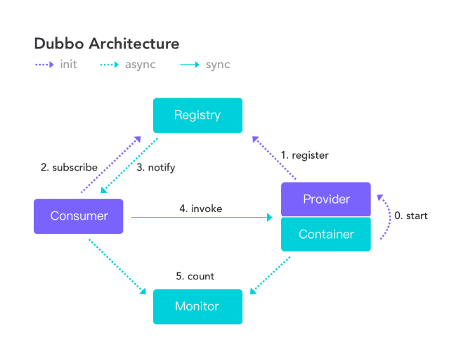

## 一、Dubbo概述

### 1. 分布式

分布式系统是若干独立的计算机集合, 但是这些计算机对于用户来说就像是一个完整的单个系统.

### 2. RPC&&Dubbo

在分布式系统中, 计算及之间需要通信, 这个时候就需要RPC框架. 

RPC（Remote Procedure Call Protocol）远程过程调用协议。一个通俗的描述是：客户端在不知道调用细节的情况下，调用存在于远程计算机上的某个对象和方法，就像调用本地应用程序中的对象和方法一样。比较正式的描述是：一种通过网络从远程计算机程序上请求服务，而不需要了解底层网络技术的协议。

Dubbo([ˈdʌbəʊ])是阿里巴巴公司开源的一个高性能优秀的服务框架，使得应用可通过高性能的 RPC 实现服务的输出和输入功能，可以和Spring框架无缝集成。它提供了三大核心能力：面向接口的远程方法调用，智能容错和负载均衡，以及服务自动注册和发现。

**问: 为什么使用RPC进行进程通信而不直接使用HTTP?**

http使用没有任何问题，首先业务简单，系统之间的交互不是特别多的情况下是可以使用http 没有任何问题，

但是如果是一个大型的网站，内部子系统较多、接口非常多的情况下，RPC框架的好处就显示出来了，

+ 传输协议
    - RPC，可以基于TCP协议，也可以基于HTTP协议
    - HTTP，基于HTTP协议
+ 传输效率
    - RPC，使用自定义的TCP协议，可以让请求报文体积更小，或者使用HTTP2协议，也可以很好的减少报文的体积，提高传输效率
    - HTTP，如果是基于HTTP1.1的协议，请求中会包含很多无用的内容，如果是基于HTTP2.0，那么简单的封装以下是可以作为一个RPC来使用的，这时标准RPC框架更多的是服务治理
+ 性能消耗，主要在于序列化和反序列化的耗时
    - RPC，可以基于thrift实现高效的二进制传输
    - HTTP，大部分是通过json来实现的，字节大小和序列化耗时都比thrift要更消耗性能
+ 负载均衡
    - RPC，基本都自带了负载均衡策略
    - HTTP，需要配置Nginx，HAProxy来实现
+ 服务治理（下游服务新增，重启，下线时如何不影响上游调用者）
    - RPC，能做到自动通知，不影响上游
    - HTTP，需要事先通知，修改Nginx/HAProxy配置

### 3. 注册中心

 将所有的服务都注册到注册中心中, 统一管理. 方便请求找到对应服务、监控服务运行状态、请求合理分配.

### 4. Dubbo的特点

+ **面向接口代理的高性能RPC调用**
    隐藏了远程调用底层细节, 只需要知道远程调用的接口即可
+ **智能负载均衡**
+ **服务自动注册与发现**
    支持多种注册中心服务
+ **高度可扩展能力**
+ **运行期流量调度**
    可配置不同路由规则, 实现灰度发布(即一部分访问新服务, 一部分访问旧服务)
+ **可视化服务治理与运维**

### 5. Dubbo设计架构

Dubbo设计架构采用了订阅发布模式.



## 二、Dubbo快速启动

### 1. 搭建ZooKeeper注册中心


### 2. 搭建可视化监控中心(需开启ZooKppper)

1. 在github上下载dubbo-admin项目
2. 在` dubbo-admin-server/src/main/resources/application.properties `中进行个性化配置
3. 进入cmd(cmd位置为pom.xml所在位置, 这个项目是使用springboot完成的), 通过`mvn clean package`命令进行打包(先clean再package).
4. 通过` java -jar dubbo-admin-0.1.jar `运行该项目
5. 通过`http://localhost:8080`(可以在配置文件中配置)


### 3. 创建服务提供者

1. 导入相关jar包`dubbo.jar`、`curator-framwork.jar`. 其中`curator`是用于操作zookeeper的客户端

2. 定义服务接口

    ```java
    package org.apache.dubbo.demo;
    
    public interface DemoService {
        String sayHello(String name);
    }
    ```

3. 服务端实现该接口

    ```java
    package org.apache.dubbo.demo.provider;
     
    import org.apache.dubbo.demo.DemoService;
     
    public class DemoServiceImpl implements DemoService {
        public String sayHello(String name) {
            return "Hello " + name;
        }
    }
    ```

4. 用spring配置暴露该服务(添加到注册中心)

    ```xml
    <?xml version="1.0" encoding="UTF-8"?>
    <beans xmlns="http://www.springframework.org/schema/beans"
        xmlns:xsi="http://www.w3.org/2001/XMLSchema-instance"
        xmlns:dubbo="http://dubbo.apache.org/schema/dubbo"
        xsi:schemaLocation="http://www.springframework.org/schema/beans        http://www.springframework.org/schema/beans/spring-beans-4.3.xsd        http://dubbo.apache.org/schema/dubbo        http://dubbo.apache.org/schema/dubbo/dubbo.xsd">
     
        <!-- 指定当前服务/应用的名字 -->
        <dubbo:application name="hello-world-app"  />
     
        <!-- 指定注册中心的地址 -->
        <dubbo:registry address="zookeeper://127.0.0.1:2181" />
     
        <!-- 指定消费者和服务者的通信规则(协议和端口号) -->
        <dubbo:protocol name="dubbo" port="20880" />
     
        <!-- 声明需要暴露的服务接口 -->
        <dubbo:service interface="org.apache.dubbo.demo.DemoService" ref="demoService" />
     
        <!-- 和本地bean一样实现服务 -->
        <bean id="demoService" class="org.apache.dubbo.demo.provider.DemoServiceImpl" />
    </beans>
    ```

5. 加载spring配置

    ```java
    import org.springframework.context.support.ClassPathXmlApplicationContext;
     
    public class Provider {
        public static void main(String[] args) throws Exception {
            ClassPathXmlApplicationContext context = new ClassPathXmlApplicationContext(new String[] {"http://10.20.160.198/wiki/display/dubbo/provider.xml"});
            context.start();
            System.in.read(); // 按任意键退出, 防止容器关闭
        }
    }
    ```


### 4. 创建消费者

1. 进行spring配置

    ```xml
    <?xml version="1.0" encoding="UTF-8"?>
    <beans xmlns="http://www.springframework.org/schema/beans"
        xmlns:xsi="http://www.w3.org/2001/XMLSchema-instance"
        xmlns:dubbo="http://dubbo.apache.org/schema/dubbo"
        xsi:schemaLocation="http://www.springframework.org/schema/beans        http://www.springframework.org/schema/beans/spring-beans-4.3.xsd        http://dubbo.apache.org/schema/dubbo        http://dubbo.apache.org/schema/dubbo/dubbo.xsd">
     
        <!-- 消费方应用名，用于计算依赖关系，不是匹配条件，不要与提供方一样 -->
        <dubbo:application name="consumer-of-helloworld-app"  />
     
        <!-- 注册中心地址 -->
        <dubbo:registry address="zookeeper://127.0.0.1:2181" />
     
        <!-- 生成远程服务代理，可以和本地bean一样使用demoService -->
        <dubbo:reference id="demoService" interface="org.apache.dubbo.demo.DemoService" />
    </beans>
    ```

2. 调用远程接口

    ```java
    import org.springframework.context.support.ClassPathXmlApplicationContext;
    import org.apache.dubbo.demo.DemoService;
     
    public class Consumer {
        public static void main(String[] args) throws Exception {
            ClassPathXmlApplicationContext context = new ClassPathXmlApplicationContext(new String[] {"http://10.20.160.198/wiki/display/dubbo/consumer.xml"});
            context.start();
            DemoService demoService = (DemoService)context.getBean("demoService"); // 获取远程服务代理
            String hello = demoService.sayHello("world"); // 执行远程方法
            System.out.println( hello ); // 显示调用结果
        }
    }
    ```

    

### 5. 注意事项

1. 服务端需要实现接口, 同时消费者端也需要有相关接口的定义. 