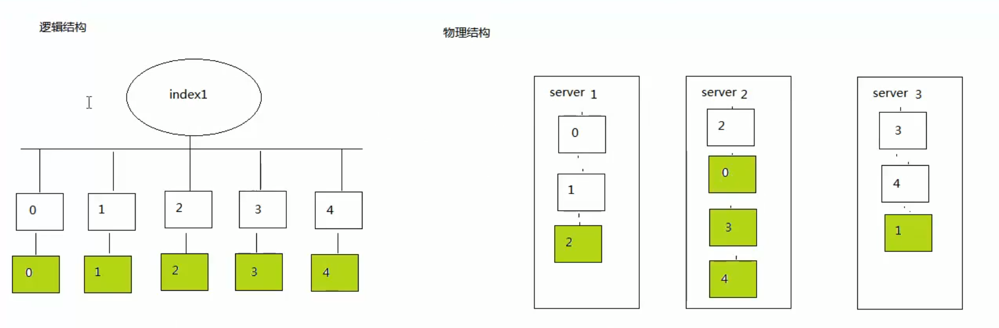

## 一、ElasticSearch简介

### 1. 什么是ElasticSearch

> Elaticsearch，简称为es， es是一个开源的高扩展的**分布式全文检索引擎**，它可以近乎**实时的存储、检索数据**；本身**扩展性**很好，可以扩展到上百台服务器，处理PB级别的数据。es也使用Java开发并使用**Lucene**作为其核心来实现所有索引和搜索的功能，但是它的目的是通过简单的**RESTful API**来隐藏Lucene的复杂性，从而让全文搜索变得简单。


### 2. ElasticSearch的使用案例

- 2013年初，GitHub抛弃了Solr，采取ElasticSearch 来做PB级的搜索。 “GitHub使用ElasticSearch搜索20TB的数据，包括13亿文件和1300亿行代码”
- 维基百科：启动以elasticsearch为基础的核心搜索架构
- SoundCloud：“SoundCloud使用ElasticSearch为1.8亿用户提供即时而精准的音乐搜索服务”
- 百度：百度目前广泛使用ElasticSearch作为文本数据分析，采集百度所有服务器上的各类指标数据及用户自定义数据，通过对各种数据进行多维分析展示，辅助定位分析实例异常或业务层面异常。目前覆盖百度内部20多个业务线（包括casio、云分析、网盟、预测、文库、直达号、钱包、风控等），单集群最大100台机器，200个ES节点，每天导入30TB+数据
- 新浪使用ES 分析处理32亿条实时日志
- 阿里使用ES 构建挖财自己的日志采集和分析体系


### 3. 学习参考资料

 https://www.elastic.co/guide/cn/elasticsearch/guide/current/index.html 


## 二、ElasticSearch相关术语

### 1. ElasticSearch与关系型数据库术语区别

Elasticsearch是**面向文档(document oriented)**的，这意味着它可以存储整个对象或文档(document)。然而它不仅仅是存储，还会索引(index)每个文档的内容使之可以被搜索。在Elasticsearch中，你可以对文档（而非成行成列的数据）进行索引、搜索、排序、过滤。Elasticsearch比传统关系型数据库如下：

```
Relational DB -> Databases -> Tables -> Rows -> Columns
Elasticsearch -> Indices   -> Types  -> Documents -> Fields
```

### 2. ElasticSearch核心概念

#### (1) 索引 index

一个索引就是一个拥有几分相似特征的文档的集合。比如说，你可以有一个客户数据的索引，另一个产品目录的索引，还有一个订单数据的索引。一个索引由一个名字来标识（必须全部是小写字母的），并且当我们要对对应于这个索引中的文档进行索引、搜索、更新和删除的时候，都要使用到这个名字。在一个集群中，可以定义任意多的索引。

#### (2) 类型 type

在一个索引中，你可以定义一种或多种类型。一个类型是你的索引的一个逻辑上的分类/分区，其语义完全由你来定。通常，会为具有一组共同字段的文档定义一个类型。比如说，我们假设你运营一个博客平台并且将你所有的数据存储到一个索引中。在这个索引中，你可以为用户数据定义一个类型，为博客数据定义另一个类型，当然，也可以为评论数据定义另一个类型。

#### (3) 文档 document

一个文档是一个可被索引的基础信息单元。比如，你可以拥有某一个客户的文档，某一个产品的一个文档，当然，也可以拥有某个订单的一个文档。文档以JSON（Javascript Object Notation）格式来表示，而JSON是一个到处存在的互联网数据交互格式。

在一个index/type里面，你可以存储任意多的文档。注意，尽管一个文档，物理上存在于一个索引之中，文档必须被索引/赋予一个索引的type。

一个文档中不仅仅包含数据, 还包含一些元数据. 这些元数据描述了文档的相关信息, 如:

**_index**: 描述了文档存放在哪个索引中

**_type**: 描述了文档存放在索引的哪个类型中

**_id**: 作为文档的唯一标识

#### (4) 字段 field

相当于是数据表的字段，对文档数据根据不同属性进行的分类标识

#### (5) 映射 mapping

mapping是处理数据的方式和规则方面做一些限制，如某个字段的数据类型、默认值、分析器、是否被索引等等，这些都是映射里面可以设置的，其它就是处理es里面数据的一些使用规则设置也叫做映射，按着最优规则处理数据对性能提高很大，因此才需要建立映射，并且需要思考如何建立映射才能对性能更好。

#### (6) 集群 cluster

一个集群就是由一个或多个节点组织在一起，它们共同持有整个的数据，并一起提供索引和搜索功能。一个集群由一个唯一的名字标识，这个名字默认就是“elasticsearch”。这个名字是重要的，因为一个节点只能通过指定某个集群的名字，来加入这个集群

#### (7) 节点 node

一个节点是集群中的一个服务器，作为集群的一部分，它存储数据，参与集群的索引和搜索功能。和集群类似，一个节点也是由一个名字来标识的，默认情况下，这个名字是一个随机的漫威漫画角色的名字，这个名字会在启动的时候赋予节点。这个名字对于管理工作来说挺重要的，因为在这个管理过程中，你会去确定网络中的哪些服务器对应于Elasticsearch集群中的哪些节点。

一个节点可以通过配置集群名称的方式来加入一个指定的集群。默认情况下，每个节点都会被安排加入到一个叫做“elasticsearch”的集群中，这意味着，如果你在你的网络中启动了若干个节点，并假定它们能够相互发现彼此，它们将会自动地形成并加入到一个叫做“elasticsearch”的集群中。

在一个集群里，只要你想，可以拥有任意多个节点。而且，如果当前你的网络中没有运行任何Elasticsearch节点，这时启动一个节点，会默认创建并加入一个叫做“elasticsearch”的集群。

#### (8) 分片和复制 shards&replicas

一个索引可以存储超出单个结点硬件限制的大量数据。比如，一个具有10亿文档的索引占据1TB的磁盘空间，而任一节点都没有这样大的磁盘空间；或者单个节点处理搜索请求，响应太慢。为了解决这个问题，Elasticsearch提供了将索引划分成多份的能力，这些份就叫做分片。当你创建一个索引的时候，你可以指定你想要的分片的数量。每个分片本身也是一个功能完善并且独立的“索引”，这个“索引”可以被放置到集群中的任何节点上。分片很重要，主要有两方面的原因： 
1）允许你水平分割/扩展你的内容容量。 
2）允许你在分片（潜在地，位于多个节点上）之上进行分布式的、并行的操作，进而提高性能/吞吐量。

至于一个分片怎样分布，它的文档怎样聚合回搜索请求，是完全由Elasticsearch管理的，对于作为用户的你来说，这些都是透明的。

在一个网络/云的环境里，失败随时都可能发生，在某个分片/节点不知怎么的就处于离线状态，或者由于任何原因消失了，这种情况下，有一个故障转移机制是非常有用并且是强烈推荐的。为此目的，Elasticsearch允许你创建分片的一份或多份拷贝，这些拷贝叫做复制分片，或者直接叫复制。

复制之所以重要，有两个主要原因： 在分片/节点失败的情况下，提供了高可用性。因为这个原因，注意到复制分片从不与原/主要（original/primary）分片置于同一节点上是非常重要的。扩展你的搜索量/吞吐量，因为搜索可以在所有的复制上并行运行。总之，每个索引可以被分成多个分片。一个索引也可以被复制0次（意思是没有复制）或多次。一旦复制了，每个索引就有了主分片（作为复制源的原来的分片）和复制分片（主分片的拷贝）之别。分片和复制的数量可以在索引创建的时候指定。在索引创建之后，你可以在任何时候动态地改变复制的数量，但是你事后不能改变分片的数量。

默认情况下，Elasticsearch中的每个索引被分片5个主分片和1个复制，这意味着，如果你的集群中至少有两个节点，你的索引将会有5个主分片和另外5个复制分片（1个完全拷贝），这样的话每个索引总共就有10个分片。

#### (9) 接近实时 NRT

Elasticsearch是一个接近实时的搜索平台。这意味着，从索引一个文档直到这个文档能够被搜索到有一个轻微的延迟（通常是1秒以内）


## 三、索引、映射、文档

ElasticSearch通过简单的restful风格url, 执行相应的命令.

### 1. 创建索引并创建mapping

```http
PUT  localhost:9200/{index}
{
    "mappings": {
        "article": {
            "properties": {
                "id": {
                	"type": "long",
                    "store": true,
                    "index":"not_analyzed"
                },
                "title": {
                	"type": "text",
                    "store": true,
                    "index":"analyzed",
                    "analyzer":"standard"  //配置分词器, 默认使用内置标准分词器
                },
                "content": {
                	"type": "text",
                    "store": true,
                    "index":"analyzed",
                    "analyzer":"standard"
                }
            }
        }
    }
}
```

### 2. 创建索引后, 再单独设置mapping

```http
POST  /{index}/{type}/_mapping
{
    "hello": {
        "properties": {
            "id":{
             	"type":"long",
                	"store":true
            },
            "title":{
                "type":"text",
                "store":true,
                "index":true,
                "analyzer":"standard"
            },
            "content":{
                "type":"text",
                "store":true,
                "index":true,
                "analyzer":"standard"
            }
        }
    }
 }
```

### 3. 删除索引

```http
DELEETE  localhost:9200/blog1
```

### 4. 添加文档

```http
PUT  /{index}/{type}/{_id}
{
	"field": "value"
	...
}
```

```http
POST /{index}/{type}
{
	"field": "value"
	...
}
```

```http
PUT /{index}/{type}/{_id}?op_type=create

PUT /{index}/{type}/{_id}/_create

此种情况下, 如果_id已存在, 则不会替换原文档, 而是报错
```

**注意:**第一种方式指定了id, 而第二种方式没有指定. 如果没有指定, 系统会自动生成一个字符串, 作为文档的_id.

请求体

### 5. 检查文档是否存在

```http
HEAD  /{index}/{type}/{_id}

如果存在返回200状态码, 如果不存在返回404状态码
```

### 6. 更新文档

```http
PUT  /{index}/{type}/{_id}
{
	"field": "value"
	...
}
```

**注意:**更新文档的操作和添加一个文档的操作一样, 因为每次添加相同的id的文档, 都是先删除旧的文档, 再创建新的文档. 同时响应体中的`_version`字段的数字会发生变化. `_version`字段的作用是用于记录文档版本, 由于Elasticsearch是异步和并发的, 所以当多个更新操作并发到达时, `_version`可以为它们的执行进行排序, 最终更新版本最高的一次操作. 同时我们可以使用`PUT  /{index}/{type}/{_id}?version=1`来指定需要更新的文档版本, 若当前版本已经高于指定版本, 则更新取消. 这是一种==乐观的并发控制==

### 7. 更新文档--部分更新

```http
PUT  /{index}/{type}/{_id}/_update
{
	"doc": {
		"newField": "value",
        "oldField": "newValue"
	}
}
```

### 8. 删除文档

```http
DELETE  /{index}/{type}/{_id}
```

**注意:**删除文档不会立刻删除, 只是先将该文档标记为已删除状态, 随着后续索引更多数据, 后台自动删除.

### 9. 查询文档--根据id查询

```http
GET  /{index}/{type}/{_id}

根据id查询, 响应体中_source字段对应查询到的数据
```

```http
GET  /{index}/{type}/{_id}?_source=title,content

只查询指定字段
```

```http
GET  /{index}/{type}/{_id}/_source

响应体中只包含数据, 不包含其他信息
```

###  10. 一次取回多个文档

```http
GET /_mget
{
   "docs" : [
      {
         "_index" : "website",
         "_type" :  "blog",
         "_id" :    2
      },
      {
         "_index" : "website",
         "_type" :  "pageviews",
         "_id" :    1,
         "_source": "views"
      }
   ]
}
```

```http
GET /{index}/{type}/_mget
{
   "ids" : [ "2", "1" ]
}

适用于同一index同一type的多个文档
```


## 四、搜索

前面介绍了如何根据id获取整个文档,  ==但 Elasticsearch 真正强大之处在于可以从无规律的数据中找出有意义的信息——从“大数据”到“大信息”。== 

ElasticSearch的搜索功能可以做到:

- 在类似于 `gender` 或者 `age` 这样的字段上使用结构化查询，`join_date` 这样的字段上使用排序，就像SQL的结构化查询一样。
- 全文检索，找出所有匹配关键字的文档并按照_相关性（relevance）_ 排序后返回结果。
- 以上二者兼而有之。

### 1. 空搜索

```http
GET  /_search

返回所有文档
```

**响应体字段介绍:**

1. **hits:** 有一个`total`记录查询到的文档数, 一个`hits`数组用于存储查询的文档(只包含前十个), 其中每个文档中有一个`_score`字段, 它衡量了文档与查询的匹配程度, 所有文档根据该分数按降序排列. hits中还有一个`max_score`用于记录最大分数
2. **took:**查询花费了多少毫秒
3. **shards:** 查询中参与分片的总数，以及这些分片成功了多少个失败了多少个。 
4. **timeout:**查询是否超时. 可以通过`GET /_search?timeout=10ms`指定超时时间, 再超时之前, 已查询到的结果会被返回.

### 2. 带索引、类型搜索

**`/_search`**

在所有的索引中搜索所有的类型

**`/gb/_search`**

在 `gb` 索引中搜索所有的类型

**`/gb,us/_search`**

在 `gb` 和 `us` 索引中搜索所有的文档

**`/g\*,u\*/_search`**

在任何以 `g` 或者 `u` 开头的索引中搜索所有的类型

**`/gb/user/_search`**

在 `gb` 索引中搜索 `user` 类型

**`/gb,us/user,tweet/_search`**

在 `gb` 和 `us` 索引中搜索 `user` 和 `tweet` 类型

**`/_all/user,tweet/_search`**

在所有的索引中搜索 `user` 和 `tweet` 类型

### 3. 分页

ElasticSearch通过`size`和`from`参数实现分页搜索.其中:

`size`表示应该返回的结果数, 和每页个数

`from`表示应该跳过的结果数.

```http
GET /_search?size=5
```

```http
GET /_search?size=5&from=10

从第三页开始
```

**深度分页造成的性能负荷:**

由于ElasticSearch是多分片的, 如果要查询10条数据, 假设有5个分片, 那么每个分片会先查询出10条数据, 然后协调节点会对这50条数据进行排序, 最终返回前10条数据.

现在假设我们请求第 1000 页—结果从 10001 到 10010 。所有都以相同的方式工作除了每个分片不得不产生前10010个结果以外。 然后协调节点对全部 50050 个结果排序最后丢弃掉这些结果中的 50040 个结果.

可以看到，在分布式系统中，对结果排序的成本随分页的深度成指数上升。这就是 web 搜索引擎对任何查询都不要返回超过 1000 个结果的原因。  

### 4. queryString

```http
POST /{index}/{type}/_search
{
    "query": {
        "query_string": {
            "default_field": "title",
            "query": "搜索服务器"
        }
    }
}
```

**注意:** 由于默认使用的分词组件是一个字一个字的拆分, 所以只要查询的内容中有query中的任意一个字, 即可被匹配到.

### 5. term

```http
POST  /{index}/{type}/_search
{
    "query": {
        "term": {
            "title": "修"
        }
    }
}
```

**注意:** 默认分词组件是一个字一个字的分的, 所以查询的关键字也只有一个字才能匹配到. 如"修改...", 直接以"修改"为关键字无法查询到, 以"修"或者"改"为关键字可以查询到

### 6. 集成KI分词器

由于原生分词器只能一个字一个字拆分, 所以我们需要导入一个插件, 实现按词组拆分.

**使用步骤:**

1. 将KI分词器解压缩
2. 将解压缩的文件拷贝进ElasticSearch的plugin目录下

**两种划分算法:**

IK分词器提供了两种分词算法, 一种是ik_smart, 为最少划分, 另一种是ik_max_word, 为最多单词划分. 以"我是程序员"为例

使用ik_smart划分就是"我"、"是"、"程序员",

而是用ik_max_word划分就是"我"、"是"、"程序员"、"程序"、"员"

**测试分析器:**

```http
GET /_analyze
{
  "analyzer": "ik_smart",
  "text": "我是程序员"
}
```

输出结果:

```json
{
  "tokens" : [
    {
      "token" : "我",
      "start_offset" : 0,
      "end_offset" : 1,
      "type" : "CN_CHAR",
      "position" : 0
    },
    {
      "token" : "是",
      "start_offset" : 1,
      "end_offset" : 2,
      "type" : "CN_CHAR",
      "position" : 1
    },
    {
      "token" : "程序员",
      "start_offset" : 2,
      "end_offset" : 5,
      "type" : "CN_WORD",
      "position" : 2
    }
  ]
}
```

**使用KI分词器:**

使用KI分词器, 只需要在mapping中, 设置field的`analyzer`属性的值为"ik_smart"即可


## 五、ES集群

### 1. 基本概念

#### (1) 扩容

服务器扩容的方式有两种, 一种是垂直扩容(提升单个服务器性能), 一种是水平扩容(增加服务器数量).  ElastiSearch天生就是分布式的，它知道如何通过管理多节点来提高扩容性和可用性。 所以搭建一个ElasticSearch集群非常简单.

#### (2) 集群与节点

在ElasticSearch中, 一个运行的实例就是一个节点, 而集群就是由一个或多个拥有相同的`cluster.name`配置的节点组成. 其中, 有一个主节点, 主节点负责管理集群范围内的所有变更，例如增加、删除索引，或者增加、删除节点等。 而主节点并不需要涉及到文档级别的变更和搜索等操作，所以当集群只拥有一个主节点的情况下，即使流量的增加它也不会成为瓶颈。  

在ElasticSearch中, 所有节点都可以成为主节点, 任意一个节点都可以对任意文档进行操作.

#### (3) 集群健康

集群健康可以通过`GET "localhost:9200/_cluster/health"`进行查看, 它在`status`字段中展示为`green`、`yellow`、`red`. 其中

green: 所有主分片和副本分片都正常运行

yellow: 所有主分片正常, 但不是所有幅分片都正常

red: 存在主分片异常

#### (4) 主分片与副本分片

一个分片是一个底层的工作单元, 是一个Lucene的实例. 一个索引只是一个逻辑命名空间, 它实际上是由多个分片构成的, 每一个分片仅保存全部数据的一部分. ElasticSearch集群会对分片进行自动管理, 使它们均匀分布在各个节点.

虽然索引是由分片构成, 但是我们在使用ElasticSearch时, 是直接与索引进行交互的, 不用管分片的细节.

图解:



为了保证数据的防丢失. 一般会为每一个主分片设置一个副本分片,  副本分片作为硬件故障时保护数据不丢失的冗余备份，并为搜索和返回文档等读操作提供服务。 在主分片出现异常的时候, 副本分片会被提升为主分片.


### 2. 搭建集群

每一个节点就是一个完整的ElasticSearch程序文件.  修改每个节点的config目录下的`ElasticSearch.yml`配置

```yml
#节点1的配置信息：
#集群名称，保证唯一
cluster.name: my-elasticsearch
#节点名称，必须不一样
node.name: node-1
#必须为本机的ip地址
network.host: 127.0.0.1
#服务端口号，在同一机器下必须不一样
http.port: 9200
#集群间通信端口号，在同一机器下必须不一样
transport.tcp.port: 9300
#设置集群自动发现机器ip集合
discovery.zen.ping.unicast.hosts: ["127.0.0.1:9300","127.0.0.1:9301","127.0.0.1:9302"]
```

完成配置后, 启动每个节点, 集群就会自动搭建完毕


## 六、Spring Data ElasticSearch

### 1. 入门案例

1. 导入相关jar包 `elasticSearch.jar`、`clientTransport` 、`spring-data-elasticSearch`

2. 编写spring配置文件, 搭建ElasticSearch环境

    ```xml
    <!--设置-->
    <elasticsearch:transport-client id="ESclient" cluster-name="my-elasticsearch" cluster-nodes="127.0.0.1:9301,127.0.0.1:9302" />
    
    <!--配置需要扫描的Dao接口的包路径-->
    <elasticsearch:repositories base-package="com.dw.elasticsearch">
    
    <!--创建template对象-->
    <bean id="esTemplate" class="...ElasticSearchTemplate">
    	<constructor-arg name="client" ref="ESclient">
    <bean>
    ```

3. 创建一个JavaBean, 该JavaBean映射为ElasticSearch中的Document. 对该Bean进行注解配置.

    ```java
    @Document(indexName="blog", type="article")
    public class Article{
        @Id
        @Field(type=FieldType.text, store=true)
        private String id;
        
        @Field(type=FieldType.text, store=true, analyzer="ik_smart")
        private String title;
        
        private String content;
        
       	//setter and getter...
        
    }
    ```

4. 创建一个Dao接口, 该接口需要继承`ElasticsearchRepository`接口.

    ```java
    /*
    	ElasticsearchRepository接口使用了泛型
    	第一个泛型参数为封装成文档的Bean
    	第二个泛型参数为该文档的主键类型
    */
    public interface EsDao extends ElasticsearchRepository<Article, String>{
        //ElasticsearchRepository中有许多CRUD操作的方法
    }
    ```

5. 创建测试类, 使用template进行操作

    ```java
    @RunWith(SpringJUnit4ClassRunner.class)
    @ContextConfiguration("classpath:....")
    public class EsTest{
        @Autowired
        private EsDao esDao;
        @Autowired
        private ElasticSearchTemplate template;
        
        //创建索引和mapping
        public void createIndex() throws Exception{
            //根据注解创建索引并配置mapping
            template.createIndex(Article.class);
            //单独配置mapping
            template.putMapping(Article.class);
        }
        
        //CRUD
        public void addDocument(){
            Article article = new Article();
            article.setId("0001");
            article.setTitle("article1");
            article.setContent("content1");
            
            //添加文档
            //由于底层lucen的添加方式是先删除再添加, 所以save也有修改的功能
            esDao.save(article);
            
            //删除文档
            esDao.delete(article);
            esDao.deleteById(id); //参数为long型
            esDao.deleteAll();
            
            //查询
            //Interable接口是Java集合的顶级接口之一, 实现了它, 就可以使用foreach循环.集合Collection、List、Set都是Iterable的实现类，所以他们及其他们的子类都可以使用foreach进行迭代。
            Interable<Article> articles = esDao.findAll();
            Optional<Article> optional = esDao.findById(1);
        }
    }
    ```

### 2. 自定义查询

有时候, 我们需要根据某个字段的值进行查询, 这时候ElasticsearchRepository的基本方法就无法满足, 这时候需要我们自己自定义查询方法. 自定义查询方法不需要具体的实现, 只需要按照Elasticsearch的规则进行相应的方法命名即可.

命名规则:

| 关键字        | 命名规则              | 解释                       | 示例                  |
| ------------- | --------------------- | -------------------------- | --------------------- |
| and           | findByField1AndField2 | 根据Field1和Field2获得数据 | findByTitleAndContent |
| or            | findByField1OrField2  | 根据Field1或Field2获得数据 | findByTitleOrContent  |
| is            | findByField           | 根据Field获得数据          | findByTitle           |
| not           | findByFieldNot        | 根据Field获得补集数据      | findByTitleNot        |
| between       | findByFieldBetween    | 获得指定范围的数据         | findByPriceBetween    |
| lessThanEqual | findByFieldLessThan   | 获得小于等于指定值的数据   | findByPriceLessThan   |

```java
public interface esDao extends ElasticsearchRepository{
    //根据Title查询(先分词再查询,每个词之间都是and关系, 即所有词都匹配成功, 才算成功)
    List<Article> findByTitle(String title);
        
    //根据title或者content查询
    List<Article> findByTitleOrContent(String title, String content);
    
    //分页查询
    /*
    	需要在调用中传递一个Pageable变量
    	通过Pageable pageable = PageRequest.of(0, 15);
    	第一个参数表示第几页
    	第二个参数表示一页多少个
    */
     List<Article> findByTitleOrContent(String title, String content, Pageable pageable);
} 
```

### 3. NativeSearchQuery

由于在ElasticsearchRepository中, 分词查询的词之间是and关系, 如果希望只要有一个词满足要求就匹配成功, 那么需要用到`NativeSearchQuery`对象

```java
@Test
public void nativeSearch(){
     //创建一个SearchQuery对象
     SearchQuery searchQuery = new NativeSearchQueryBuilder()
                //设置查询条件，此处可以使用QueryBuilders创建多种查询, 如queryStringQuery、termQuery等
                .withQuery(QueryBuilders.queryStringQuery("备份节点上没有数据").defaultField("title"))
                //还可以设置分页信息
                .withPageable(PageRequest.of(1, 5))
                //创建SearchQuery对象
                .build();


        //使用模板对象执行查询
        elasticsearchTemplate.queryForList(searchQuery, Article.class)
                .forEach(a-> System.out.println(a));
    
}
```

