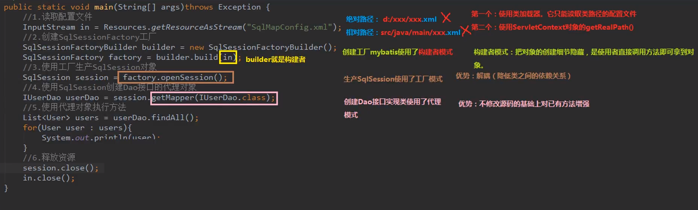
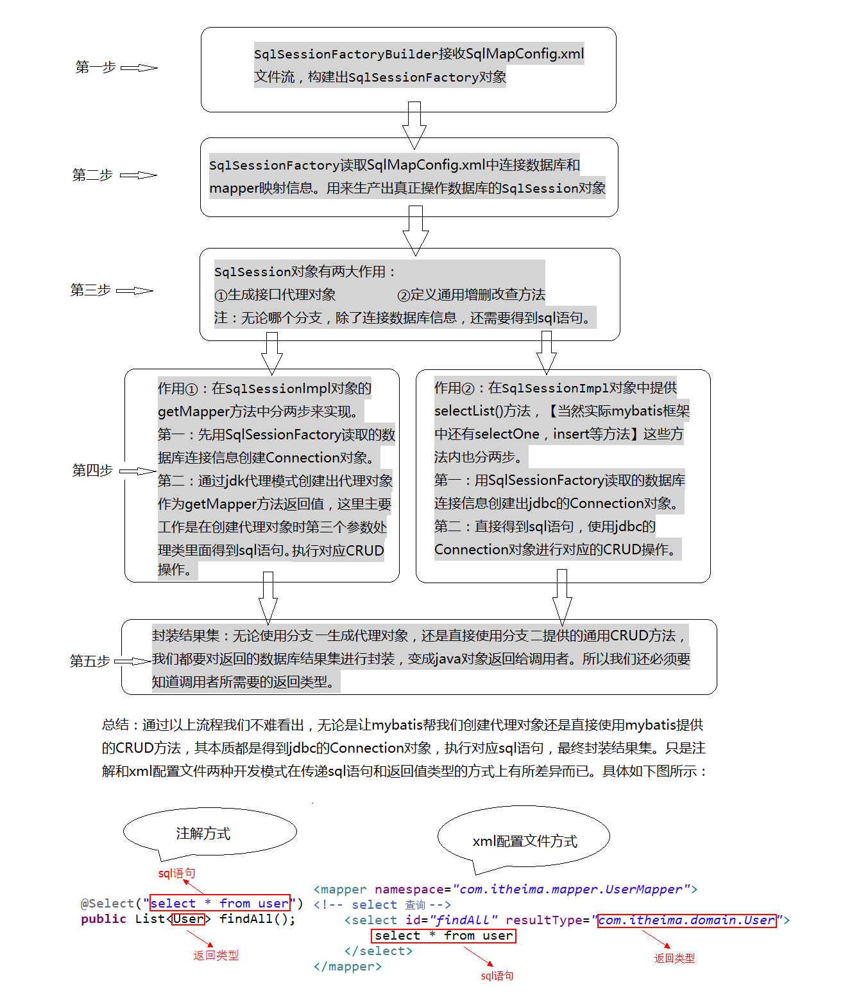

# MyBatis

## 一、MyBatis概述

MyBatis是一个持久层框架, 用Java编写. 它封装了JDBC操作的很多细节, 使得开发者只需要关注sql语句本身, 而无需关注注册驱动, 创建连接等繁杂的过程. 它使用了ORM思想, 实现了结果集的封装.

**ORM**: Object Relational Mapping, 对象关系映射. 简单说, 就是将数据库中的实体类和实体属性, 和Java对象映射起来, 将查询结果转化为Java对象.

## 二、MyBatis入门案例

#### 1. 环境搭建

1. 创建Maven工程
2. 创建实体类和dao接口
3. 创建MyBatis的主配置文件
4. 创建映射配置文件

主配置文件: MyBatisConfig.xml

```xml
<?xml version="1.0" encoding="UTF-8" ?>
<!DOCTYPE configuration
  PUBLIC "-//mybatis.org//DTD Config 3.0//EN"
  "http://mybatis.org/dtd/mybatis-3-config.dtd">

<configuration>
  <!--配置环境-->
  <environments default="development">
    <!--配置MySql的环境-->
    <environment id="mysql">
      <!--配置事务类型-->
      <transactionManager type="JDBC"/>
      <!--配置数据源(连接池)-->
      <dataSource type="POOLED">
        <property name="driver" value="com.mysql.jdbc.Driver"/>
        <property name="url" value="jdbc:mysql://localhost:3306/system"/>
        <property name="username" value="root"/>
        <property name="password" value="123456"/>
      </dataSource>
    </environment>
  </environments>

  <!--配置别名(可选)-->
  <typeAliases>
    <!--第一种方法, type为全类名, alias为别名, 有了别名后就不在区分大小写-->
    <typeAliase type="com.dw.bean.User" alias="User"></typeAliase>

    <!--第二种方法, name为包名, 这样包内的所有类都有了别名, 别名就是类名且不区分大小写-->
    <package name="com.dw.bean"></package>
  </typeAliases>
  
  <!--指定映射配置文件的位置, 每个Dao都有一个独立的映射配置文件-->
  <!--映射文件的文件位置必须与Dao的包结构一致, 如UserDao在com.dw.UserDao下, 那么映射文件路径就应该是com/dw/UserDao.xml-->
  <mappers>
    <!--除了可以通过resource来找到映射文件, 还可以通过url属性来定位映射文件, 如url="file:///D:/com/dw/UserDao.xml"-->
    <mapper resource="com/dw/UserDao.xml"/>
    
    <!--指定dao接口所在的包, 有了它就不用再写<mapper>标签了-->
    <package name="com.dw.dao"></package>
  </mappers>
    
</configuration>
```

映射配置文件: UserDao.xml

```xml
<?xml version="1.0" encoding="UTF-8" ?>
<!DOCTYPE mapper
  PUBLIC "-//mybatis.org//DTD Mapper 3.0//EN"
  "http://mybatis.org/dtd/mybatis-3-mapper.dtd">

<!--类名必须为全类名-->
<mapper namespace="com.dw.UserDao">
  <!--配置findAll方法-->
  <!--id为方法名, resultType为查询结果封装的对象的全类名-->
  <select id="findAll" resultType="com.dw.bean.User">
    select * from user
  </select>
</mapper>
```

#### 2. 使用MyBatis

1. 配置文件方式

```Java
public class Test{
    public static void main(String[] args){
        //1. 读取配置文件
        //Resources是一个Mybatis的类, 内部实现也是通过ClassLoader的getResourceAsStream()方法获取流对象
        InputStream in = Resources.getResourceAsStream("MyBatisConfig.xml");

        //2. 创建SqlSessionFactory工厂
        SqlSessionFactoryBuilder builder = new SqlSessionFactoryBuilder();
        SqlSessionFactory factory = builder.build(in);

        //3. 使用工厂生产SqlSession对象
        SqlSession session = factory.openSession();

        //4. 使用SqlSession对象创建UserDao的代理对象, 所以不用实现UserDao接口
        UserDao userDao = session.getMpapper(UserDao.class);

        //5. 执行Dao对象方法
        List<User> list = userDao.findAll();

        //6. 遍历集合
        list......

        //7. 释放资源(先开后闭)
        session.close();
        in.close();
    }
}
```

2. 注解方式

```xml
<!--
	1. 去掉映射文件
	2. 在List<User> findAll()方法上加上注解 @Select("select * from user")
	3. 修改主配置文件的
-->
<mappers>
    <mapper class="com.dw.dao.UserDao"/>
</mappers>
```

#### 3. 入门案例分析

1. 三种设计模式



2. 流程分析


## 三、 自定义MyBatis框架

#### 1. 开发流程图




## 四、MyBatis基础CRUD操作

#### 1. 查询操作

```xml
<!--配置findAll方法-->
<!--id为方法名, resultType为查询结果封装的对象的全类名-->
<select id="findAll" resultType="com.dw.bean.User">
    select * from user
</select>

<!--
    注意:
    1. 模糊查询时, 传递的参数必须带上%, 否则无法实现模糊查询. 因为like #{userName}不会自带%
    2. 上述查询时, 封装对象的属性和数据库的各属性名字是相同的(在windows中, 大小写不同不影响, Linux中严格区分大小写), 所以查询的结果可以直接封装到对象中, 当封装对象属性名和数据库的各属性名, 不一致时, 就无法完成封装. 这时可以在select语句中取别名, 如 id as userID, sex as userSex... , 也可以在映射配置文件中配置数据库的列名和封装对象属性名的对应关系
-->
<resultMap id="attrMap" type="com.dw.bean.user">
    <!--主键映射-->
    <!--id为对象属性名, column为对应的数据库列名-->
    <id property="userID" column="id"></id>
    <!--非主键映射-->
    <result property="userSex" column="sex"></result>
</resultMap>
<!--同时还需要修改resultType为resultMap="attrMap"-->
```

#### 2. 保存操作

```xml
<!--id为方法名称 parameterType为方法需要的参数类型-->
<!--#{userName}表示User对象的userName属性-->
<insert id="saveUser" parameterType="com.dw.bean.User">
    insert into user(userName, sex) values (#{userName},#{sex})
</insert>

<!--
    注意: 
    1. 在执行对数据库有修改的方法之后, 需要加上 sqlSession.commit(); 来提交事务, 否则事务会回滚导致修改失败. 还可以再创建sqlSession对象时, 使用openSession(true)方法创建, 这样也会自动提交事务.
    2. 因为MyBatis使用了ognl表达式, 所以在parameterType指定了参数是User对象, 那么#{userName}就表示user对象的userName属性, 如果一个A对象中有一个属性a=new B(), 我们需要使用B对象的attr属性作为查询条件, 那么parameterType为A, #{a.attr}表示A对象中的B对象的attr属性
    3. 除了用#{}的方式, 还可以使用 '${name}' 来表示, 但是这样的方式, sql语句是字符串拼接起来的, 存在安全隐患, 而#{}的方式, 是preparedStatement方式, 每一个#{}都是一个?, 更安全.
-->
```

#### 3. 修改操作

```xml
<update id="updateUser" parameterType="com.dw.bean.User">
    update user set userName=#{userName},sex=#{sex} where id=#{id}
<update>
```

#### 4. 删除操作

```xml
<!--这里的parameterType写integer或者int或者INT或者INTEGER或者java.lang.Integer都是可以的-->
<!--#{id}中的id在此处就不代表属性了, 只是一个占位符, 可以是任意名字(只有一个参数时可以)-->
<delete id="deleteUser" parameterType="int">
    delete from user where id=#{id}
<delete>
```


## 五、MyBatis数据库连接池

MyBatis事务通过`<transactionManager>`标签的`type`属性指定事务类型

事务面试常见问题:

1. 什么是事务?
2. 事务四大特性ACID
3. 不考虑隔离性会产生的三个问题
4. 解决办法: 四种隔离级别


## 六、MyBatis动态sql语句

#### 1. `<if>`和`<where>`

```xml
<select id="findByCondition" resultType="com.dw.bean.User" parameterType="com.dw.bean.User">
    select * from user where 1=1

    <!--判断条件, 动态拼接sql语句-->
    <if test="userName != null and userName !='ABC'">
        and userName=#{userName}
    </if>
</select>

<!--
1. 多个条件语句用and连接而不是&&
2. 上述代码, 如果条件判断通过, 则拼接的sql语句就是 select * from user where 1=1 and userName=#{userName}

上述代码还可以使用<where>标签来替代 where 1=1
-->

<select id="findByCondition" resultType="com.dw.bean.User" parameterType="com.dw.bean.User">
    select * from user

    <where>
        <if test="userName != null and userName !='ABC'">
            userName=#{userName}
        </if>
    </where>
</select>
```

#### 2. `<foreach>`

```xml
<!--sql语句: select * from user where id in (41,42,43,44,45);-->

<select id="findInId" resultType="com.dw.bean.user">
    select * from user
    <!--遍历user对象中的idList集合, 取每一个值拼接成一个sql语句-->
    <foreach collection="idList" open="where id in (" close=")" item="oneId" separator=","> 
        #{oneId}
    </foreach>
</select>
```

#### 3. `<sql>`和`<include>`

```xml
<!--有一些经常用到的重复的sql语句, 如select * from user 可以将其抽出来-->

<sql id="selectUserSql">select * from user</sql>

<!--在用到sql语句时, 使用 <include refid="selectUserSql"></include>代替原来的sql语句, 与其他语句拼接-->
```


## 七、MyBatis多表查询

#### 1. 表与表的关系

1. 一对一: 一个人有一个身份证, 一个身份证对应一个人
2. 一对多、多对一: 一个账户对应多个订单, 多个订单对应一个账户
3. 多对多: 一个学生有多个老师, 一个老师教多个学生

在MyBatis中, 把多对一, 也简化成一对一, 如一个订单也只对应一个账户

#### 2. 一对一的情况

有一个订单表和一个账户表, 需要查询某个订单和其对应的账户信息

1. 可以创建一个CountUser类, 继承Count类, 然后添加成员变量, 这些成员变量就是需要的账户信
2. 可以在Count类中添加一个成员变量, 一个User对象. 在查询时, 将查询的关于账户的信息, 自动封装在user对象中. **√**

一般使用第二种方法实现一对一的表的连接, 这时候就需要使用ResultMap来实现user对象和查询数据的映射

```xml
<resultMap id="account_user_map" type="com.dw.bean.account">
    <id property="id" column="aid"></id>
    <result property="udi" column="uid"></result>
    <result property="money" column="money"></result>

    <!--用于查询的用户信息的数据封装到成员变量user对象中-->
    <association property="user"  javaType="com.dw.bean.User">
        <id property="id" column="id"></id>
        <result property="name" column="name"></result>
        <result property="sex" column="sex"></result>
    </association>
</resultMap>
```

#### 3. 一对多的情况

查询一个用户的信息和其所有账户信息. 在User对象中创建一个Count对象集合List<Count> counts, 这就是一对多的关系

```xml
<resultMap id="user_count_map" type="com.dw.bean.User">
    <id property="id" column="id"></id>
    <result property="name" column="name"></id>
    
    <collection property="counts" ofType="com.dw.bean.count">
        <id property="aid" column="aid"></id>
        <result property="uid" column="uid"></result>
        <result property="money" column="money"></result>
    </collection>
<resultMap>
```

#### 4. 多对多的情况

一个学生上多个老师的课, 一个老师教多个学生. 

多对多的关系结构需要三张表表示, 除了学生表和教师表, 还需要加上一个中间表, 用于记录学生和老师之间的关系. 

多对多的关系实际上可以分成两个一对多的关系, 所以解决办法也是和一对多的情况相同.


## 八、MyBatis延迟加载

#### 1. 引入

用户表和账户表是一对多的关系, 用户对象里有一个List集合, 用以储存对应的account对象. 在原来的sql语句中, 查询一个用户, 就会自动查询与他相对应的账户信息, 封装在List集合中, 这是立即加载. 但是这个账户信息, 不一定会被使用, 如果不被使用, 则查找没有意义, 浪费了资源, 所以应该应用延迟加载, 当需要使用这个List集合时, 才去执行查询操作, 这样可以节省资源.

#### 2. 延迟加载与立即加载

1. 延迟加载:  需要使用数据时才发起查询, 不需要时不查询. 也叫按需加载(懒加载)
2. 立即加载: 不管需不需要调用方法立即执行查询

#### 3. 延迟加载与立即加载应用场景

1. 一般在一对多或多对多时, 应该应用延迟加载
2. 一般在多对一或一对一时, 应该应用立即加载

#### 4. 一对一延迟加载

查询账户, 账户对象中有一个User对象, 封装账户对应的用户信息

```xml
<!--1. 在主配置文件中开启延迟加载-->
<configuration>
    <settings>
        <setting name="lazyLoadingEnable" value="true"></setting>
    </settings>
</configuration>

<!--2. 修改查询账户方法的resultMap-->
<resultMap id="map">
    <id property="id" column="id"></id>
    <result property="uid" column="uid></result>
    <result property="money" column="money">

    <!--select指定延迟加载的方法, 这里是User的findById方法-->
    <!--findById需要一个id参数, 这里的column就是指定这个参数, 表示数据库的uid属性作为参数来查询User, 所以在延迟加载中column这个属性是必不可少的-->
    <!-- 如果column需要传递多个参数, 可以使用colunm={a=xxx, b=xxx}的格式 -->
    <association property="user" column="uid" javaType="com.dw.bean.User" select="com.dw.UserDao.findById"><association>
</resultMap>

<select id="findAllAccount" resultMap="map">
    select * from account
<select>

<!--在UserDao.xml中-->
<select id="findById" parameterType=""int" resultType="com.dw.bean.user">
    select * from user where id = #{id}
</select>

<!--
	在测试类中, 如果只调用findAllAccount()方法, 是不会执行findById的查询操作的
	如果调用了findAllAccount()方法获取到了account对象, 并且使用了它的user属性, 则会执行findById的查询操作, 把对应的用户信息封装到user对象中
-->
```

#### 5. 一对多的延迟加载

查询一个用户, 用户对象有一个List集合, 保存对应的Account对象

```xml
<!--与上面类似-->
<collection property="AccountList" select="com.dw.AccountDao.findAccountsById" column="id" ofType="account"></collection>
```


## 九、MyBatis缓存

####   1. 缓存的概念

缓存: 存在于内存中, 减少访问数据库的次数, 提高查询效率

+ 什么数据适用缓存: 不经常更改的数据, 数据的正确性(因为缓存与数据库一段时间后可能数据不同)对最终结果影响不大的数据
+ 什么数据不适用缓存: 经常改变的数据

#### 2. 一级缓存

sqlSession对象缓存. 在执行完查询操作后, 查询结果会同时存入sqlSession对象中, 保存结构是Map,

当我们再一次查询相同的数据时, 会先查询sqlSession对象中有没有缓存数据. 

sqlSession对象关闭后或者调用clearCache()方法后, 缓存清空.

当调用sqlSession的修改、添加、删除、commit()等方法后, 缓存清空

如果两次查询数据一致, 第二次通过sqlSession缓存获取到的数据对象与第一次查询获取的数据对象是同一个

#### 3. 二级缓存

sqlSessionFactory对象缓存, 由同一个sqlSessionFactory对象创建的sqlSession共享该缓存.

当两次查询数据一致, 并通过二级缓存获取数据时, 第二次获取的数据对象和第一次不同

#### 4. 使用二级缓存

1. 在主配置文件中配置

```xml
<settings>
    <setting name="cacheEnable" value="true"></setting>
</settings>
```

2. 在映射文件中配置

```xml
<cache/>
```

3. 在查询标签中设置

```xml
<select useCache="true" ...>
    ...
</select>
```

## 十、MyBatis注解开发

#### 1. 环境搭建

环境搭建还是需要主配置文件, 注解开发可以替代映射配置文件, 主配置文件的`<mappers>`中的`<mapper>`, 使用class属性来完成映射, 也可以通过`<package>`完成映射

#### 2. CRUD操作

```java
@Select("select * from user")

@Insert( "insert into user(userName, sex) values(#{userName}, #{sex})" )

@Update("update user set userName=#{userName}")

@Delete("delete from user where userName=#{userName}")

//当方法有多个参数时:
@Insert( "insert into user_role(userId, roleId) values(#{userId}, #{roleId})" )
public void addUser(@Param("userId") String uId, @Param("roleId") String rId)
```

#### 3. 数据库属性名与对象属性名映射

```java
//在方法上加注释
@Results(id="userMap", value={
    @Result(id=true, column="id", property="userId")
    @Result(column="name", property="userName")
})

//其他方法可以引用上面的配置
@ResultMap(value={"userMap"})
```

#### 4. 一对一查询

```java
@Results(id="userMap", value={
    @Result(id=true, column="id", property="userId")
    @Result(column="name", property="userName")
    @Result(property="user", column="uid", one=@One(select="com.dw.UserDao.findById", fetchType=FetchType.LAZY))
})

fetchType.LAZY: 延迟加载
fetchType.EAGER: 立即加载
```

#### 5. 一对多查询

```java
@Results(id="userMap", value={
    @Result(id=true, column="id", property="userId")
    @Result(column="name", property="userName")
    @Result(property="accountList", clumn="id", many=@Many(select="com.dw.AccountDao.findAccountsById", fetchType=FetchType.LAZY))
})
```

#### 6. 配置二级缓存

```java
//1. 首先在主配置文件中配置
//2. 然后再Dao类上配置
@CacheNamespace(blocking=true)
```

#### 7. 配置别名

```java
//在类名上添加注解
@Alias(value="user")
```


