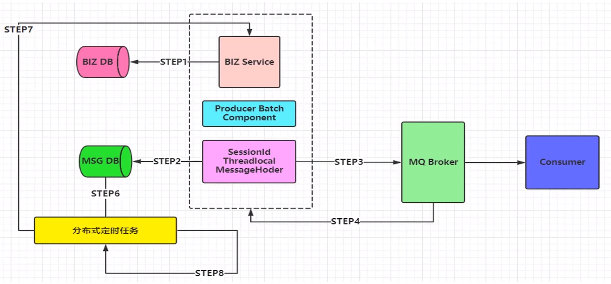

## 一、消息中间件

### 1. 消息队列(MQ)

在高并发环境下，由于来不及同步处理，请求往往会发生堵塞，比如说，大量的insert，update之类的请求同时到达MySQL，直接导致无数的行锁表锁，甚至最后请求会堆积过多，从而触发连接错误。通过使用消息队列，我们可以异步处理请求，从而缓解系统的压力。

### 2. 消息中间件

消息中间件利用高效可靠的消息传递机制进行==平台无关==的数据交流，并基于数据通信来进行分布式系统的集成。通过提供消息传递和消息排队模型，它可以在分布式环境下扩展进程间的通信。对于消息中间件，常见的角色大致也就有Producer（生产者）、Consumer（消费者）

### 3. 消息中间件常见应用场景

#### (1) 异步处理

如用户注册功能, 注册后需向用户发送手机短信和电子邮件. 如果采用传统串行方式, 那么需要等待三个操作都完成后才能将结果返回给用户, 用户等待时间长.

因为发送短信和邮件并不是最核心的业务逻辑, 所以可以通过消息队列来进行异步处理, 这样用户的等待时间就只有注册信息写入数据库的时间和写入消息队列的时间(该时间极小).

#### (2) 解耦

如A系统发送数据给B、C、D三个系统, 通过接口调用发送. 后续如果需要增加更多的系统接收A系统的数据或者部分系统取消接收A的数据, 那么A系统就需要不断地修改.

这种情况下, A可以将数据发送到MQ中, 那个系统需要数据就去MQ中去取, 而不再需要A来发送. 这种消息中间件的发布订阅功能实现了系统的解耦.

#### (3) 削峰

如电商平台数据库在秒杀时期或购物高峰期每秒需要处理很多请求, 而在其他时间只有少量请求需要处理. 为了保证数据库服务器在高峰期不会挂掉, 可以使用消息中间件来存积请求, 数据库根据自身负载能力从消息中间件中获取请求并处理. 

这样虽然短时间内会有大量请求存积在消息中间件中, 但是可以保证服务器的稳定, 且在高峰期后, 请求变少, 服务器可以快速处理完存积在消息中间件中的请求.


## 二、RabbitMQ概述

### 1. RabbitMQ介绍

> RabbitMQ是实现了高级消息队列协议（AMQP）的开源消息代理软件（亦称面向消息的中间件）RabbitMQ服务器是用Erlang语言编写的，而群集和故障转移是构建在开放电信平台框架上的。所有主要的编程语言均有与代理接口通讯的客户端库。

### 2. RabbitMQ优点

+ 开源、性能优秀、稳定性保障
+ 提供可靠性消息投递模式(confirm)、返回模式(return)
+ 与SpringAMPQ完美整合, API丰富
+ 集群模式丰富、表达式配置、HA模式、镜像队列模型
+ 在保证数据不丢失的情况下做到高可靠性、高可用性

### 3. RabbitMQ高性能原因

RabbitMQ高性能的原因是因为它是用Erlang语言编写的.

Erlang语言最初在于交换机领域的架构模式, 它有着和原生Socket一样的延迟.

### 4. 高级消息队列协议(AMQP)

#### (1) 概念

> AMPQ是具有现代特征的二进制协议. 是一个提供统一消息服务的应用层标准高级消息队列协议, 是应用层协议的一个开放标准, 为面向消息的中间件设计.

#### (2) AMQP模型


#### (3) AMQP核心概念

+ **Server:** 又称Broker, 接收客户端的连接, 实现AMPQ实体服务
+ **Connection:** 连接, 应用程序与Broker的网络连接
+ **Channel:** 网络信道, 几乎所有的操作都在Channel中进行, Channel是进行消息读写的通道. 客户端可建立多个Channel, 每个Channel代表一个会话任务.
+ **Message:** 消息, 服务器和应用程序之间传送的数据. 由Properties和Body组成. Properties可以对消息进行修饰, 比如消息的优先级、延迟等高级特性; Body就是消息体内容.
+ **Virtual host:** 虚拟地址, 用于进行==逻辑隔离==, 最上层的消息路由. 一个Virtual host里可以由若干个Exchange和Queue, 同一个Virtual host里面不能有相同名称的Exchange或Queue
+ **Exchange:** 交换机, 接收消息, 根据路由键转发消息到绑定的队列(注意队列要与交换机绑定).
+ **Binding:** Exchange和Queue之间的虚拟连接, Binding中可以包含路由键(routing key), 这个路由键就是用来匹配Queue和Message的.
+ **Routing key:** 一个路由规则, Virtual host可用它确定如何路由一个特定消息. 比如在Direct Exchange中, 当队列的Routing Key与消息的Routing Key一致时, 交换机就会将消息存入该队列.
+ **Queue:** 也成为Message Queue, 消息队列, 保存消息并将它们转发给消费者

#### (4) RabbitMQ架构图


## 三、RabbitMQ安装

1. 准备编译环境

    ```shell
    yum install 
    build-essential openssl openssl-devel unixODBC unixODBC-devel 
    make gcc gcc-c++ kernel-devel m4 ncurses-devel tk tc xz
    ```

2. 下载相关rpm包(这里使用rpm安装方式, 可以自动进行配置环境变量等操作, 更适合初学者)

    因为RabbitMQ是由Erlang语言编写的, 所以需要先安装Erlang.

    socat也是其依赖环境

    ```shell
    rpm -ivh erlang-18.3-1.el7.centos.x86_64.rpm
    rpm -ivh socat-1.7.3.2-5.el7.lux.x86_64.rpm
    rpm -ivh rabbitmq-server-3.6.5-1.noarch.rpm
    ```

3. 修改配置文件

    配置文件是以json格式编写的, 可进行相应的更改.

    修改loopback_users中的<<"guest">>替换为guest

    ```shell
    vim /usr/lib/rabbitmq/lib/rabbitmq_server-3.6.5/ebin/rabbit.app
    ```

4. 通过`rabbitmq-server start &`启动, 其中&表示后台启动

5. 通过`rabbitmq-plugins enable rabbitmq-management`安装管控台插件, 安装后可以通过`15672`端口访问图形化管理界面

6. 通过`rabbitmqctl app_stop`停止服务


## 四、RabbitMQ基础

### 1. 命令行操作

RabbitMQ中的命令有三种开头, 分别是`rabbitmq-server`、`rabbitmqctl`、`rabbitmq-plugins`. 其中`rabbitmqctl`功能最丰富, `rabbitmq-plugins`用于插件管理.

==另外, 大多数命令行能完成的操作, 在图形化管控台中也可以完成.==

+ `rabbitmqctl start_app` : 开启应用
+ `rabbitmqctl stop_app` : 关闭应用
+ `rabbitmqctl status` : 查看节点状态

### 2. RabbitMQ Exchange

#### (1) 属性

+ **Name:** 交换机名称
+ **Type:** 交换机类型direct、topic、fanout、headers
+ **Durability:** 持久化
+ **Auto delete:** 当最后绑定在Exchange上的队列删除后, 自动删除该Exchange
+ **Internal:** 是否用于RabbitMQ内部使用, 默认为false
+ **Arguments:** 扩展参数, 用于扩展AMQP协议定制化使用

#### (2) Exchange类型

+ **Direct Exchange**

    在代码创建Exchange时, 需要将队列、Exchange、Routing Key三者绑定在一起.

    所有发送到Direct Exchange的消息会被转发到消息Routing Key与队列Routing Key相同的队列.

+ **Topic Exchange**

    发送到Topic Exchange中的消息, 会被转发到与消息有相同Topic的队列中.

    可以模糊匹配Topic, 其中#表示一个或多个词, *表示一个词.

     比如消息Routing Key为user.name, 那么其可以发送到Routing Key为user.#的队列中

    


+ **Fanout Exchange**

    无需Routing Key, 发送到Fanout Exchange的消息, 会转发给其所有绑定的队列.

    

### 3. RabbitMQ Java API

1. 导入相关jar包: `amqp-client`

2. 编写Producer类

    ```java
    package com.bfxy.rabbitmq.quickstart;
    
    import com.rabbitmq.client.Channel;
    import com.rabbitmq.client.Connection;
    import com.rabbitmq.client.ConnectionFactory;
    
    public class Procuder {
    
    	
    	public static void main(String[] args) throws Exception {
    		//1 创建一个ConnectionFactory, 并进行配置
    		ConnectionFactory connectionFactory = new ConnectionFactory();
    		connectionFactory.setHost("192.168.11.76");
    		connectionFactory.setPort(5672);
    		connectionFactory.setVirtualHost("/");
    		
    		//2 通过连接工厂创建连接
    		Connection connection = connectionFactory.newConnection();
    		
    		//3 通过connection创建一个Channel
    		Channel channel = connection.createChannel();
    		
    		//4 通过Channel发送数据
    		for(int i=0; i < 5; i++){
    			String msg = "Hello RabbitMQ!";
    			//参数1 exchange  参数2 routingKey  参数3 properties  参数4 body
    			channel.basicPublish("", "test001", null, msg.getBytes());
    		}
    
    		//5 记得要关闭相关的连接
    		channel.close();
    		connection.close();
    	}
    }
    ```

3. 编写Consumer类

    ```java
    package com.bfxy.rabbitmq.quickstart;
    
    import com.rabbitmq.client.Channel;
    import com.rabbitmq.client.Connection;
    import com.rabbitmq.client.ConnectionFactory;
    import com.rabbitmq.client.Envelope;
    import com.rabbitmq.client.QueueingConsumer;
    import com.rabbitmq.client.QueueingConsumer.Delivery;
    
    public class Consumer {
    
    	public static void main(String[] args) throws Exception {
    		
    		//1 创建一个ConnectionFactory, 并进行配置
    		ConnectionFactory connectionFactory = new ConnectionFactory();
    		connectionFactory.setHost("192.168.11.76");
    		connectionFactory.setPort(5672);
    		connectionFactory.setVirtualHost("/");
    		
    		//2 通过连接工厂创建连接
    		Connection connection = connectionFactory.newConnection();
    		
    		//3 通过connection创建一个Channel
    		Channel channel = connection.createChannel();
    		
    		//4 声明（创建）一个队列
    		String queueName = "test001";
            //参数2 队列持久化  参数3 独占队列  参数4 是否自动删除(最后一个监听被移除后队列会被自动删除)  参数5 其他参数(此处为一个Map<String, Object>对象)
    		channel.queueDeclare(queueName, true, false, false, null);
    		
    		//5 创建消费者
    		QueueingConsumer queueingConsumer = new QueueingConsumer(channel);
    		
    		//6 设置Channel
            //参数2 autoask 消费者收到broker的消息后, 会返回一个ask签收信息, 这里指定是否自动签收
    		channel.basicConsume(queueName, true, queueingConsumer);
    		
    		while(true){
    			//7 获取消息
    			Delivery delivery = queueingConsumer.nextDelivery();
    			String msg = new String(delivery.getBody());
    			System.err.println("消费端: " + msg);
    			//Envelope envelope = delivery.getEnvelope();
    		}
    		
    	}
    }
    ```

**注意:**

+ 我们在生产者端通过channel发送信息时并没有指定对应的exchange, 但是消费者还是收到了生产者的消息. 这是因为在不指定exchange的情况下, 默认会有一个default exchange, 此时会从所有队列中匹配与routing key相同名字的队列, 将消息保存到该队列中.
+ 当消费者接收到消息后, 该消息就会从消息队列中删除.


## 五、RabbitMQ高级

### 1. 如何保证消息100%投递成功?

#### (1) 消息落库, 对消息状态进行打标(更新消息状态)

首先除了业务入库外(BIZ DB), 消息也应该入库(MSG DB), 当消息发送到MQ Broker时, Broker返回一个确认, 然后更新数据库中消息的状态.

这个过程中会添加一个分布式定时任务, 当定时时间到时, 会检查消息数据库中消息的状态, 如果状态为0则重新给Broker发送一次消息, 当然重发也应该有次数限制.


#### (2) 消息的延迟投递, 做二次确认, 回调检查

首先只需要将业务入库(BIZ DB), 发送消息给MQ Broker, 并且在延迟一段时间后再发送一次消息.

当消费者端监听到生产者的消息后, 收到消息后会发送一个确认消息给Broker.

CallBack service负责监听这个确认消息, 当监听到确认消息后, 说明消息投递成功, 并将消息写入数据库(MSG DB).

CallBack service同时还负责监听延迟消息, 监听到延迟消息后, 会从数据库中查询是否有对应的消息, 如果没有则会让生产者再次发送该消息.

这种方法与第一种方法相比, 减少了发送消息前数据库的写入次数, 提高了并发量和效率. 消息入库被单独成一个服务, 这个服务是作为一个补充的服务, 并不在核心链路上, 这样的解耦使得在高并发情况下核心链路的并发量得到提高.


### 2. 幂等性问题

#### (1) 什么是幂等性?

一次和多次请求某一个资源对于资源本身应该具有同样的结果（网络超时等问题除外）。也就是说，其任意多次执行对资源本身所产生的影响均与一次执行的影响相同。

这里需要关注几个重点：

+ 幂等不仅仅只是一次（或多次）请求对资源没有副作用（比如查询数据库操作，没有增删改，因此没有对数据库有任何影响）。

+ 幂等还包括第一次请求的时候对资源产生了副作用，但是以后的多次请求都不会再对资源产生副作用。

+ 幂等关注的是以后的多次请求是否对资源产生的副作用，而不关注结果。

+ 网络超时等问题，不是幂等的讨论范围。

#### (2) 什么情况下需要幂等?

业务开发中，经常会遇到重复提交的情况，无论是由于网络问题无法收到请求结果而重新发起请求，或是前端的操作抖动而造成重复提交情况。 在交易系统，支付系统这种重复提交造成的问题有尤其明显，比如：

+ 用户在APP上连续点击了多次提交订单，后台应该只产生一个订单；

+ 向支付宝发起支付请求，由于网络问题或系统BUG重发，支付宝应该只扣一次钱。 

很显然，声明幂等的服务认为，外部调用者会存在多次调用的情况，为了防止外部多次调用对系统数据状态的发生多次改变，将服务设计成幂等。

以SQL为例，有下面三种场景，只有第三种场景需要开发人员使用其他策略保证幂等性：

1. `SELECT col1 FROM tab1 WHER col2=2`，无论执行多少次都不会改变状态，是天然的幂等。
2. `UPDATE tab1 SET col1=1 WHERE col2=2`，无论执行成功多少次状态都是一致的，因此也是幂等操作。
3. `UPDATE tab1 SET col1=col1+1 WHERE col2=2`，每次执行的结果都会发生变化，这种不是幂等的。

#### (3) 幂等与防重

重复提交是在第一次请求已经成功的情况下，人为的进行多次操作，导致不满足幂等要求的服务多次改变状态。

而幂等更多使用的情况是第一次请求不知道结果（比如超时）或者失败的异常情况下，发起多次请求，目的是多次确认第一次请求成功，却不会因多次请求而出现多次的状态变化。 

#### (4) 如何保证幂等

幂等需要通过**唯一的业务单号**来保证。也就是说相同的业务单号，认为是同一笔业务。使用这个唯一的业务单号来确保，后面多次的相同的业务单号的处理逻辑和执行效果是一致的。 下面以支付为例，在不考虑并发的情况下，实现幂等很简单：①先查询一下订单是否已经支付过，②如果已经支付过，则返回支付成功；如果没有支付，进行支付流程，修改订单状态为‘已支付’。 

#### (5) 防重复提交策略

上述的保证幂等方案是分成两步的，第②步依赖第①步的查询结果，无法保证原子性的。在高并发下就会出现下面的情况：第二次请求在第一次请求第②步订单状态还没有修改为‘已支付状态’的情况下到来。

既然得出了这个结论，余下的问题也就变得简单：把查询和变更状态操作加锁，将并行操作改为串行操作。

**乐观锁**
如果只是更新已有的数据，没有必要对业务进行加锁，设计表结构时使用乐观锁，一般通过version来做乐观锁，这样既能保证执行效率，又能保证幂等。例如： UPDATE tab1 SET col1=1,version=version+1 WHERE version=#version# 不过，乐观锁存在失效的情况，就是常说的ABA问题，不过如果version版本一直是自增的就不会出现ABA的情况。（从网上找了一张图片很能说明乐观锁，引用过来，出自Mybatis对乐观锁的支持） 

**防重表**
使用订单号orderNo做为去重表的唯一索引，每次请求都根据订单号向去重表中插入一条数据。第一次请求查询订单支付状态，当然订单没有支付，进行支付操作，无论成功与否，执行完后更新订单状态为成功或失败，删除去重表中的数据。后续的订单因为表中唯一索引而插入失败，则返回操作失败，直到第一次的请求完成（成功或失败）。可以看出防重表作用是加锁的功能。

**分布式锁**
这里使用的防重表可以使用分布式锁代替，比如Redis。订单发起支付请求，支付系统会去Redis缓存中查询是否存在该订单号的Key，如果不存在，则向Redis增加Key为订单号。查询订单支付已经支付，如果没有则进行支付，支付完成后删除该订单号的Key。通过Redis做到了分布式锁，只有这次订单订单支付请求完成，下次请求才能进来。相比去重表，将放并发做到了缓存中，较为高效。思路相同，同一时间只能完成一次支付请求。 

**token令牌**
这种方式分成两个阶段：申请token阶段和支付阶段。 第一阶段，在进入到提交订单页面之前，需要订单系统根据用户信息向支付系统发起一次申请token的请求，支付系统将token保存到Redis缓存中，为第二阶段支付使用。 第二阶段，订单系统拿着申请到的token发起支付请求，支付系统会检查Redis中是否存在该token，如果存在，表示第一次发起支付请求，删除缓存中token后开始支付逻辑处理；如果缓存中不存在，表示非法请求。 实际上这里的token是一个信物，支付系统根据token确认，你是你妈的孩子。不足是需要系统间交互两次，流程较上述方法复杂。 

**支付缓冲区**
把订单的支付请求都快速地接下来，一个快速接单的缓冲管道。后续使用异步任务处理管道中的数据，过滤掉重复的待支付订单。优点是同步转异步，高吞吐。不足是不能及时地返回支付结果，需要后续监听支付结果的异步返回。

#### (6)导致消息出现非幂等的原因

+ 可靠性消息投递机制, 当消息发送给broker后, broker的confirm未成功发送给生产者导致生产者又给broker发送了一条消息
+ broker与消费端通信中的网络抖动, 消费端额ack未成功发送给broker
+ 消费端故障或异常

#### (7) 消费端如何避免重复消费?

+ 唯一ID+指纹码机制, 利用数据库主键去重

    根据消息生成唯一的ID, 消息入库时ID作为主键, 利用主键机制确保消息不重复。

    **注意:** 

    本地ID生成服务作为统一ID生成服务的备用服务, 在统一ID生成服务不工作时启用。

    消费端消息是先入库并检查是否重复, 再进行消息处理。

    根据ID规则路由到不同的数据库, 是为了解决单个数据库负载过大的情况。

    

+ 利用Redis原子性实现

    利用Redis实现幂等, 需要考虑这些问题:

    1. 如果消息需要入库, 数据库和缓存之间如何做到原子性? (可能存在缓存中有但是未成功写入数据库)
    2. 如果不进行入库, 那么保存在缓存中, 如何设置定时同步策略?

### 3. Confirm确认消息机制


当生产者发送了消息给Broker后, Broker会发送一个confirm消息给生产者, 此时生产者会监听这个消息, 如果收到表示成功投递.

Confirm确认消息机制, 需要通过代码手动开启. 详情见代码示例.

### 4. Return机制


当生产者产生的消息, 在发送给Broker时无法匹配到对应的队列, 那么就会给生产者发送一个Return消息.

Return机制默认时关闭的, 需要手动开启. 它取决于一个重要的配置: Mandatory, 默认为false. 

在未开启的情况下, Broker收到无法匹配的消息会直接删除.

### 5. 自定义消费者

在实际开发中, 我们会自定义一个消费者并`extends DefaultConsumer`, 通过其`handleDelivery()`方法处理消息.

```java
//自定义MyConsumer
public class MyConsumer extends DefaultConsumer {


	public MyConsumer(Channel channel) {
		super(channel);
	}

	@Override
	public void handleDelivery(String consumerTag, Envelope envelope, AMQP.BasicProperties properties, byte[] body) throws IOException {
		System.err.println("-----------consume message----------");
		System.err.println("consumerTag: " + consumerTag);
		System.err.println("envelope: " + envelope);
		System.err.println("properties: " + properties);
		System.err.println("body: " + new String(body));
	}


}

//在Consumer类中, 通过下面的代码监听消息
channel.basicConsume(queueName, true, new MyConsumer(channel));
```

### 6. 消费端ACK、NACK、TTL

消费端收到消息后可以通过ACK(手动或自动)对Broker做出应答, 当然也可以对消息进行NACK使其重返队列.

TTL是Time To Live的缩写, 也就是生存时间. 指定了TTL的值后, 队列中的消息会在指定时间(毫秒)后被删除.

TTL是队列的属性, 针对队列中每一条消息有效的, 而消息的expiration属性是针对单个消息的. 

### 7. 消费端限流

假如Broker中存储了成千上万条消息, 这个时候随便开启一个消费者客户端, 巨量的消息全部推送过来, 这个时候单个客户端无法同时处理这么多的消息, 所以会造成崩溃. 所以我们需要进行消费端限流.

RabbitMQ提供了一种qos(服务质量保证)功能, 即在非自动确认消息的前提下, 如果一定数量的消息未被确认, 那么不在消费新的消息.

```java
//设置消费者的最大处理数
//第一个参数表示消息的大小限制, 0表示不限制
//第二个参数表示同时处理的最大消息数
//第三个参数表示限制范围是否是global. 如果是true则表示所有使用该channel的客户端都进行限制, false表示对单个消费者客户端进行限制
channel.basicQos(0, 1, false);

//如果要进行限制, 需要先将自动应答autoask设置为false
channel.basicConsume(queueName, false, new MyConsumer(channel));

//在处理消息时, 需要手动应答
channel.basicAck(envelope.getDeliveryTag(), false);
```

### 8. DLX死信队列

DLX, Dead-Letter-Exchange

利用DLX, 当消息在一个队列中变成死信(dead message)之后, 它能被重新publish到另一个Exchange, 这个Exchange就是DLX.

==死信队列本质就是一个普通的Exchange.==

**消息进入死信队列的情况:**

1. 消息被NACK且requeue被设置为false
2. 消息TTL过期
3. 队列达到最大长度

如果想要队列中的死信消息进入死信队列, 则需要设置队列的参数

```java
Map<String, Object> agruments = new HashMap<String, Object>();
//dlx.exchange为死信队列的名字
agruments.put("x-dead-letter-exchange", "dlx.exchange");
//这个agruments属性，要设置到声明队列上
channel.queueDeclare(queueName, true, false, false, agruments);
channel.queueBind(queueName, exchangeName, routingKey);

//创建一个死信队列
channel.exchangeDeclare("dlx.exchange", "topic", true, false, null);
channel.queueDeclare("dlx.queue", true, false, false, null);
channel.queueBind("dlx.queue", "dlx.exchange", "#");
```


## 六、RabbitMQ+Spring

### 1. 核心组件

+ **ConnectionFactory:**

    封装了与RabbitMQ服务器的相关连接信息

+ **RabbitMQAdmin:**

    用于操作RabbitMQ的Exchange、Queue、Binding、RoutingKey

    底层实现是通过Spring容器获取Exchange、Bingding、RoutingKey、Queue的@Bean声明。然后调用RabbitTemplate的execute方法执行对应的操作。

+ **SpringAMQP声明:**

+ **RabbitTemplate:**

    用于发送消息的关键类

    该类提供了丰富的发送消息方法, 包括可靠性投递消息方法、回调监听消息接口ConfirmCallback、返回值确认接口ReturnCallback等。将该类对象注入容器即可直接使用。

    在与spring整合时需要实例化, 在与spring boot整合时在配置文件中添加配置即可。

+ **SimpleMessageListenerContainer:**

    简单消息监听容器, 用于消费端的相关设置。注入容器后即可使用。

    设置事务特性、事务管理器、事务属性、事务容量(并发)、是否开启事务、回滚消息

    设置消费者数量、最小最大数量、批量消费

    设置消息确认和自动确认模式、是否重回队列、异常捕获、handler函数

    设置消费者标签生成策略、是否独占模式、消费属性等

    设置具体监听器、消息转换器

    SimpleMessageListenerContainer支持在应用运行时动态改变设置。

+ **MessageListenerAdapter:**

    消息监听适配器。通过自己定义一个消息监听适配器, 完成对消息的监听和处理。

    通过SimpleMessageListenerContainer的setMessageListener()方法进行设置。

+ **MessageConverter:**

    消息转化器, 解决消息监听适配器自定义消息处理方法的参数类型问题。

    通过`adapter.setMessageConverter(new TextMessageConverter());`设置。


## 七、RabbitMQ+Spring Boot

RabbitMQ与Spring Boot整合后, 主要配置都是通过`applcation.properties`来完成的

`RabbitTemplate`都是已经注入了容器, 直接@Autowired即可


## 八、RabbitMQ集群架构

### 1. 常见集群架构模式

#### (1) 主备模式

一个节点作为主节点, 一个节点作为从节点, 当主节点发生故障时从节点代替主节点工作, 在主节点正常的情况下从节点不提供服务。适合数据量小的应用场景。


#### (2) 远程模式

当一个节点的消息队列业务繁忙时可以调用远程另外一个节点处理业务。可以有效缓解单个节点的压力。


#### (3) 镜像模式

多个节点的镜像队列之间共享消息, 保持消息同步


#### (4) 多活模式

节点之间可以设计为镜像模式, 节点集之间可以通过Federation插件进行数据同步。

注意: Federation插件是进行节点与节点之间的数据同步而不是节点集之间。如果节点集中使用镜像模式, 则只需要黄色集中一个节点与绿色集中一个节点通过Federation保持同步即可。


### 2. HAProxy+Keepalived

#### (1) HAProxy

> HAProxy提供**高可用性、负载均衡以及基于TCP和HTTP应用的代理**，支持虚拟主机，它是免费、快速并且可靠的一种解决方案。HAProxy特别适用于那些负载特大的web站点，这些站点通常又需要会话保持或七层处理。HAProxy运行在当前的硬件上，完全可以支持数以万计的并发连接。并且它的运行模式使得它可以很简单安全的整合进您当前的架构中， 同时可以保护你的web服务器不被暴露到网络上。

#### (2) Keepalived

> Keepalived的作用是检测服务器的状态，如果有一台web服务器宕机，或工作出现故障，Keepalived将检测到，并将有故障的服务器从系统中剔除，同时使用其他服务器代替该服务器的工作，当服务器工作正常后Keepalived自动将服务器加入到服务器群中，这些工作全部自动完成，不需要人工干涉，需要人工做的只是修复故障的服务器。

### 3. 延迟队列

延迟队列不会在生产者发送消息后立即将消息放入队列, 而是在设定的延迟时间过后才将消息加入队列。

延迟消息可以实现消息的延迟推送、定时任务、消息重试策略、业务削峰限流、降级的异步延迟消息机制。

1. 下载延迟队列插件
2. 将插件放到指定文件
3. 启动插件

发送到延迟队列的消息需要在消息头中通过`x-delay`属性设置延迟时间。


## 九、互联网大厂SET(单元化)架构

### 1. 架构演变

随着互联网公司业务的多元化发展, 单个大型分布式体系集群, 通过加机器和集群内部拆分(kv、mq、mysql等)虽然具备了一定的可扩展性。但是, 随着业务量的进一步增长, 整个集群规模逐渐变得巨大, 从而在某个点上达到瓶颈。并且当大集群内核心服务出现问题时, 会影响全网所有用户。

后来, 诞生出了"同城双活"和"两地双中心"架构, 但是冷备中心随时待命会造成资源浪费且本质上数据仍然是单点写, 数据库瓶颈没有解决。

随后出现了单元化结构, 并广泛应用于互联网大厂。

### 2. SET化架构

SET化架构的核心是将核心业务作为一个单元, 并部署多个这样的单元。用户通过路由规则路由到不同的单元调用服务。同时还有一个中心单元, 主要提供非核心业务的服务。

如: 美团将其外卖业务作为一个单元, 部署到各个城市。用户的服务请求会根据其所在地路由到当地的单元进行处理。而类似如修改头像等非核心业务则部署在中心单元, 全国所有用户的修改头像请求都在中心单元处理。


**注意:**

+ SET化架构解决了容灾问题、能够实现高效的本地化服务、且可通过docker实现集装箱式扩展
+ 全局数据(如商店菜品)部署在中心单元, 其他单元集群同步数据到本单元
+ 每个单元集群前期只储存本单元产生的数据, 后期进行双向数据同步, 实现容灾需求


## 十、MQ组件架构设计

### 1. MQ架构设计方案


### 2. 几种消息发送模式

#### (1) 迅速消息发送


#### (2) 确认消息发送

消息入库, 业务入库。通过定时任务检查数据库中消息状态, 实现可靠性投递。


#### (3) 批量消息发送

将消息打包成集合, 批量发送。



#### (4) 延迟消息发送

利用延迟队列插件实现消息的延迟发送。

应用场景: 订单7天自动确认收货、红包过期处理...

#### (5) 顺序消息发送

消费者每接收到一条消息就将其入库(顺序消息都具有同一会话ID), 在消息入库的同时给自身发送一个延迟消息, 延迟时间到后检查是否已经收到所有的消息, 如果全收到则顺序进行业务处理, 反之则根据需求进行补偿机制。


#### (6) 事务消息发送

一般大型互联网项目都不会使用事务机制, 因为会对性能造成极大影响。但是在互联网金融行业, 则必须要使用事务机制确保不会出错。

传统的RabbitMQ事务和Spring集成事务机制, 在性能测试中, 效果不理想, 非常消耗系统资源且会造成阻塞现象, 所以不建议使用。

一般采用类似可靠性投递的补偿机制来实现事务机制。这就要求业务操作DB1和消息记录操作DB2这两个数据库必须<u>使用同一数据源(同时失败同时成功)</u>。然后利用重写`Spring DataSourceTransactionManager`在本地事务提交的时候发送消息, 这时候可能出现事务提交成功但是消息发送失败的情况, 这个时候需要利用补偿机制进行补偿。

主要思路总结就是保证业务和消息入库的一致性, 对消息失败情况进行补偿。

重写`DataSourceTransactionManager`的方法就是继承它并改写相关方法


