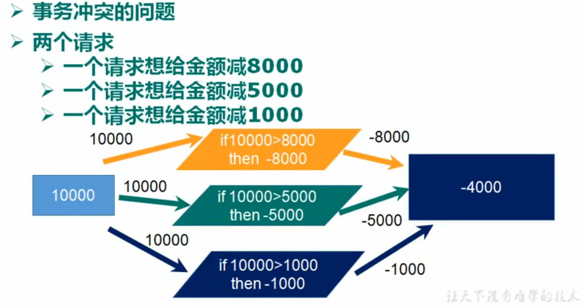
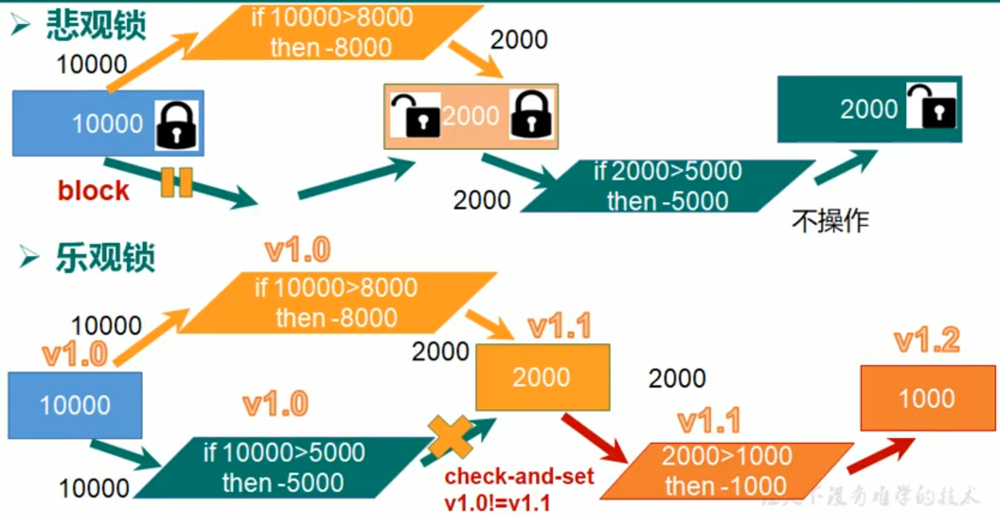

# Redis

## 一、 NOSQL与Redis简介

#### 1. NOSQL介绍

> NoSQL(NoSQL = Not Only SQL)，意即“不仅仅是SQL”，是一项全新的数据库理念，泛指非关系型的数据库。随着互联网web2.0网站的兴起，传统的关系数据库在应付web2.0网站，特别是超大规模和高并发的SNS类型的web2.0纯动态网站已经显得力不从心，暴露了很多难以克服的问题，而非关系型的数据库则由于其本身的特点得到了非常迅速的发展。NoSQL数据库的产生就是为了解决大规模数据集合多重数据种类带来的挑战，尤其是大数据应用难题.

**NOSQL的优点**

+ 成本：nosql数据库简单易部署，基本都是开源软件，不需要像使用oracle那样花费大量成本购买使用，相比关系型数据库价格便宜。
+ 查询速度：nosql数据库将数据存储于缓存之中，关系型数据库将数据存储在硬盘中，自然查询速度远不及nosql数据库。
+ 存储数据的格式：nosql的存储格式是key-value形式、文档形式、图片形式等等，所以可以存储基础类型以及对象或者是集合等各种格式，而数据库则只支持基础类型。
+ 扩展性：关系型数据库有类似join这样的多表查询机制的限制导致扩展很艰难。

**NOSQL的缺点**

+ 维护的工具和资料有限，因为nosql是属于新的技术，不能和关系型数据库10几年的技术同日而语。
+ 不提供对sql的支持，如果不支持sql这样的工业标准，将产生一定用户的学习和使用成本。
+ 不提供关系型数据库对事务的处理。

**非关系型数据库的优势**

+ 性能NOSQL是基于键值对的，可以想象成表中的主键和值的对应关系，而且不需要经过SQL层的解析，所以性能非常高。
+ 可扩展性同样也是因为基于键值对，数据之间没有耦合性，所以非常容易水平扩展。

**关系型数据库的优势**

+ 复杂查询可以用SQL语句方便的在一个表以及多个表之间做非常复杂的数据查询。
+ 事务支持使得对于安全性能很高的数据访问要求得以实现。对于这两类数据库，对方的优势就是自己的弱势，反之亦然。

**总结**

关系型数据库与NoSQL数据库并非对立而是互补的关系，即通常情况下使用关系型数据库，在适合使用NoSQL的时候使用NoSQL数据库，让NoSQL数据库对关系型数据库的不足进行弥补。一般会将数据存储在关系型数据库中，在nosql数据库中备份存储关系型数据库的数据


#### 2. 常见NOSQL产品

1. **键值(Key-Value)存储数据库**

    相关产品： Tokyo Cabinet/Tyrant、Redis、Voldemort、Berkeley DB

    典型应用： 内容缓存，主要用于处理大量数据的高访问负载。

    数据模型： 一系列键值对

    优势： 快速查询

    劣势： 存储的数据缺少结构化

2. **列存储数据库**

    相关产品：Cassandra, HBase, Riak

    典型应用：分布式的文件系统

    数据模型：以列簇式存储，将同一列数据存在一起

    优势：查找速度快，可扩展性强，更容易进行分布式扩展

    劣势：功能相对局限

3. **文档型数据库**

    相关产品：CouchDB、MongoDB

    典型应用：Web应用（与Key-Value类似，Value是结构化的）

    数据模型： 一系列键值对

    优势：数据结构要求不严格

    劣势： 查询性能不高，而且缺乏统一的查询语法

4. **图形(Graph)数据库**

    相关数据库：Neo4J、InfoGrid、Infinite Graph

    典型应用：社交网络

    数据模型：图结构

    优势：利用图结构相关算法。

    劣势：需要对整个图做计算才能得出结果，不容易做分布式的集群方案**。**


#### 3.Redis介绍

> Redis是一个开源的使用ANSI C语言编写、支持网络、可基于内存亦可持久化的日志型、Key-Value型数据库. 它的查询速度非常的快, 据官方提供的测试数据，50个并发执行100000个请求,读的速度是110000次/s,写的速度是81000次/s. 它还提供了多种键值数据类型来适应不同场景下的存储需求, 这些数据类型都支持push/pop、add/remove及取交集并集和差集及更丰富的操作, 且这些操作都是==原子性==的.

**Redis支持的键值数据类型**

1. 字符串类型 string
2. 链表 list
3. 集合 set
4. 有序集合 zset
5. 哈希(Map) hash

**redis应用场景**

+ 数据缓存（数据查询、短连接、新闻内容、商品内容等等）
+ 最新N个数据 ---- 利用list实现按自然时间排序
+ 排行榜 ---- 利用zset
+ 时效性数据 如手机验证码 ---- 数据时效性
+ 计数器 --- 自增方法INCR、DECR
+ 秒杀---incr操作原子性
+ 去除大量数据中的重复数据 ---- 利用set集合
+ 构建队列 ---- 利用list
+ 发布订阅消息系统 ---- pub/sub模式
+ 分布式集群架构中的session分离


#### 4. Redis安装


#### 5. Redis可视化客户端

Redis-desktop-manager是一款Redis可视化客户端.


## 二、各数据类型及常用命令

#### 1. String型

| 命令                   | 说明                                                         |
| :--------------------- | :----------------------------------------------------------- |
| set key value          | 添加                                                         |
| del key                | 删除, 并返回删除的值                                         |
| get key                | 查询                                                         |
| getrange key start end | 获取子字符串, 索引从0开始                                    |
| strlen key             | 求字符串长度                                                 |
| getset key value       | 赋新值, 并返回旧值                                           |
| append key value       | 补充, 将value添加到key对应的字符串后面, 返回新的字符串的长度 |


#### 2. Hash型

Hash型与String型类似, 只不过多了一个field

| 命令                                    | 说明                                      |
| --------------------------------------- | ----------------------------------------- |
| hset key field value                    | 添加一个field-value                       |
| hmset key field1 value1 [field2 value2] | 添加field-value, 可同时设置多个           |
| hdel key field1 [field2]                | 删除, 可同时删除多个field                 |
| hmget key field1 [field2]               | 获取值, 可同时获取多个field的值           |
| hkeys key                               | 获取所有的键(field)                       |
| hvals key                               | 获取所有的值(value)                       |
| hgetall key                             | 获取所有field-value                       |
| hlen key                                | 获取键值对个数                            |
| hexists key field                       | 判断field是否存在, 存在返回1, 不存在返回0 |
| hincrby / hdecrby                       | 增加 / 减少                               |


#### 3. List型

| 命令                                    | 说明                                                    |
| --------------------------------------- | ------------------------------------------------------- |
| lpush key node1 [node2]                 | 从链表左边添加节点                                      |
| rpush key node1 [node2]                 | 从链表右边添加节点                                      |
| linsert key before\|after value newnode | 在值为value的节点前\|后插入一个节点, 返回-1表示插入失败 |
| lpop key                                | 删除左边第一个节点, 并返回值                            |
| rpop key                                | 删除右边第一个节点, 并返回值                            |
| lindex key index                        | 读取对应index的节点, index从0开始                       |
| lrange key start end                    | 获取指定节点范围的值, 索引从0开始, -1表示最后一个节点   |
| llen key                                | 获取节点个数                                            |
| lset key index node                     | 设置下标为index的值                                     |
| ltrim key start end                     | 只保留start到end区间的节点(包含start和end)              |


#### 4. Set型

| 命令                        | 说明                                             |
| --------------------------- | ------------------------------------------------ |
| sadd key member1 [member2]  | 添加成员, 可同时添加多个                         |
| srem key member1 [member2]  | 删除成员                                         |
| sdiff key1 [key2] [key3]    | 求集合差集, 如果只有一个key, 则返回该key所有成员 |
| sdiffstore des key1 [key2]  | 求集合差集, 并保存到des集合中                    |
| sinter key1 [key2]          | 求集合交集, 如果只有一个key, 返回该key所有成员   |
| sinterstore des key1 [key2] | 求集合交集, 并保存到des集合中                    |
| sunion key1 [key2]          | 求集合并集                                       |
| sunionstore des key1 [key2] | 求集合并集, 并保存到des集合中                    |
| smembers key                | 返回集合所有成员                                 |
| spop key                    | 随机查找一个成员                                 |
| sismember key member        | 判断member是否是key集合的成员                    |
| scard key                   | 统计成员个数                                     |


#### 5. Zset型(会自动根据score的大小, 从小到大排序)

| 命令                                   | 说明                                                         |
| -------------------------------------- | ------------------------------------------------------------ |
| zadd key score1 value1 [score2 value2] | 向有序集合中添加一个或多个成员                               |
| zrange key start end [withscore]       | 按分值从小到大返回成员, 可选择返回值带上分数                 |
| zrevrange key  start end [withscore]   | 按分值从大到小返回成员                                       |
| zcard key                              | 获取集合成员个数                                             |
| zcount key min max                     | 根据分数返回成员列表 (包含min和max), 如需不包含, 在分数前加 ( |
| zscore key member                      | 返回成员分数                                                 |
| zincrby key number member              | 将member成员的分数加上number                                 |


#### 6. 通用命令

| 命令               | 说明                               |
| ------------------ | ---------------------------------- |
| keys *             | 查询所有的key名, *可以为正则表达式 |
| type key           | 查看key对应的数据类型              |
| del key            | 删除key                            |
| exists key         | 判断key是否存在                    |
| expire key seconds | 设置过期时间                       |
| ttl key            | 查看剩余时间                       |
| select x           | 使用第x个数据库                    |
| move key x         | 将某个key移动到第x个数据库         |


## 三、Spring操作Redis

#### 1. Spring-data-redis简介

> Spring-data-redis是spring大家族的一部分. 它提供了在spring应用中通过简单的配置访问Redis服务, 对Redis底层开发包(Jedis、JRedis、RJC)进行了高度的封装, RedisTemplate提供了各种Redis操作、异常化处理及序列化, 支持发布订阅, 并对spring 3.1 cache进行了实现.

**spring-data-redis主要功能**

1. 连接池自动管理, 提供了一个高度封装的`RedisTemplate`类
2. 针对Jedis中大量api进行了归类封装, 将同一类型操作封装为operation接口. 它们分别是`ValueOperations`、`SetOperations`、`ZSetOperations`、`HashOperations`、`ListOperations`


#### 2. 环境搭建

1. 导入相关依赖`jedis.jar`、`spring-data-redis.jar`
2. 编写redis配置文件 redis-config.properties

```properties
redis.host=192.168.0.1
redis.port=6379
redis.pass=password

#redis有16个db, 从0开始编号, 默认使用第0个
redis.database=0

#控制一个pool最多有多少个状态为idle(空闲)的jedis实例
redis.maxIdle=300

redis.maxWait=3000

#在borrow一个jedis实例时, 是否提前validate, 如果为true, 则得到的实例都是可用的
redis.testOnBorrow
```

3. 在spring配置文件中配置

```xml
需要spring-cache.xsd约束文件

<context:property-placeholder location="clsspath:redis-config.properties">

<!--redis连接池相关配置-->
<bean id="poolconfig" class="redis.clients.jedis.JedisPoolConfig">
    <property name="maxIdle" value="${redis.maxIdle}"></property>
    <property name="maxWaitMills" value="${redis.maxWait}"></property>
    <property name="testOnBorrow" value="${redis.testOnBorroe}"></property>
</bean>
    
<!--Jedis工厂-->
<bean id="JedisConnectionFactory" class="...JedisConnectionFactory" 
      p:host-name="${redis.host	}" p:port="${redis.port}"
      p:password="${redis.pass}"
      P:pool-config-ref="poolconfig">
</bean>   
    
<!--JedisTemplate-->    
<bean id="redisTemplate" class="...RedisTemplate">
  	  <property name="connectionFactory" ref="JedisConnectionFactory"></property>
</bean>
```


#### 3. RedisTemplate操作各种数据类型

1. **String类型**

```java
//添加
redisTemplate.opsForValue().set(key, value);

------------------------------------------------------

//获取对应key的value并返回
redisTemplate.opsForValue().get(key);

//批量获取值
//返回值为List<String>, 参数为Collection<String>
redisTemplate.opsForValue().multiGet(keys);

//获取子字符串
redisTemplate.opsForValue().get(key, start, end);

//获取长度
redisTemplate.opsForValue().size(key);

-------------------------------------------------------

//追加
redisTemplate.opsForValue().append(key, value);

//使对应key的value增加increment, 并返回增加后的值(前提是value是一个数)
//increment为Double型
redisTemplate.opsForValue().increment(key, increment);

//使对应key的value增加increment, 并返回增加后的值(前提是value是一个数)
//increment为Long型
redisTemplate.opsForValue().increment(key, increment);

//用 value 参数覆写给定 key 所储存的字符串值，从偏移量 offset 开始
redisTemplate.opsForValue().set(key, value, offset);
```

2. **Hash类型**

```java
//添加
redisTemplate.opsForHash().put(key, field, value);

//批量添加, 参数map为一个Map<String, String>
redisTemplate.opsForHash().putAll(key, map);

---------------------------------------------------------

//删除一个或多个, fields为Object型可变参数
redisTemplate.opsForHash().delete(key, fields);

---------------------------------------------------------

//获取
redisTemplate.opsForHash().get(key, field);

//获取所有的field
redisTemplate.opsForHash().keys(key);

//获取所有的value
redisTemplate.opsForHash().values(key);

//获取所有键值对
//返回值为Map<Object, Object>
redisTemplate.opsForHash().entries(key);

//查询是否存在
redisTemplate.opsForHash().hasKey(key, field);

//获取field-value的数量
redisTemplate.opsForHash().size(key);

------------------------------------------------------------

//value增加increment并返回, 参数可以是Double也可以是Long
redisTemplate.opsForHash().increment(key, field, increment);
```

3. **List类型**

```java
//从左边添加
redisTemplate.opsForList().leftPush(key, value);

//从左边添加, values为Collection<String>
redisTemplate.opsForList().leftPushIfPresent(key, values);

//如果pivot节点存在, 则在其之前添加
redisTemplate.opsForList().leftPush(key, pivot, value);

//以上三种方法都有其对应的rightxxx方法

-------------------------------------------------------

//移除并获取列表最右边一个元素
redisTemplate.opsForList().leftPop(key);

//如果列表没有元素会阻塞列表直到等待超时或发现可弹出元素为止
redisTemplate.opsForList().leftPop(key, timeout, unit);

//rightPop同上

--------------------------------------------------------

//通过索引查询
redisTemplate.opsForList().index(key, index);

//遍历
redisTemplate.opsForList().range(key, start, end);

//返回列表长度
redisTemplate.opsForList().size(key);

--------------------------------------------------------

//设置值
redisTemplate.opsForList().set(key, index, value);

//裁剪
redisTemplate.opsForList().trim(key, start, end);
```

4. **set方法**

```java
//添加
redisTemplate.opsForSet().add(key, values);

---------------------------------------------------

//删除
redisTemplate.opsForSet().pop(key);

---------------------------------------------------

//随机获取一个成员
redisTemplate.opsForSet().randomMember(key);

//随机获取count个成员
redisTemplate.opsForSet().randomMembers(key, count);

//获取所有成员
redisTemplate.opsForSet().members(key);

//求交集   
redisTemplate.opsForSet().intersect(key, otherKey);
//求交集并保存到另一个集合
redisTemplate.opsForSet().intersectAndStore(key, otherKey, destKey);

//求并集
redisTemplate.opsForSet().union(key, otherKeys);
redisTemplate.opsForSet().unionAndStore(key, otherKey, destKey);

//求差集
redisTemplate.opsForSet().difference(key, otherKeys);
redisTemplate.opsForSet().differenceAndStore(key, otherKey, destKey);

//求集合大小
redisTemplate.opsForSet().size(key);

//判断是否存在
redisTemplate.opsForSet().isMember(key, value);
```

5. **ZSet类型**

```java
//添加元素
redisTemplate.opsForZSet().add(key, value, score);

//添加元素分数, 并返回最新的值
redisTemplate.opsForZSet().incrementScore(key, value, delta);

---------------------------------------------------------------

//删除
redisTemplate.opsForZSet().remove(key, values);
//删除指定区间的元素
redisTemplate.opsForZSet().removeRange(key, start, end);
//删除指定分数区间的元素
redisTemplate.opsForZSet().removeRangeByScore(key, min, max);

---------------------------------------------------------------------

//查看排名(从小到大)
redisTemplate.opsForZSet().rank(key, value);

//查看排名(从大到小)
redisTemplate.opsForZSet().reverseRank(key, value);

//查看指定区间的元素
redisTemplate.opsForZSet().reverseRangeWithScores(key, start,end);

//根据分数区间, 查看指定元素
redisTemplate.opsForZSet().reverseRangeByScore(key, min, max);
redisTemplate.opsForZSet().reverseRangeByScoreWithScores(key, min, max);

//获取对应分数区间元素的个数
redisTemplate.opsForZSet().count(key, min, max);

//获取对应分数
redisTemplate.opsForZSet().score(key, value)

//集合大小
redisTemplate.opsForZSet().size(key)
```

6. **通用**

```java
//判断是否有key所对应的值，有则返回true，没有则返回false
redisTemplate.hasKey(key);

//删除key
redisTemplate.delete(key);

//批量删除
//其中keys为Collection<String> keys
redisTemplate.delete(keys);

//将当前传入的key值序列化为byte[]类型
redisTemplate.dump(key);

//设置过期时间
//其中timeout为long型, unit为TimeUnit型, date为Date型
redisTemplate.expire(key, timeout, unit);
return redisTemplate.expireAt(key, date);

//查询匹配到的key值, pattern为一个正则表达式
//返回值为一个set集合
redisTemplate.keys(pattern);

//为key重命名
redisTemplate.rename(oldKey, newKey);

//查看key对应类型, 返回值为DataType
redisTemplate.type(key);

//随机获取一个key
redisTemplate.randomKey();

//获取key的剩余过期时间, 返回值为long型
redisTemplate.getExpire(key);

//持久化保存
redisTemplate.persist(key);
```


#### 4. 注意事项

1. 使用RedisTemplate保存对象, 对象需要`implements serilizer`. 如果保存的是对象, 会发现设置的key的前面还有一串符号, 这是由于序列化对象引起的. 所以一般我们都把对象转化成json数据再进行保存. 我们可以使用转json工具来转换, 也可以修改RedisTemplate的默认序列化器.


## 四、Redis持久化

Redis是一种内存数据库, 当服务关闭后,  里面的数据就会清空, Redis提供了持久化的方案, 可以将数据保存在硬盘里。

#### 1. RDB持久化机制

默认方式, 不需要进行配置, 在一定时间间隔中, 检测key的变化情况, 然后持久化数据

默认配置如下, 可以进行相应修改:

+ save 900 1     在900秒内, 有1个或以上key发生变化, 则持久化数据
+ save 300 10   在300秒内, 有10个或以上key发生变化, 则持久化数据
+ save 60 10000  在60秒类, 如果有10000个或以上key发生变化, 则持久化数据

配置完成后需要通过命令行启动Redis服务: 找到在radis文件目录, 输入`redis-server.exe redis.windows.conf`


#### 2. AOF持久化机制

日志记录的方式, 每一次命令操作后都会持久化数据.

使用方法: 在redis.windows.conf中修改`appendonly no` 为 `appendonly yes`

其他配置: 

+ appendsync always : 每一次操作都持久化
+ appendsync everysec : 每一秒持久化一次
+ appendsync no : 不持久化


## 五、Redis事务

#### 1. Redis事务介绍

==Redis是单线程的==, 它以队列的方式依次执行命令. 先来的命令先执行, 后来的命令后执行. 这就导致了当多个客户端对同一个Redis发出命令时, 由于到达时间的不确定性, 导致结果的不确定性.

Redis事务的作用就是串联多个命令, 防止别的命令插队. Redis事务是一个单独的隔离操作, 事务中所有的命令都会构成一个"子队列", 这些命令按顺序执行, **在事务的执行过程中, 不会被其他客户端发送的命令打断, 即事务开启后只有一个客户端可以向Redis发送命令, 其他客户端发送的命令无效。**

#### 2. 实现:

Redis事务通过三个命令完成.

1. Multi: 从Multi命令开始进入组队阶段, 输入的命令会依次进入"子队列", 但==此时它们并没有执行==.
2. Exec: 输入Exec命令后进入执行阶段, 子队列中的命令才会依次执行.
3. discard: 在Multi命令后, 可以通过discard命令放弃组队.

**Spring Boot实现Redis事务:** https://www.jianshu.com/p/d353dd7eb0cf


#### 3. 事务中的错误处理

1. 在组队过程中, 输入了错误的命令, **整个子队列都会取消**
2. 在Exec命令后, 子队列中的命令依次执行, 此时命令发生错误会报错, 但**不会影响其他命令**, 其他命令会正常执行. 

综上所述: ==事务的错误处理在组队阶段具有原子性, 在执行阶段没有原子性==。同时Redis的事务与SQL的事务的区别就在于, Redis事务**没有回滚机制。**


#### 4. 乐观锁和悲观锁

1. **业务中的Redis问题**



2. **解决方案**



当一个命令执行成功后, 数据版本会发生改变, 此时其他并发操作的版本与数据版本不一致, 这些并发操作就会被取消.

3. **Redis解决办法**

Redis采用了乐观锁的办法避免事务冲突, 它与悲观锁相比能**提高系统吞吐量**.

Redis通过命令 `watch key1 [key2]`来实现对key的监听, **监听的key在exec之间数据发生了变化, 则事务会被中断, 命令不会被执行.**

可以通过`unwatch`命令取消对所有key的监听, 在`Exec`或`discard`命令后, 会自动取消对应key的监听.

4. **弊端**

乐观锁虽然提高了并发量, 但是当多个并发线程对同一key进行操作时, 只能有一个操作成功, 其他都会失败, 相当于其他的操作都是无效操作.

==**5. 注意**==

+ Redis事务解决的问题是多个客户端对Redis发送命令, 由于命令到达时间的不确定性而导致的结果的不确定性。开启了Redis事务后, 在事务过程中, 只有一个客户端可以对redis发送命令, 其他客户端发送的命令无效。

    而watch是与redis事务结合起来使用的, watch解决的问题是在事务开启之前, 数据就已经发生了不期望的改变。

    所以watch结合事务的使用应该是`watch A阶段 multi B阶段 exec`。如果在A阶段watch的key数据发生了改变, 则后续B阶段排队的命令不会被exec。

+ Redis秒杀是不需要用到事务和watch的, 直接利用Redis数据操作的原子性即可。利用decr的原子性就可以实现基本的秒杀功能。


## 六、Redis 发布和订阅

#### 1. 发布订阅介绍

发布订阅是一种应用程序(系统)之间的通讯, 传递数据的技术手段. 特别在异构(不同语言)系统之间作用非常明显. 发布订阅可以实现应用(系统)之间的解耦.

在软件架构中，发布订阅是一种消息范式，消息的发送者（称为发布者）不会将消息直接发送给特定的接收者（称为订阅者）。而是将发布的消息分为不同的类别，无需了解哪些订阅者（如果有的话）可能存在。同样的，订阅者可以表达对一个或多个类别的兴趣，只接收感兴趣的消息，无需了解哪些发布者（如果有的话）存在。


#### 2. Redis发布和订阅

| 命令                                         | 描述                             |
| -------------------------------------------- | -------------------------------- |
| SUBSCRIBE channel [channel]                  | 订阅指定的一个或多个频道的信息   |
| PSUBSCRIBE pattern [channel]                 | 订阅一个或多个符合给定模式的频道 |
| PUBLISH channel message                      | 将信息发送到指定的频道           |
| UNSUBSCRIBE channel [channel]                | 退订指定的频道                   |
| PUNSUBSCRIBE pattern [pattern]               | 退订所有给定模式的频道           |
| PUBSUB subcommand [argument [argument ...\]] | 查看订阅与发布系统状态           |


#### 3. Java中的Redis发布和订阅

Jedis提供了使用Java实现Redis发布和订阅的功能, 订阅者在收到发布者的消息后会调用回调方法, 这个回调方法就可以执行相关的操作. 所以可以使用发布和订阅功能实现不同应用程序之间的通信, 比如mysql和检索数据库之间的数据同步.(消息中间件).

**Spring Boot实现发布订阅:** https://www.jianshu.com/p/1aa4484f81f3


## 七、Redis主从复制

#### 1. 主从复制介绍

**概念:** 主从复制, 就是主机数据更新后根据配置和策略, 自动同步到备机的master/slaver机制, master以写为主, slaver以读为主.

**优点:** 

1. 读写分离, 性能扩展
2. 容灾快速恢复


#### 2. 配置主从复制

1. 为每一个Redis服务编写自己的配置文件. 可以配置一个配置文件 ,然后其他配置文件通过`include`导入该配置文件, 再自己添加相关配置覆盖原配置. 其中需要注意覆盖的配置有:
    + daemonize yes: 通用配置, 可以在主配置中配置, 作用是守护线程避免控制台混乱输出
    + pidfile: 进程id
    + port: 端口
    + Log文件名字
    + dbfilename
    + Appendonly 关闭或者更换名字
2. 通过`slaveof ip port`命令使该数据库成为slaver数据库, 通过`info replication`命令查看主从复制信息.


#### 3. 主从复制细节

1. master可以读和写, 但是slaver只能读
2. slaver加入后会复制master之前的所有数据, 而不是只复制加入后新增的数据
3. 主机关闭后, 从机不会立即变成主机. 主机重启后, master/slaver关系仍存在
4. 从机关闭后, 重启后会变成master, 需要再次设置才能变成slaver. 也可以直接在配置文件中配置`slaveof ip port` , 这样从机重启后会自动变成slaver
5. 一个slaver也可以有它的slaver, 不过该slaver也仍然是一个slaver, 不能进行写操作. 不过它的存在可以减轻master的压力.


#### 4. 主从复制原理

+ 每次从机连通后, 都会给主机发送sync指令
+ 主机收到指令, 立刻进行存盘操作, 发送RDB文件给从机
+ 从机收到RDB后, 进行全盘加载
+ 之后每次主机的写操作, 都会立即发给从机, 从机执行相同的命令


#### 5. Redis哨兵机制

在Redis中, 可以通过命令`slaveof no one`来使一个slaver变成master. 在实际中, 如果master被关闭, 需要一个从机变成主机, 由于master被shutdown的时间不确定, 因此引入了哨兵机制, 监听master, 在其shutdown后, 让其slaver成为master.

1. 自定义sentinel.conf文件
2. 在srntinel.conf中填写`sentinel monitor mymaster ip port 1`, 用来监听master, 最后一个数字表示当有多少个从机检测到master无法连接, 就取代它的位置
3. 执行命令`redis-sentinel ../sentinel.conf`

当开启了哨兵模式后, master被shutdown后, 会有其slaver成为master, **当master重连后, 它会变成一个slaver**. 

至于slaver中谁可以成为master, 取决于配置文件中`slave-priority 100` 对slaver的优先级设置, 数字越小, 优先级越高. 0表示无法成为master.

当优先级相同时, 会比较偏移量, 偏移量大优先级高. 偏移量是指, 在master关闭后, 从机获得master数据的多少.

如果偏移量相同, 会根据runid决定. runid越小, 优先级越高.


## 八、Redis集群

#### 1. Redis集群介绍

**概念:** Redis集群实现了对Redis的水平扩容, 即启动N个redis节点, 将整个数据库分布存储在这N个节点中, 每个节点储存总数据的1/N

**集群解决的问题:**

1. 解决容量不够的问题
2. 提高并发写操作的执行效率

**集群与主从复制的区别:** 集群与主从复制是完全不同的两个概念, 它们解决的问题也不同, 集群中的每个redis是独立的, 它们之间的数据是不共享的, 但它们会构成一个整体, 这个整体的数据才是完整的. 主从复制, 每个redis的数据都是完整且一致的, 每个redis就是一个整体.


#### 2. 构建集群


#### 3. 使用集群

1. 通过`redis-cli -c`命令, 以集群方式连接redis
2. 执行相关命令操作
3. 如果不使用`-c`, 那么一个redis只能对自己slot所在的key进行操作


#### 4. 集群原理

多个redis构成集群, redis会将16384(16*1024)块格子分配给这些redis, 每个redis的格子一同构成完整的数据库.

集群中也可以有主从关系, 但是只有各master才能分配这些格子.


#### 5. 细节

1. 集群中master被关闭, slaver会自动代替它. 当master重启后, 会变成slaver
2. 当一个master和其所有slaver都被关闭后, 要么整个集群被关闭(自己配置), 要么其他集群正常运行.


## 九. Redis案例

#### 1. 验证码案例

一个验证码只有2分钟时效, 且一天一个手机号只能发送3次验证码

key的命名: pnumber.count记录一天发送个数、pnumber.code记录验证码

由此可见, key的名字设计非常重要


#### 2. 秒杀案例

实际上秒杀系统的设计是根据业务需求而动态变化的, 业务越复杂, 秒杀系统的架构设计就越复杂。对于一个最简单的秒杀架构, 可以直接使用Redis完成。Redis的incr操作原子性就可以解决秒杀当中的超卖问题。

注意, Redis的每一个操作具有原子性, 但是如果一个get操作+一个set操作合在一起是不具有原子性的。也就是说之所以能用Redis实现一个基本的秒杀系统是因为incr操作包含了get和set的功能, 且加在一起是原子性的, 这样就就解决了超卖问题。但是如果不用incr而是用get+set, 就和普通多线程一样存在超卖问题。

**原子性定义:** 一个或多个操作，要么全部执行且在执行过程中不被任何因素打断，要么全部不执行。