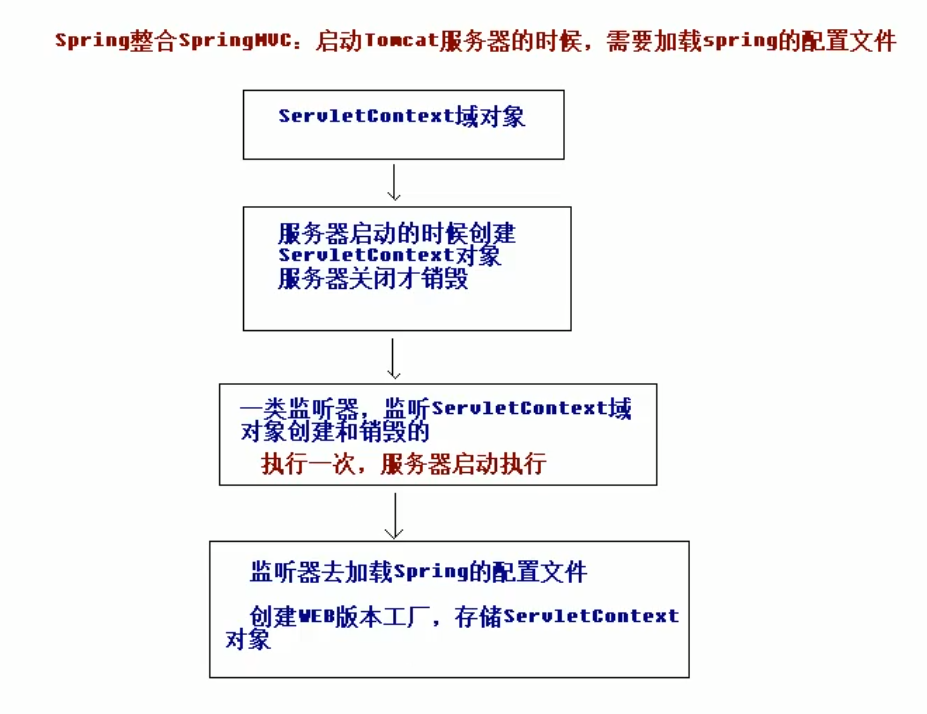

## 一、SSM整合概述

#### 1. 整合思路

以Spring为中心, 整合SpringMVC和MyBatis. 配置以方便性为主, 采用xml+注解的方式配置

#### 2. 整合步骤

1. 配置Spring
2. Spring整合SpringMVC
3. Spring整合MyBatis


## 二、Spring整合SpringMVC

#### 1. 为什么需要整合

由于Spring和SpringMVC是两个配置文件, 在SpringMVC配置文件中只扫描Controller注解, 所以容器中并没有其他的Bean, 这时候处理器方法中, 需要调用Service的方法, 但是容器中没有, 无法实现依赖注入, 所以需要进行整合.

#### 2. 整合原理

在Tomcat启动时加载Spring的配置文件



#### 3. 配置监听器

需要导入jar包 spring-web.jar

```xml
在web.xml中配置监听器, 配置顺序 filter-listener-servlet
<listener>
    <listener-class>org.springframework.web.context.ContextLoaderListener</listener-class>
</listener>
<context-param>
    <param-name>contextConfigLocation</param-name>
    <param-value>classpath:springConfig.xml</param-value>
</comtext-param>
```


## 三、Spring整合MyBatis

#### 1. 核心思路

在Service中能够使用IOC容器中的SqlSession对象

#### 2. 整合过程

```xml
<!--
    在Spring配置文件springConfig.xml中进行整合, 整合后就可以删除MyBatis的配置文件了.
    需要mybatis-spring.jar
-->

<!--配置连接池-->
<bean id="dataSource" class="com.mchange.v2.c3p0.ComboPooledDataSource">
    <property name="driverClass" value="">
    <property name="jdbcurl" value="">
    <property name="user" value="">
    <property name="password" value="">
</bean>

<!--配置生产sqlSession的工厂, sqlSession是线程不安全的, 所以不能使用同一个sqlSession-->
<bean id="factory" class="org.mybatis.spring.sqlSessionFactoryBean">
    <property name="dataSource" ref="dataSource"></property>
    
    <!--给对应包下所有类起别名-->
    <property name="typeAliasPackage" value="com.dw">
</bean>

<!--配置映射, 将所有Dao接口的代理对象加入到容器中-->
<bean id="mapperScan" class="org.mybatis.spring.mapper.MapperscannerConfigurer">
    <property name="basePackage" value="com.dw" />
</bean>

<!--配置事务管理器-->
<bean id="transactionManager" class="org.springframework.jdbc.datasource.DataSourceTransactionManager">
    <property name="dataSource" ref="dataSource"></property>
</bean>

<!--配置事务通知-->
<tx:advice id="txAdvice" transaction-manager="transactionManager">
    <!--配置事务属性-->
    <tx:attributes>
    <!--针对不同方法, 设置不同的事务属性. name表示方法名, 可以使用通配符* 如find*表示所有的find开头的方法-->
        <tx:method name="transfer" propagation="REQUIRED" read-only="false"/>
        <tx:method name="find*" propagation="SUPPORTS" read-only="true"></tx:method>
    </tx:attributes>
</tx:advice>

<!--配置切面-->
<aop:config>
    <aop:pointcut id="pt1" expression="execution(* com.itheima.service.*.*(..))"></aop:pointcut>
    <aop:advisor advice-ref="txAdvice" pointcut-ref="pt1"></aop:advisor>
</aop:config>

<!--
    事务配置也可以通过注解配置
    配置完成后直接为Dao接口加上注解@Component, 就可以直接注入到Service里, Service中可以直接调用dao的相关方法即可执行.
    也可以通过容器对象的getBean(UserDao.class)获取UserDao的代理对象, 再调用相关方法.
-->
```

