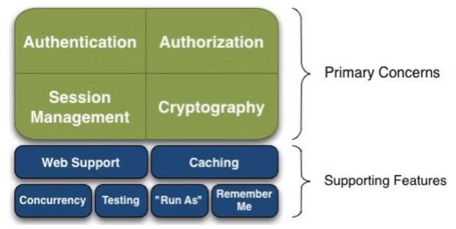
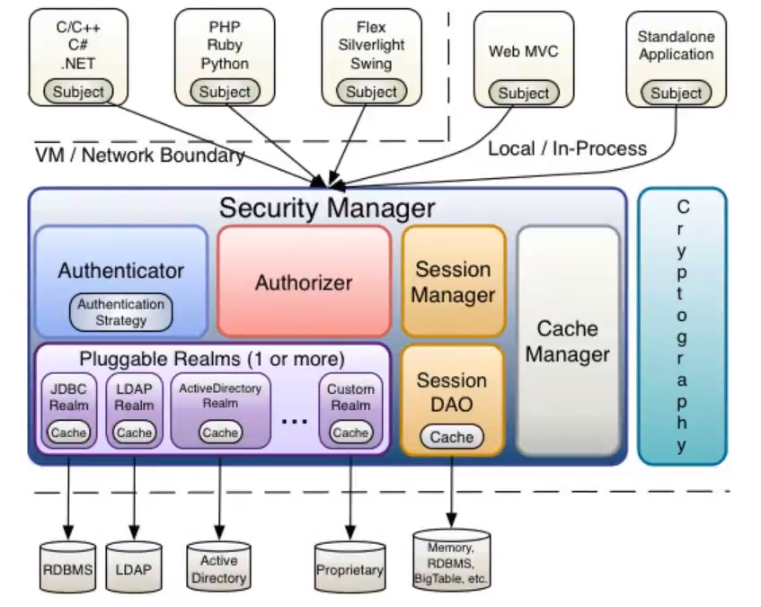
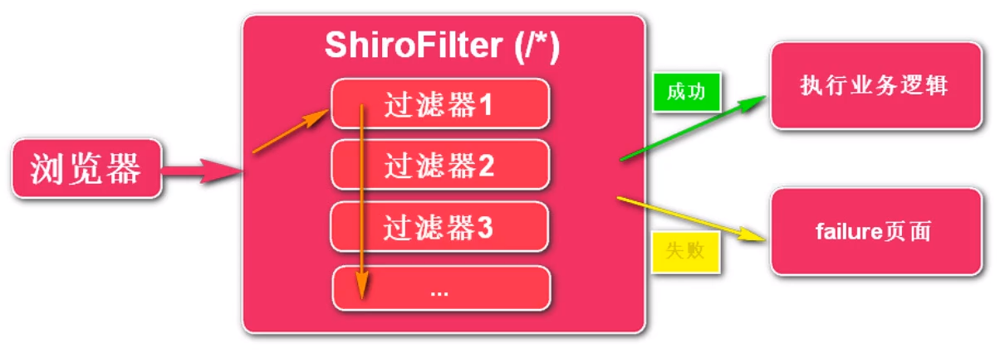

## 一、Shiro简介

### 1. Shiro介绍

> Shiro是Java的一个安全(权限)框架, 可以轻松的完成身份认证、授权、加密、会话管理等功能。且其不仅可以支持Java EE环境, 还支持Java SE环境。

### 2. Shiro功能概述



+ **Authentication:** 身份认证/登录
+ **Authorization:** 权限验证
+ **Session Management:** 会话管理
+ **Cryptography:** 加密, 保护数据安全性. 如密码加密存储到数据库
+ **Web Support:** 轻松集成Web项目
+ **Caching:** 缓存, 如用户登陆后其用户信息保存在缓存中, 提高效率
+ **Remember Me:** 一次登录后, 下一次能立即确认你是哪一个用户

### 3. Shiro组件



+ **Subject:** 代表当前用户, 应用代码直接交互对象就是Subject, 只要得到了Subject对象就可以做绝大多数shiro操作. Subject会将所有的交互都委托给SecurityManager, 但Subject是安全管理中直接操作的对象。
+ **SecurityManager:** 管理所有的Subject, 是Shiro的核心。
+ **Realm:** Shiro从Realm中获取安全数据(用户、角色、权限等)。SecurityManager要验证用户身份就需要从Realm中获取相应的安全数据。Realm是安全数据访问入口。

### 4. RBAC模型

RBAC, Role Base Access Control 基于角色的访问控制。

Shiro就采用了RBAC模型

RBAC模型有三个主体, **用户、角色、权限**。

一个用户可以有多个角色, 一个角色可以分配给多个用户。

一个角色可以有多个权限, 一个权限可以分配给多个角色。

数据库设计中就应该对应5张表, 分别是用户表、角色表、权限表、用户角色中间表、角色权限中间表。

### 5. Shiro架构


## 二、Shiro入门

1. 导入相关jar包
2. 编写`shiro.ini`配置文件

```ini
[users]
daiwei=123,admin
zhangsan=123,teacher
lisi=123,student

[roles]
admin=*
teacher=paper:create, paper:searchScore
student=paper:do

#[]在ini文件中用于划分区域
#[users]区域的格式为: 用户名=密码, 角色1, 角色2...
#[roles]区域的格式为：角色名=权限1, 权限2...
# * 为通配符, 代表所有权限

#权限表示方法
#1.	资源:操作
#	一个资源的多个操作可以简化为"资源:操作1,操作2" 注意加上""
#	paper:*表示试卷的所有操作权限
#	*:do表示所有资源的do权限
#2. 资源:操作:实例
#	paper:do:1表示对试卷实例1的do权限
#	"paper:do,searchScore:1"表示对试卷实例1的do和searchScore权限
#	paper:*:1表示对试卷实例1的所有权限
```

3. 编写代码

```java
public class ShiroTest{
    public static void main(String[] args){
        //读取配置文件, 创建SecurityManager
        Factory<SecurityManager> factory = new IniSecurityManagerFactory("classpath:shiro.ini");
        SecurityManager securityManager = factory.getInstance();
        
        //将SecurityManager托管给SecurityUtils
        SecurityUtils.setSecurityManager(securityManager);
        
        //获取Subject, 通过Subject执行相关功能操作(底层是调用SecurityManager)
        Subject currentUser = Security.getSubject();
        
        //身份认证
        if(!currentUser.isAuthenticated()){//判断是否已经登录
            //如果未登录
            UsernamePasswordToken token = new UsernamePasswordToken("daiwei", "123");
            try{
                //将Token令牌传入login()方法, 进行身份认证, 失败会抛出异常
                currentUser.login(token);
            }catch(UnknownAccountException e){
                System.out.println("用户不存在!");
            }
        }
        
        //认证成功后用户信息会存入Subject对象中
        //通过getPrincipal()方法获取用户名
        String username = currentUser.getPrincipal();
        
        //角色校验
        if(currentUser.hasRole("admin")){
            //拥有admin角色
        }
        
        //权限校验
        if(currentUser.isPermitted("paper:do")){
            //拥有试卷的do权限
        }
        
        //用户登出
        currentUser.logout();
    }
}
```


## 三、Shiro Web集成

### 1. 集成Web工作模式

Web项目集成Shiro后, 所有的请求都会先进入ShiroFilter处理, ShiroFilter会根据请求路径做出相应的验证, 再根据验证结果选择后续执行方向。

注意: 并不是每一个请求都会依次经过过滤器1、过滤器2...而是会依次遍历过滤器, 选择与请求路径相匹配的过滤器进行验证。




### 2. 基本集成(未使用数据库)

1. 导入`shiro-web.jar`
2. 配置`web.xml`

```xml
<filter>
	<filter-name>shiroFilter</filter-name>
    <filter-class>org....ShiroFilter</filter-class>
</filter>
<filter-mapping>
    <filter-name>shiroFilter</filter-name>
    <url-pattern>/*</url-pattern>
</filter-mapping>

<!--读取配置文件, 如未配置路径默认为classpath:shiro.ini-->
<listener>
    <listener-class>shiro.EnritomentLoaderListener<listener-class>
</listener>
<context-param>
	<param-name>shiroConfigLocation</param-name>
    <param-value>classpath:xxx.ini</param-value>
</context-param>
```

3. 配置`shiro.ini`

```ini
[users]
...
[roles]
...

[main]
#没有身份认证时, 跳转的路径
shiro.loginUrl = /user/loginPage
#角色或权限校验不通过时, 跳转的路径
shiro.unauthorizedUrl = /author/error
#登出后跳转的路径
shiro.redirectUrl=/

#指定各请求对应的过滤器(验证规则)
[urls]
#可以匿名使用
/user/login = anon
#需要认证(登录)
/user/query = authc
#需要登录且同时拥有admin和daiwei两个角色(多个参数需要用"")
/user/delete = authc,roles["admin", "daiwei"]
#需要登录且拥有user:search权限(如有多个权限设置需要同时满足才算验证成功)
/user/search = authc,perms[user:search]
#登出, 清空用户信息
/user/logout = logout
#指定端口才能验证成功
/user/testport = port[8080]
#除上述请求外其他请求
/** = authc
```

4. 编写`/user/login`的处理方法

```java
@RequestMapping(/user/login)
public String login(String username, String Password){
    //由于在web.xml中的配置, SecurityManager已被自动创建并托管给SecurityUtils, 所以不需要再手动在创建
    Subject currentUser = Security.getSubject();
    UsernamePasswordToken token = new UsernamePasswordToken(username, password);
    //如果登录失败则会抛出异常, 编写异常处理器处理即可
    currentUser.login(token);
    
    return "index";
}
```

### 3. Shiro标签

Shiro标签适用于jsp页面, 使用时需要导入标签库。

```jsp
<%@ taglib prefix="shiro" uri="http://shiro.apache.org/tags">
```

#### (1) 身份认证标签

```html
<shiro:authenticated> 已登录状态时显示标签体中的内容
<shiro:user> 已登录或记住我
<shiro:guest> 未登录且未记住我
<shiro:notAuthenticated> 未登录
<shiro:principal> 获取用户名(该标签就表示用户名)    
```

#### (2) 角色校验标签

```html
<shiro:hasAnyRoles name="admin,manager"> 有其中任意一种角色
<shiro:hasRole name="admin"> 指定角色(只能为单个角色)
<shiro:lacksRole name="admin"> 没有指定角色
```

#### (3) 权限校验标签

```html
<shiro:hasPermission name="user:delete"> 有指定权限
<shiro:lacksPermission name="user:delete"> 没有指定权限
```

### 4. 自定义Realm

在入门案例中使用的是ini配置文件的方式保存用户名和密码, 但是在实际项目中, 用户信息、项目角色和权限都是放在数据库中的。入门案例中Shiro会读取配置文件并创建IniRealm封装用户信息, 使用了数据库后需要自定Realm。

#### (1) 数据库建表

涉及5个表, 用户表、角色表、权限表、用户角色表、角色权限表

#### (2) 自定义Realm

```java
public class MyRealm extends AuthorizingRealm{
    /*
     * 作用: 查询权限信息, 只需要查询数据库权限信息并将其封装到AuthorizationInfo即可, 验证工作后续自动完成
     * 何时触发: 涉及角色和权限验证时
    */
    @override
    protected AuthorizationInfo doGetAuthorizationInfo(PrincipalCollection principala){
        String username = (String)principals.getPrimaryPrincippal();
        Set<String> roles = RoleDao.searchRoles(username);
        Set<String> permissions = PermissionDao.searchPermissions(username);
       	SimpleAuthorizationInfo simpleAuthorizationInfo = new SimpleAuthorizationInfo(roles);
        simpleAuthorizationInfo.setStringPermissions(permissions);
        
        return simpleAuthorizationInfo;
    }
    
    /*
     * 作用: 查询用户身份信息, 只用查询信息并封装即可, 验证工作后续自动完成
     * 何时触发: subject.login()时触发
    */
    @override
    protected AuthenticationInfo doGetAuthenticationInfo(AuthenticationToken token) throws AuthenticationException{
        String username = (String)token.getPrincipal();
        User user = UserDao.searchUaser(String username);
        
        if(user == null){
        	return null;
        }
         
        return new SimpleAuthenticationInfo(user.getUsername(), //数据库中的用户名
                                            user.getPassword(), //数据库中的密码
                                            this.getName);      //realm的标识
    }
    
    
}
```

#### (3) 配置Realm

修改`shiro.ini`相关配置

```ini
[main]
realm1 = com.dw.MyRealm
realm2 = com.dw.MyRealm2
securityManager.realms=$realm1,$realm2
```

