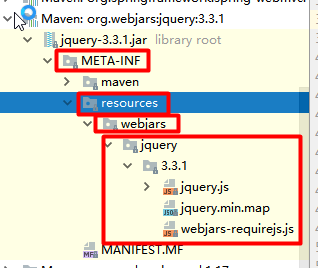

# Spring Boot Web开发

## 一、基于Spring Boot的Web开发简介

由于Spring Boot的自动配置功能, 我们进行Web开发已经无需进行各种繁琐的配置, 开发效率得到了很大的提高。Spring Boot底层通过Spring MVC实现对Web开发的支持, 使用Spring Boot进行Web开发大致分为三步:

1. 创建Spring Boot项目, 选择需要使用到的场景启动器
2. 根据项目需求在application.properties配置文件中进行少量配置
3. 编写业务代码

## 二、静态资源映射规则

在Spring Boot项目中, 是没有WebApp目录的, 对于静态资源的访问, Spring Boot配置了一套映射规则。

这些配置都在 `ResourcesProperties.class` 中

```java
@ConfigurationProperties(prefix = "spring.resources", ignoreUnknownFields = false)
public class ResourceProperties implements ResourceLoaderAware {...}
```

1. **通过webjars, 引入静态资源**

访问webjars官网, 查询相关的静态资源, 复制其maven仓库坐标, 像添加框架jar包一样把这些坐标添加到pom,xml中, 这些静态资源就会以jar包的方式导入. 

```xml
<dependency>
	<groupId>org.webjars</groupId>
	<artifactId>jquery</artifactId>
	<version>3.3.1</version>
</dependency>
```

导入的jar包结构如下:



通过` /webjars/**` 访问相关资源, 如: `localhost:8080/webjars/jquery/3.3.1/jquery.js`

2. **自己添加静态资源**

classpath:/META-INF/resources/ 
classpath:/resources/
classpath:/static/
classpath:/public/
/

以上5个路径都可以存放静态资源, 通过`/**`, 就可以自动映射到对应的静态资源, 不管它在上面5个路径中的哪一个。`classpath: `指的就是 `java/resources` 目录

如: localhost:8080/jquery.js

3. **默认页面&&图标**

默认页面和图标的存放路径和访问路径同上. 不过默认页面名字必须为index.html, 图标名字必须为favicon.ico

4. **自定义静态资源存储路径(会替换默认路径)**

```properties
spring.resources.static-locations=[classpath:/css/, classpath:/js/]
```

## 三、模板引擎

#### 1. 简介

> 模板引擎（这里特指用于Web开发的模板引擎）是为了使用户界面与业务数据（内容）分离而产生的，它可以生成特定格式的文档，用于网站的模板引擎就会生成一个标准的HTML文档。


Jsp、Velocity、Freemarker、Thymleaf等都是模板引擎. 在Spring Boot项目中, 由于项目是以jar包的形式存在的, 所以不支持Jsp模板引擎. 我们使用Spring Boot推荐的Thymleaf作为模板引擎.

#### 2. Thymleaf入门

1. 导入依赖

```xml
<!--如果内置版本过低, 可以修改版本-->
<properties>
	<thymeleaf.version>3.0.9.RELEASE</thymeleaf.version>
	<!-- 布局功能的支持程序 thymeleaf3以上版本需要layout2以上版本的支持 -->
	<thymeleaf-layout-dialect.version>2.2.2</thymeleaf-layout-dialect.version>
</properties>

<dependency>
	<groupId>org.springframework.boot</groupId>
	<artifactId>spring-boot-starter-thymeleaf</artifactId>
</dependency>
```

2. 使用Thymleaf

首先介绍以下Thymleaf的相关配置

```java
@ConfigurationProperties(prefix = "spring.thymeleaf")
public class ThymeleafProperties {

	private static final Charset DEFAULT_ENCODING = Charset.forName("UTF-8");

	private static final MimeType DEFAULT_CONTENT_TYPE = MimeType.valueOf("text/html");

	public static final String DEFAULT_PREFIX = "classpath:/templates/";

	public static final String DEFAULT_SUFFIX = ".html";
```

上述配置表示, 我们将HTML页面放在classpath:/templates/目录下, 我们的模板引擎就会根据Thymleaf语法自动渲染.

Controller.java

```java
public class Controller{
    
    @RequestMapping(/hello)
    public String test(Model model){
        model.addAttribute("test", "this is a test");
        model.addAttribute("array", Arrays.asList("111", "222"));
        return success;
    }
}
```
在classpath:/templates/目录下的success.html
```html
<!DOCTYPE html>
<!--用于Thymleaf语法提示-->
<html lang="en" xmlns:th="http://www.thymeleaf.org">
    
	<head>
    	<meta charset="UTF-8">
    	<title>Title</title>
	</head>
	<body>
        <!--th:text 设置div里的文本内容 -->
        <div th:text="${test}">这里的文字会被替换掉</div>
        
        <!--同上-->
        <div>[[${test}]]</div>
        
        <!--th:utext 设置div里的文本内容, 要解析html标签-->
        <div th:utext="${test}">这里的文字会被替换掉</div>
        
        <!--同上-->
        <div>[(${test})]</div>
        
        <!--th:xxx 替换掉原来的属性 如这里就是替换原来的href属性-->
        <a href="#" th:href="@{/hello}">
        
        <!--遍历集合, 每一次都生成一个<h1>标签-->
        <h1 th:each="name:${array}" th:text="${name}"></h1>
        
        <!--当满足条件时才显示该标签, 注意#strings是引用内置工具对象, 不要省略#-->
        <h1 th:text="${mag}" th:if="${not #strings.isEmpty(msg)}"></h1>
        
        <!--通过三元运算符判断gender的值, 为0是赋予男, 为1是赋予女-->
        <h1 th:text="${gender}==0?'男':'女'"></h1>
            
        <!--值为true表示选中状态-->
        <input type="radio" th:checked="true" />
            
        <select>
        	<option th:selected="true">1</option>  
        </select>
        
	</body>
</html>
```

#### 3. Thymleaf语法

1. th:xxx


2. 表达式

注意: 表达式语法只有在th:xxx=""中才有效, 单独使用是无效的

```properties
Simple expressions:（表达式语法） 
    Variable Expressions: ${...}：获取变量值；OGNL；
    		1）、获取对象的属性、调用方法
    		2）、使用内置的基本对象：
    			#ctx: the context object.
    			#vars: the context variables.
                #locale: the context locale.
                #request: the HttpServletRequest object.
                #response: the HttpServletResponse object.
                #session: the HttpSession object.
                #servletContext: the ServletContext object.
            3）、内置的一些工具对象：
#execInfo : information about the template being processed.
#messages : methods for obtaining externalized messages inside variables expressions, in the same way as they would be obtained using #{…} syntax.
#uris : methods for escaping parts of URLs/URIs
#conversions : methods for executing the configured conversion service (if any).
#dates : methods for java.util.Date objects: formatting, component extraction, etc.
#calendars : analogous to #dates , but for java.util.Calendar objects.
#numbers : methods for formatting numeric objects.
#strings : methods for String objects: contains, startsWith, prepending/appending, etc.
#objects : methods for objects in general.
#bools : methods for boolean evaluation.
#arrays : methods for arrays.
#lists : methods for lists.
#sets : methods for sets.
#maps : methods for maps.
#aggregates : methods for creating aggregates on arrays or collections.
#ids : methods for dealing with id attributes that might be repeated (for example, as a result of an iteration).

	Selection Variable Expressions: *{...}：选择表达式：和${}在功能上是一样
	补充功能:
   	<div th:object="${session.user}">
    	<p>Name: <span th:text="*{firstName}">Sebastian</span>.</p>
    	<p>Surname: <span th:text="*{lastName}">Pepper</span>.</p>
    	<p>Nationality: <span th:text="*{nationality}">Saturn</span>.</p>
    </div>
    
    Message Expressions: #{...}：获取国际化内容
    Link URL Expressions: @{...}：定义URL；
    		@{/order/process(execId=${execId},execType='FAST')}
    Fragment Expressions: ~{...}：片段引用表达式
    		<div th:insert="~{commons :: main}">...</div>
    		
Literals:（字面量）
	Text literals: 'one text' , 'Another one!' ,…
	Number literals: 0 , 34 , 3.0 , 12.3 ,…
    Boolean literals: true , false
    Null literal: null
    Literal tokens: one , sometext , main ,…
Text operations:（文本操作）
    String concatenation: +
    Literal substitutions: |The name is ${name}|
Arithmetic operations:（数学运算）
    Binary operators: + , - , * , / , %
    Minus sign (unary operator): -
Boolean operations:（布尔运算）
    Binary operators: and , or
    Boolean negation (unary operator): ! , not
Comparisons and equality:（比较运算）
    Comparators: > , < , >= , <= ( gt , lt , ge , le )
    Equality operators: == , != ( eq , ne )
Conditional operators:条件运算（三元运算符）
    If-then: (if) ? (then)
    If-then-else: (if) ? (then) : (else)
    Default: (value) ?: (defaultvalue)
Special tokens:
    No-Operation: _ 
```

#### 4. 公共页面抽取

1. 在公共页面中抽取公共的片段

```html
<div th:fragment="header">
	这个div就是需要被抽取的部分
<div>
```

2. 在其他页面引用被抽取的片段

```html
<div th:insert="~{pagename :: header}"></div>

引入片段有三种方式:
1. th:insert: 在当前标签中插入抽取片段
2. th:replace: 将抽取的片段替换掉当前标签
3. th:include: 将抽取片段的内容插入到当前标签中

值的写法:
1. ~{被抽取片段的页面名称 :: css选择器}
2. ~{被抽取片段的页面名称 :: 抽取片段名称}

~{} 可省
```

3. 拓展

```html
还可以在引入片段时传入参数
<div th:insert="pagename :: header(active='a1')"></div>

在抽取的片段代码中的<a>标签可以进行判断, 如果参数值为a1, 则链接class属性添加active
<div th:fragment="header">
	<a th:class="${active}=='a1'?'active':''">
<div>
```


## 四、Spring MVC自动配置

#### 1. 默认配置

Spring Boot 通过`WebMvcAutoConfiguration.class`自动配置好了Spring MVC

以下是Spring Boot对Spring MVC的默认配置:

+ 自动配置了ViewResolver(视图解析器)
    + ContentNegotiatingViewResolver：组合所有的视图解析器
    + 自定义思路：自定义一个视图解析器, 将其加入容器, 则该解析器会被自动加入解析器组中

- Support for serving static resources, including support for WebJars. 静态资源存放路径与webjars支持
- Static `index.html` support. 默认页面配置
- Custom `Favicon` support. 图标配置
- 自动注册了`Converter`, `GenericConverter`, `Formatter` 组件.
    - Converter：类型转换器
    - 自定义思路: 自定义类型转换器, 并将其添加到容器中
    - `Formatter`  格式化器, 如时间字符串转化为Date对象

```java
@Bean
@ConditionalOnProperty(prefix = "spring.mvc", name = "date-format")
public Formatter<Date> dateFormatter() {
	return new DateFormatter(this.mvcProperties.getDateFormat());
}
```

- Support for `HttpMessageConverters`
    - HttpMessageConverters是从容器中确定；获取所有的HttpMessageConverter
    - HttpMessageConverter：转换Http请求和响应参数 如: User对象-->json
    - 自定义思路: 自定义HttpMessageConverter, 并将其加入容器
- Automatic registration of `MessageCodesResolver` 定义错误代码生成规则
- Automatic use of a `ConfigurableWebBindingInitializer` bean

#### 2. 拓展功能

Spring Boot的默认配置并没有帮我们配置完所有功能, 如果需要使用其他未配置功能(如: interceptors, formatters, view controllers等)还需要我们进行拓展配置

拓展方法: 编写一个配置类, 加上注解`@Configuration`并实现`WebMvcConfigurer`接口, 且该类不能使用注解`@EnableWebMvc`

```java
@Configuration
public class MyMvcConfig implements WebMvcConfigurer{

    @Override
    public void addViewControllers(ViewControllerRegistry registry) {
        registry.addViewController("/atguigu").setViewName("success");
    }
}
```

#### 3. 全面接管Spring MVC

我们可以在自定义配置类中加上注解`@EnableWebMVC`使默认自动配置全部失效. 此时所有相关配置都需要我们自己完成.

## 五、国际化

#### 1. 基础实现

1. 编写国际化配置文件`login.properties`、`login_zh_CN.properties`、`login_en_US.properties`, 其中`login.properties`为默认配置文件. ==需要注意配置IDEA解决中文乱码问题.==
2. 设置基础名

```java
@ConfigurationProperties(prefix = "spring.messages")
public class MessageSourceAutoConfiguration {
    
	private String basename = "messages";  
```

通过源码我们可以发现, Spring Boot默认基础名为messages, 我们可以在配置文件中修改该基础名

```properties
#其中i18n是存放国际化配置文件的文件夹的名称
spring.messages.basename=i18n.login
```

3. Spring Boot默认设置了`AcceptHeaderLocaleResolver`来获取区域信息, 所以默认是根据请求头来自己判断区域信息的, 我们无需配置.
4. 通过Thymleaf模板引擎的`#{}`来使用国际化配置

#### 2. 如何实现点击链接切换区域信息?

1. 链接href添加请求参数, 传递区域信息
2. 自定义LocaleResolver

```java
public class MyLocaleResolver implements LocalResolver{
    
    @Override
    public Locale resolveLocale(HttpServletRequest request){
        Locale locale = null;
        String localeStr = request.getParameter("locale")
        if(localeStr!=null || localeStr.equals("")){
            Locale locale = new Locale(localeStr.split("-")[0], localeStr.split("-")[1]);
            return locale
        }else{
            return new Locale("zh", "CN");
        }
    }
    
    @Override //该方法不用重写
    public ...
}
```

3. 将自定义的LocaleResolver添加到容器, 添加后会自动替换掉默认的

```java
@Configuration
public class MyMvcConfig implements WebMvcConfigurer{
    
    @Bean
    public MyLocaleResolver getLocale(){
        return new MyLocaleResolver();
    }
}
```


## 六、拦截器

用户登录后将信息保存在session中, 设置一个拦截器, 检查session中是否有登录信息, 如果没有跳转到登录页面.

1. 自定义拦截器:

```java
public class MyInterceptor implements HandlerInterceptor{
    //在JDK1.8中可以直接在接口中实现方法, 它的实现类就可以不用实现方法. HandlerIterceptor就是这样的接口
   
    @Override
    public boolean preHandle(HttpServletRequest request, HttpServletResponse response, Object handler) throws Exception {
        //判断session中有没有登录信息
        ......
    }
}
```

2. 配置拦截器:

```java
@Configuration
public class MyMvcConfig implements WebMvcConfigurer{
    
    @Override
    public void addInterceptor(InterceptorRegistry registry){
        
        /*
        	在Spring Boot 1.x版本不用exclude静态资源
        	在Spring Boot 2.x版本需要手动exlude静态资源
        */
		registry.addInterceptor(new MyInterceptor()).addPathPatterns("/**")
            .excludePathPatterns("/index.html", "/", "/user/login")
    }
}
```

## 七、错误处理

Spring Boot自动配置了错误处理页面, 当我们的应用出现错误时, 会在浏览器中显示默认的错误页面. 如果我们用其他客户端(非浏览器)访问, 则会传回一段json数据, 里面记录了错误信息.

#### 1. 原理分析

错误处理的自动配置类为`ErrorMvcAutoConfiguration.class`

该自动配置类主要给容器中添加了四个组件:

1. ErrorPageCustomizer
2. BasicErrorController
3. DefaultErrorViewResolver
4. DefaultErrorAttributes

程序出现错误, `ErrorPageCustomizer`就会生效, 该组件定义了错误相应规则, 默认发出/error请求

```java
	@Value("${error.path:/error}")
	private String path = "/error";
	//出现错误时访问的url
```

这个请求会被`BasicErrorController`处理

```java
@Controller
@RequestMapping("${server.error.path:${error.path:/error}}")
public class BasicErrorController extends AbstractErrorController {
    
    //产生html类型的数据；浏览器发送的请求来到这个方法处理
    @RequestMapping(produces = "text/html")
	public ModelAndView errorHtml(HttpServletRequest request,
			HttpServletResponse response) {
		HttpStatus status = getStatus(request);
		Map<String, Object> model = Collections.unmodifiableMap(getErrorAttributes(
				request, isIncludeStackTrace(request, MediaType.TEXT_HTML)));
		response.setStatus(status.value());
        
        //定义了跳转的错误页面
		ModelAndView modelAndView = resolveErrorView(request, response, status, model);
		return (modelAndView == null ? new ModelAndView("error", model) : modelAndView);
	}

    //产生json数据，其他客户端来到这个方法处理
	@RequestMapping
	@ResponseBody
	public ResponseEntity<Map<String, Object>> error(HttpServletRequest request) {
		Map<String, Object> body = getErrorAttributes(request,
				isIncludeStackTrace(request, MediaType.ALL));
		HttpStatus status = getStatus(request);
		return new ResponseEntity<Map<String, Object>>(body, status);
	}
}
```

具体跳转到哪个页面由`DefaultErrorViewResolver`决定

```java
@Override
	public ModelAndView resolveErrorView(HttpServletRequest request, HttpStatus status,
			Map<String, Object> model) {
		ModelAndView modelAndView = resolve(String.valueOf(status), model);
		if (modelAndView == null && SERIES_VIEWS.containsKey(status.series())) {
			modelAndView = resolve(SERIES_VIEWS.get(status.series()), model);
		}
		return modelAndView;
	}

	private ModelAndView resolve(String viewName, Map<String, Object> model) {
        //跳转的错误页面的名字 error/状态码、error/4xx等
		String errorViewName = "error/" + viewName;
        
        //先看模板引擎目录有没有该页面
		TemplateAvailabilityProvider provider = this.templateAvailabilityProviders
				.getProvider(errorViewName, this.applicationContext);
		if (provider != null) {
            //模板引擎可用的情况下返回到errorViewName指定的视图地址
			return new ModelAndView(errorViewName, model);
		}
        //模板引擎不可用，就在静态资源文件夹下找errorViewName对应的页面   
		return resolveResource(errorViewName, model);
	}
```

通过`DefaultErrorAttributes`将错误信息保存在request域中

错误信息:

1. timestamp：时间戳
2. status：状态码
3. error：错误提示
4. exception：异常对象
5. message：异常消息
6. errors：JSR303数据校验错误对象


#### 2. 自定义错误页面

1. 如果template目录下有对应错误页面, 则使用该错误页面. 错误页面应该放在`templates/error`目录下, 名字为状态码. 如: 404.html、4xx.html, Spring Boot就会根据相应错误跳转到对应页面.
2. 如果template目录下没有对应页面, 则在静态资源路径下找. 命名规则一样, 也必须放在error文件夹下
3. 如果都没有找到, 则使用默认页面

#### 3. 自定义错误数据

1. 自定义异常处理器
2. 自定义ErrorAttributes

`DefaultErrorAttributes`的作用是将错误信息保存在request域中, 它被自动加载类加入容器的条件是容器中不存在该组件. 我们可以自定义一个该组件, 将其加入容器, 这样容器中就使用我们自定义的组件了.

`BasicErrorController`处理/error请求时, 错误信息是通过`DefaultErrorAttributes`的`getErrorAttributes()`方法获取到的, 我们只需要继承`DefaultErrorAttribute`然后重写该方法即可

```java
@Component
public class MyErrorAttributes extends DefaultErrorAttributes {

    @Override
    public Map<String, Object> getErrorAttributes(RequestAttributes requestAttributes, boolean includeStackTrace) {
        Map<String, Object> map = super.getErrorAttributes(requestAttributes, includeStackTrace);
        map.put("company","atguigu");
        return map;
    }
}
```

## 八、注册Servlet三大组件

Spring Boot默认是以jar包的方式打包的, 所以没有web.xml文件, 所以想要注册Servlet、Listener、Filter三大组件, 需要通过`ServletRegistrationBean`、`FilterRegistrationBean`、`ServletListenerRegistrationBean`

1. 自定义组件

```java
public class MyServlet extends HttpServlet{
	...
}        
```

2. 在配置类中添加组件

```java
@Configuration
public class ServerConfig{
    @Bean
    public ServletRegistrationBean myServlet(){
        ServletRegistrationBean registrationBean = new ServletRegistrationBean(new MyServlet(),"/myServlet");
        return registrationBean;
    }

    @Bean
    public FilterRegistrationBean myFilter(){
        FilterRegistrationBean registrationBean = new FilterRegistrationBean();
        registrationBean.setFilter(new MyFilter());
        registrationBean.setUrlPatterns(Arrays.asList("/hello","/myServlet"));
        return registrationBean;
    }

    @Bean
    public ServletListenerRegistrationBean myListener(){
        ServletListenerRegistrationBean<MyListener> registrationBean = new ServletListenerRegistrationBean<>(new MyListener());
        return registrationBean;
    }
}    
```

`DispatcherServlet`底层就是通过`ServletRegistrationBean`创建的. 我们可以通过配置`server.servletPath`来修改`DispatcherServlet`默认拦截的url


## 九、Servlet容器

Servlet容器就是Tomcat、Jetty、Jboss等容器软件. Spring Boot为我们内嵌了Servlet容器.

#### 1. 修改容器相关配置

1. 通过配置文件修改

```properties
server.port=8081
server..servlet.context-path=/crud

server.tomcat.uri-encoding=UTF-8

//通用的Servlet容器设置
server.xxx

//Tomcat的设置
server.tomcat.xxx
```

2. 自己编写一个`EmbeddedServletContainerCustomizer`. 方法一的底层实现也是这个定制器.
    2.0以上版本被 `WebServerFactoryCustomizer`取代

```java
@Bean
public EmbeddedServletContainerCustomizer embeddedServletContainerCustomizer(){
    return new EmbeddedServletContainerCustomizer() {

        //定制嵌入式的Servlet容器相关的规则
        @Override
        public void customize(ConfigurableEmbeddedServletContainer container) {
            container.setPort(8083);
        }
    };
}
```

#### 2. 切换容器

Spring Boot内置了三种容器, 分别是:

1. Tomcat: 默认
2. Jetty: 适合长连接(如聊天应用)
3. Undertow: 适合高并发, 不支持jsp

切换方法:去除相应依赖, 添加需要的依赖

```xml
<!-- 引入web模块 -->
<dependency>
   <groupId>org.springframework.boot</groupId>
   <artifactId>spring-boot-starter-web</artifactId>
   <exclusions>
      <exclusion>
         <artifactId>spring-boot-starter-tomcat</artifactId>
         <groupId>org.springframework.boot</groupId>
      </exclusion>
   </exclusions>
</dependency>

<!--引入其他的Servlet容器-->
<dependency>
   <artifactId>spring-boot-starter-jetty</artifactId>
   <groupId>org.springframework.boot</groupId>
</dependency>
```

#### 3. 容器自动配置原理

#### 4. 容器启动原理

#### ~~5. 使用外置Servlet容器以支持jsp~~

1. 创建项目时, 选择以war包方式打包
2. 通过project structure添加webapp文件夹, 里面添加web.xml文件
3. 配置本地Tomcat, 注意deployment配置中添加需要部署的项目
4. 通过配置`spring.mvc.view.prefix`和`spring.mvc.view.suffix`设置视图解析位置
5. 启动本地服务器即可

注意:

通过IDEA创建时, 它自动完成了一些设置, 这些设置必不可少

1. 将嵌入式Tomcat指定为provided

```xml
<dependency>
   <groupId>org.springframework.boot</groupId>
   <artifactId>spring-boot-starter-tomcat</artifactId>
   <scope>provided</scope>
</dependency>
```

2. 必须编写一个`SpringBootServletInitializer`的子类，并调用configure方法

```java
public class ServletInitializer extends SpringBootServletInitializer {

   @Override
   protected SpringApplicationBuilder configure(SpringApplicationBuilder application) {
       //传入SpringBoot应用的主程序
      return application.sources(SpringBoot04WebJspApplication.class);
   }

}
```

## X、其他细节问题

1. 在Spring Boot项目中, 网页默认页面是静态资源路径中的index.html, 在使用Thymleaf模板时, 首页的位置在templates目录下, 无法默认被加载. 可以编写一个控制器, 将 / 请求跳转到templates目录下的index.html. 或者自定义一个视图控制器, 将 / 请求跳转.
2. `@RequestMapping`可以用`@PostMapping`  、`@GetMapping`等来代替, 它们都相当于指定了请求方法的`@RequestMapping`

3. 可以配置`spring.thymleaf.cache=false`禁用模板引擎缓存, 禁用后按`ctrl+F9`重新编译该页面, 就可以直接使变化生效, 不用重启服务器了.
4. 视图在多级目录下 `return "xx/xxx"`
5. Spring Boot封装请求参数时, 时间格式默认为dd/MM/yyyy, 可以通过`spring.mvc.date-format=yyyy-MM-dd`来修改默认时间格式
6. ~~Thymleaf中多个${}等表达式用 + 链接~~
7. 一个添加页面表单, 也可用于修改页面. 所以添加页面可以和修改页面共用, 不过添加页面表单不需要数据, 修改页面需要表单数据. 直接通过`th:value="${user}!=null?${user.name}"`来根据需要在表单上显示或不显示数据

