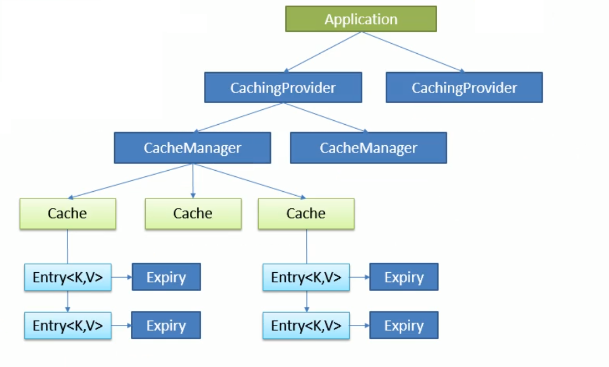
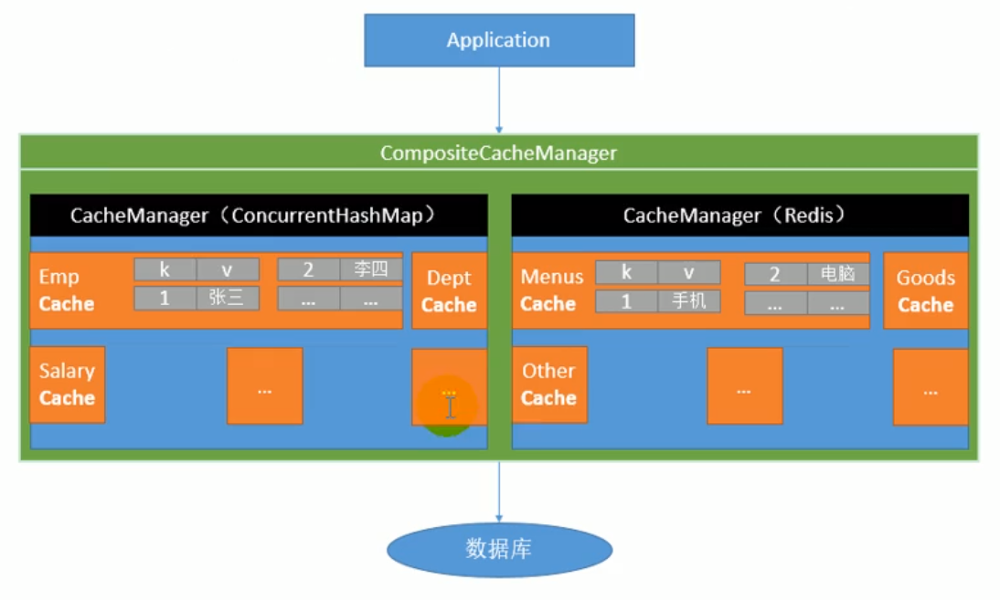

# Spring Boot 缓存

## 一、JSR 107

JSR 107是一个缓存规范(类似于SLF4J), 它提供了5个核心接口, 分别是:

1. **CachingProvider**定义了创建、配置、获取、管理和控制多个CacheManager。一个应用可以在运行期访问多个CachingProvider。
2. **CacheManager**定义了创建、配置、获取、管理和控制多个唯一命名的Cache，这些Cache存在于CacheManager的上下文中。一个CacheManager仅被一个CachingProvider所拥有。
3. **Cache**是一个类似Map的数据结构并临时存储以Key为索引的值。一个Cache仅被一个CacheManager所拥有。
4. **Entry**是一个存储在Cache中的key-value对。
5. 每一个存储在Cache中的条目有一个定义的有效期，即**Expiry Duration**。一旦超过这个时间，条目为过期的状态。一旦过期，条目将不可访问、更新和删除。缓存有效期可以通过ExpiryPolicy设置。

结构图如下:




## 二、Spring缓存抽象

#### 1. Spring 缓存抽象基本介绍

Spring从3.1开始定义了`org.springframework.cache.Cache`和`org.springframework.cache.CacheManager`接口统一不同的缓存技术.并支持使用JCache(JSR 107)注解简化我们的开发

重要注解和接口:

| 注解或接口     | 说明                                                       |
| -------------- | ---------------------------------------------------------- |
| Cache          | 缓存接口, 定于缓存操作. 实现有: RedisCache、EhCacheCache等 |
| CacheManager   | 缓存管理器, 管理各种Cache组件                              |
| @Cacheable     | 主要针对方法配置, 能够根据方法的请求参数对其结果进行缓存.  |
| @CacheEvict    | 清除缓存                                                   |
| @CachePut      | 更新缓存, 保证方法调用, 同时缓存结果                       |
| @EnableCaching | 开启注解缓存                                               |
| keyGenerator   | 缓存数据时key的生成策略                                    |
| serilizer      | 缓存数据时value序列化策略                                  |
| @Caching       | @Cacheable、@CachePut、@CacheEvict组合版                   |
| @CacheConfig   | 注解在类上, 抽取缓存公共配置                               |

图解:



由图可知, 每一个CacheManager可以管理多个Cache, 每一个Cache可以存储多个key-value


#### 2. Spring Boot 缓存详解

1. **@Cacheable**

```java
@EnableCaching
public class UserService{
    @Autowired
    private UserDao userdao;
    
    @Cacheable(cacheNames = {"user"})
    public User getUserById(Integer id){
        ...查询员工的相关操作
    }
}

/*
	getUserById方法在第一次执行时会从数据库中查询数据, 方法返回值会保存到缓存中, 第二次调用该方法时, 只要key是一样的, 那么就不会再从数据库中查询而是直接从缓存中获取
*/

/*
	@Cacheable的属性有:
	1. cacheNames/value: 指定cache的名字, 数组结构, 可以指定多个
	2. key: 指定缓存数据的key. 默认为方法参数的值. 支持spel表达式, 如key="#id"
	3. keyGenerator: key的生成器, 可以自己指定key的生成器组件
	4. cacheManager/cacheResolver: 指定cacheManager
	5. condition: 指定缓存条件. 支持spel表达式 如: condition="#id > 0"
	6. sync: 是否使用异步模式
*/

/*
	spel表达式:
	1. methodName 当前被调用的方法名 #root.methodName
	2. method 当前方法对象 如: #root.method.name
	3. target 当前被调用的目标对象 #root.target
	4. targetClass 被调用目标对象类 #root.targetClass
	5. args 参数列表 #root.args[0]
	6. caches cache数组 #root.caches[0].name
	7. 直接使用参数名获取参数值 #id, 也可以使用#a0、#p0这种形式, 0表示参数索引
	8. result 方法执行后的返回值 #result. 注意在@Cacheable中的key属性是不能使用 #result的, 因为@Cacheable生成key的时间是在方法执行之前, 那时还没有返回值
*/

/*
	自定义keyGenerator
	然后通过属性keyGenerator指定Bean的id即可
*/
@Configuration
public class config{
    
    @Bean("myKeyGenerator")
    public KeyGenerator getKeyGenerator(){
        return new KeyGenerator(){
            public Object generator(Object target, Method method, Object...params){
                return method.getName()+Arrays.asList(params).toString();
            }
        }
    }
    
}
```

2. **@CachePut**常用于同步数据库和缓存的数据, 首先执行方法, 然后将方法返回值更新到缓存中.
3. **@CacheEvict**常用于删除操作, 通过指定`key`的值, 删除缓存中对应数据. 还可以指定`allEntries=true`来删除整个cache组件. `beforeInvocation`指定是否在方法执行之前删除缓存, 默认为false. 如果是在方法执行之后删除缓存, 如果方法执行中出错, 那么就不会清除缓存.
4. **@Caching**

```java
@Caching(
	cacheable={@Cacheable(...)},
    put={@CachePut(...)},
    evict={@CacheEvict(...)}
)
public User findUserById(Integer id){
	...	    
    
}
```

5. **@CacheConfig**

```
@CacheConfig(cacheNames="", keyGenerator="", cacheManager="")
public class UserService{
	...
}
```


#### 3. 缓存原理


## 三、Redis与Spring 缓存

#### 1.实现步骤

1. 导入相关依赖`spring-boot-starter-data-redis`
    导入依赖后, CacheManager由默认变成RedisCacheManager
    默认Cache变成RedisCache, RedisCache通过操作redis来缓存数据
2. 配置Redis

```yaml
spring:
	redis:
		host: 
		port:
		password:
		timeout:
		jedis:
			pool:
				max-active:
				max-wait:
				max-idle:
				min-idle:
```

3. 使用上述注解进行操作即可


#### 2. 注意事项

保存对象时, 最好将对象转化为json数据再进行保存.

1. 可以使用转json工具完成
2. 也可以自定义RedisCacheManager(2.x版本)

```java
@Bean
public RedisCacheManager cacheManager(RedisConnectionFactory redisConnectionFactory) {
	//初始化一个RedisCacheWriter
 	RedisCacheWriter redisCacheWriter = RedisCacheWriter.nonLockingRedisCacheWriter(redisConnectionFactory);
	//设置CacheManager的值序列化方式为json序列化
	RedisSerializer<Object> jsonSerializer = new GenericJackson2JsonRedisSerializer();
	RedisSerializationContext.SerializationPair<Object> pair = RedisSerializationContext.SerializationPair.fromSerializer(jsonSerializer);
	RedisCacheConfiguration defaultCacheConfig = RedisCacheConfiguration.defaultCacheConfig().serializeValuesWith(pair);

	//设置默认超过时期是1天
	defaultCacheConfig.entryTtl(Duration.ofDays(1));
    //初始化RedisCacheManager
    return new RedisCacheManager(redisCacheWriter, defaultCacheConfig);
}
```


