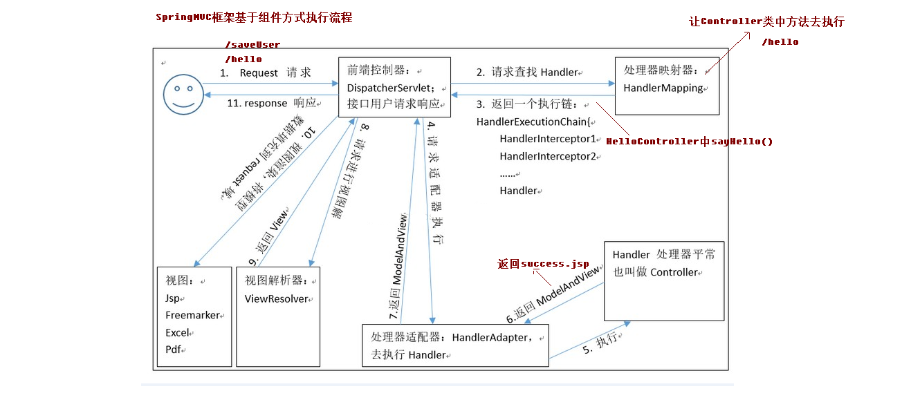

## 一、Spring MVC概述

### 1. 简介

> SpringMVC是一个基于Java实现MVC设计模型的请求驱动类型的轻量级WEB框架. 属于SpringFramwork的后续产品, 已经融合在Spring Web Flow里. Spring框架提供了构建Web应用程序的全功能MVC模块, 使Spring可以插入MVC开发框架. SpringMVC框架通过一套注解, 让一个简单的Java类也可以成为处理请求的控制器(Servlet), 而无需实现任何接口, 同时它还支持RESTful编程风格.

### 2. Spring MVC的优势

+ 清晰的角色划分
    +  前端控制器（DispatcherServlet）
    + 请求到处理器映射（HandlerMapping）
    + 处理器适配器（HandlerAdapter）
    + 视图解析器（ViewResolver）            
    + 处理器或页面控制器（Controller）            
    + 验证器（ Validator）            
    + 命令对象（Command 请求参数绑定到的对象就叫命令对象）            
    + 表单对象（Form Object 提供给表单展示和提交到的对象就叫表单对象)
+ 分工明确，而且扩展点相当灵活，可以很容易扩展，虽然几乎不需要。
+ 由于命令对象就是一个POJO，无需继承框架特定API，可以使用命令对象直接作为业务对象。
+ 和Spring 其他框架无缝集成，是其它Web框架所不具备的。
+ 可适配，通过HandlerAdapter可以支持任意的类作为处理器。
+ 可定制性，HandlerMapping、ViewResolver等能够非常简单的定制。
+ 功能强大的数据验证、格式化、绑定机制。
+ 利用Spring提供的Mock对象能够非常简单的进行Web层单元测试。
+ 本地化、主题的解析的支持，使我们更容易进行国际化和主题的切换。
+ 强大的JSP标签库，使JSP编写更容易。
+ 还有比如RESTful风格的支持、简单的文件上传、约定大于配置的契约式编程支持、基于注解的零配置支持等等。

### 3. SpringMVC和Struts2的异同:

+ 共同点
    + 它们都是表现层框架，都是基于MVC模型编写的。
    + 它们的底层都离不开原始ServletAPI。
    + 它们处理请求的机制都是一个核心控制器。
+ 不同点:
    + Spring MVC 的入口是 Servlet, 而 Struts2 是 Filter
    + Spring MVC 是基于方法设计的，而Struts2是基于类，Struts2每次执行都会创建一个动作类。所以Spring MVC 会稍微比 Struts2 快些。
    + Spring MVC 使用更加简洁,同时还支持 JSR303, 处理 ajax 的请求更方便
    + Struts2 的OGNL 表达式使页面的开发效率相比Spring MVC 更高些，但执行效率并没有比JSTL提升，尤其是struts2的表单标签，远没有html执行效率高

### 4. Spring MVC入门案例

#### 1. 在web.xml中配置前端控制器

```xml
<servlet>
    <servlet-name>dispatcherServlet</servlet-name>
    <servlet-class>org.springframework.web.servlet.DispatcherServlet</servlet-class>
        <!--加载Spring配置文件, contextConfigLocation是DispatcherServlet的一个属性, value是其值-->
        <init-param>
            <param-name>contextConfigLocation</param-name>
            <param-value>classpath:springMVCConfig.xml</param-value>
        </init-param>
        <!--配置容器加载该Servlet的时机, 大于0表示程序启动就加载, 小于0或未配置表示使用该Servlet时才加载, 正数的值越小加载优先级越高-->
        <load-on-startup>1</load-on-startup>
</servlet>

<servlet-mapping>
    <servlet-name>dispatcherServlet</servlet-name>
    <url-pattern>/</url-pattern>
</servlet-mapping>
```

#### 2. 创建配置文件springMVCConfig.xml 

SpringMVC可以和Spring用同一个配置文件,但是为了模块化和可读性一般将它们分开. 

```xml
<?xml version="1.0" encoding="UTF-8"?>
<beans xmlns="http://www.springframework.org/schema/beans"
    xmlns:mvc="http://www.springframework.org/schema/mvc"
    xmlns:context="http://www.springframework.org/schema/context"
    xmlns:xsi="http://www.w3.org/2001/XMLSchema-instance"
    xsi:schemaLocation="http://www.springframework.org/schema/beans
    http://www.springframework.org/schema/beans/spring-beans.xsd
    http://www.springframework.org/schema/mvc
    http://www.springframework.org/schema/mvc/spring-mvc.xsd
    http://www.springframework.org/schema/context http://www.springframework.org/schema/context/spring-context.xsd">


    <!--开启MVC注解支持, 以支持MVC @RequestMapping等注解-->
    <mvc:annotation-driven></mvc:annotation-driven>

    <!--扫描包-->
    <context:component-scan base-package="com.dw">
        <!--由于Spring和SpringMVC配置文件分开了, 所以SpringMVC只需要扫描Controller注解即可-->
        <!--同理在Spring的配置文件中, 应该排除对Controller注解的扫描 <context:exclude-filter> -->
        <context:include-filter type="annotation" expression="org.springframework.stereotype.Controller">
    </context:component-scan>

    <!--配置视图解析器-->
    <bean id="viewResolver" class="org.springframework.web.servlet.view.InternalResourceViewResolver">
        <!--prefix为视图路径, suffix为视图后缀-->
        <property name="prefix" value="/WEB-INF/pages/"></property>
        <property name="suffix" value=".jsp"></property>
    </bean>
</bean>
```

#### 3. 编写控制器

```java
@Controller("jelloController")
public class HelloController{
    
    @RequestMapping(path="/hello")
    public String sayHello(){
        System.out.println("控制器方法执行...");
        return "success";
    }
}
```

#### 4. 页面(视图)

```jsp
index.jsp

<body>
    <h3>入门案例</h3>
    <a href="${ pageContext.request.contextPath }/hello">入门案例</a>
</body>

------------------------------------------------------------------------

/WEB-INF/packages/success.jsp

<body>
    <h3>Success</h3>
</body>
```

#### 5. 运行结果

启动程序后, 会出现index.jsp页面, 点击"入门案例"链接就会跳转到一个success.jsp页面, 页面内容是Success.


## 二、Spring MVC组件介绍



+ 前端控制器: 用户请求到达前端控制器，它就相当于mvc模式中的c. DispatcherServlet是整个流程控制的中心，由它调用其它组件处理用户的请求，DispatcherServlet的存在降低了组件之间的耦合性。
+ 处理器映射器: HandlerMapping负责根据用户请求找到Handler(处理器, 也就是处理请求的方法)，SpringMVC提供了不同的映射器实现不同的映射方式，例如：配置文件方式，实现接口方式，注解方式等。
+ Handler: 即处理器, 也就是对请求进行处理的方法
+ 处理器适配器: 通过HandlerAdapter对处理器进行执行，这是适配器模式的应用，通过扩展适配器可以对更多类型的处理器进行执行。
+ 视图解析器: ViewResolver负责将处理结果生成View视图，ViewResolver首先根据逻辑视图名解析成物理视图名即具体的页面地址，再生成View视图对象，最后对View进行渲染将处理结果通过页面展示给用户。
+ 视图: SpringMVC框架提供了很多的View视图类型的支持，包括：jstlView、freemarkerView、pdfView等。我们最常用的视图就是jsp。一般情况下需要通过页面标签或页面模版技术将模型数据通过页面展示给用户，需要由程序员根据业务需求开发具体的页面。

其中, 处理器映射器、处理器适配器在配置了`<mvc:annotation-driven>`后会自动加载


## 三、请求参数绑定

#### 1. **请求参数为基本类型 如.../find?username=dw&password=123**

此时可以在对应方法中传递参数, 参数名称与请求参数名称一致(严格区分大小写)

#### 2. 需要把请求参数封装成Bean

+ 创建一个Bean, 该Bean的属性和请求参数名称一一对应(名字相同、大小写相同), 将该Bean作为方法参数即可完成自动封装
+ 如果Bean对象里还有对象属性, 则可以以对象名.属性名的方式为请求参数命名, 如user.name会封装进Bean对象里user对象变量的name属性中

#### 3. 需要把请求参数封装成集合对象

有一个List集合myList<User>和一个Map集合myMap<String, User>

前端请求参数的命名为: myList[0].name、myList[0].age、myMap['one'].name、myMap['one'].age

#### 4. 获取原生Servlet API(即request等对象)

将其作为方法参数即可, 如...(HttpServletRequest request...)

#### 5. 特殊情况

求参数传到后端都是字符串类型的, SpringMVC会自动将其转化为对应类型, 一般基本类型都可以顺利转换, 但是有些类型可能会出现问题, 如String-->Date, 当请求参数的时间格式与SpringMVC需要的格式不一致时, 就无法自动转换.这时候需要自己编写自定义类型转换器或注解配置.

```java
/*
    解决办法一:
    1. 编写一个类型转换器, 该转换器需要实现Converter<S, T>接口, 其中S为String类型, T为需要转化成的类型
*/
public class StringToDateConverter implements Converter<String, Date> {
    /*
    	用于把String类型转成日期类型
    */
    @Override
    public Date convert(String source) {
        DateFormat format = null;
        try {
            if(StringUtils.isEmpty(source)) {
                throw new NullPointerException("请输入要转换的日期");
            }
            format = new SimpleDateFormat("yyyy-MM-dd");
            Date date = format.parse(source);
            return date;
        } catch (Exception e) {
            throw new RuntimeException("输入日期有误");
        }
    }
}

//2. 将自定义类型转换器也配置到类型转换服务中
<!-- 配置类型转换器工厂 -->
<bean id="converterService" class="org.springframework.context.support.ConversionServiceFactoryBean">
<!-- 给工厂注入一个新的类型转换器 -->
    <property name="converters">
        <array>
            <!-- 配置自定义类型转换器 -->
            <bean class="com.itheima.web.converter.StringToDateConverter"></bean>
        </array>
    </property>
</bean>

//3. 通过annotation-driven标签加载类型转换器工厂
<mvc:annotation-driven conversion-service="converterService"></mvc:annotation-driven>

/*
    解决办法二:
    在需要转换的属性上加上注解
*/
@DateTimeFormat(pattern="yyyy-MM-dd HH:mm")
```

#### 6. 关于Post请求中文乱码

post请求传递参数会出现中文乱码的问题, 这时候需要通过Filter解决

```xml
<!--
	注意: 
	1. 过滤器应该配置在<servlet>前面, 否则不符合约束条件
	2. 如果get方法出现中文乱码, 需要修改tomcat配置文件    
-->

<filter>
    <filter-name>CharacterEncodingFilter</filter-name>
    <filter-class>org.springframework.web.filter.CharacterEncodingFilter</filter-class> 
        <!-- 设置过滤器中的属性值 -->
        <init-param>
            <param-name>encoding</param-name>
            <param-value>UTF-8</param-value>
        </init-param>
        <init-param>
            <param-name>forceEncoding</param-name>
            <param-value>true</param-value>
        </init-param>
</filter>
<filter-mapping>
    <filter-name>CharacterEncodingFilter</filter-name>
    <url-pattern>/*</url-pattern>
</filter-mapping>

<!--在springmvc的配置文件中可以配置静态资源不过滤, 否则js、css等资源都无法正常加载-->
<!-- location表示url路径, 这些路径配置后都不会被拦截，mapping表示文件路径，**表示该目录下的文件以及子目录的文件 -->
<mvc:resources location="/css/" mapping="/css/**"/>
<mvc:resources location="/images/" mapping="/images/**"/>
<mvc:resources location="/scripts/" mapping="/javascript/**"/>

<!--第二种方法(推荐)-->
<!--使静态资源被原生servlet处理-->
<mvc:default-servlet-handler/>
```


## 四、注解开发

#### 1. @RequestMapping

+ 作用: 用于连接请求和对应处理方法
+ 属性:
    + path: 用于指定url-pattern
    + value: 作用与path一样, 相当于path的别名
    + method: 用于限制请求的方法, 规定方法才能正常请求. 值是一个枚举类型数组. 如method={RequestMethod.POST}
    + params: 用于限制请求参数形式, 值是一个字符串数组. 如params={"username"}表示必须有参数username. params={"username=dw"}表示必须有username参数, 且值为dw, params={"username!hello"}表示必须有参数username且值不能为hello
    + headers: 用于限制请求头, 规定请求头才能正常请求. 值为字符串数组. 如headers={"Accept"}
+ 其他细节
    + 该注解可以作用于一个方法, 也可以作用于一个类. 当url-pattern为多级结构时, 如/user/find, 可以将/user部分注解在类上, 将/find部分注解在该类对应方法上, 这样请求还是映射到该类的相关方法, 这种形式体现了模块化开发的思想

#### 2. @RequestParam

+ 作用: 解决请求参数名和方法中参数名不一致的情况
+ 属性:
    + name和value属性一样, 用于指定请求参数名
    + required 默认为true, 表示必须有指定的请求参数名
+ 用法: 作用在方法参数, 如...(@RequestParam("name") String username) 表示请求参数是name与参数username相对应

#### 3. @RequestHeader

+ 作用: 获取请求头信息
+ 用法: ...(@RequestHeader("Accept") String header), value属性指定获取的请求头类型

#### 4. @RequestBody

+ 作用：用于获取请求体的内容(只有post方法才有请求体)
+ 用法: ...(@RequestBody String body)  将请求体信息传给body参数**@CookieValue**

#### 5. @CookieValue

+ 作用: 获取cookie中的值
+ 属性: value用于指定cookie的key
+ 用法: ...(@CookieValue("JSESSIONID") String value) 将key为JSESSIONID的数据传给value参数

#### 6. @SessionAttributes

+ 作用: 多次执行控制器方法间的参数共享

+ 用法: 

    ```java
    @SessionAttributes("msg") //将Model中key为msg的数据保存在session作用域中
    public class Test{
    
        @RequestMapping("/test")
        public void test(Model model){
            /*
                Model是一个接口, ModelMap是其实现类
                Model的功能类似一个Map<String, Object>集合
                通过addAttribute(String key, Object value)方法可以添加键值对
                通过get(String key)获取数据(ModelMap才有该方法)
                Model的底层实现还是request.setAttribute()
                但是我们一般使用Model来代替Request, 因为其更符合MVC设计思想
            */
            model.addAttribute("msg", "hello");
        }
    }
    ```

#### 7. @PathVariable

+ 作用: 绑定url中的占位符
+ REST风格介绍:
    + /account/1 HTTP GET ： 得到 id = 1 的 account
    + /account/1 HTTP DELETE： 删除 id = 1的 account
    + /account/1 HTTP PUT： 更新id = 1的 account
+ 使用:
    + href="...../find/10"
    + @RequestMapping("/find/{uid}")
    + public String find(@PathVariable(name="uid") String id)

#### 8. @ModelAttribute

+ 作用: 该注解是SpringMVC4.3版本以后新加入的。它可以用于修饰方法和参数。出现在方法上，表示当前方法会在控制器的方法执行之前，先执行。它可以修饰没有返回值的方法，也可以修饰有具体返回值的方法。出现在参数上，获取指定的数据给参数赋值。

+ 用法:

    ```java
    //1. 有返回值
    @RequestMapping("/get")
    public String get(User user){
       ...
    }
    
    @ModelAttribute
    public User pre_get(String name, int age){
        User u = new User;
        u.setName(name);
        u.setAge(age);
        u.setDate(new Date())
        return u;
    }
    
    //这个pre_get方法就会先执行, 然后将返回值作为参数传递给get方法
    
    //2. 无返回值, 作用于参数
    @RequestMapping("/get")
    public String get(@ModelAttribute(value="one") User user){
        ...
    }
    
    @ModelAttribute
    public void pre_get(String name, Maper<String, User> map){
        User u = new User;
        u.setName(name);
        u.setAge(age);
        u.setDate(new Date())
        map.put("one", u);
    }
    ```


## 五、处理器返回值类型

#### 1. 字符串

返回字符串时, 会根据视图解析器的配置, 跳转到对应与返回值名称相同的视图.                   

两种特殊情况:

+ return "forward:/WEB-INF/pages/success.jsp" 直接转发到对应页面, 此时不会经过视图解析器, 路径需要自己写完整                   

+ return "redirect:/index,jsp" 直接重定向到对应页面, 重定向不能访问WEB-INF, 这里不写项目名是因为框架自动处理

#### 2. void

默认会跳转到url+.jsp 如.../user/find 就会跳转到 .../user/find.jsp, 也可以自己获取原生request和response进行跳转操作

#### 3. ModelAndView

实际上第一种返回字符串的方法底层也是使用该方法实现的

```java
@RequestMapping("/find")
public ModelAndView find(){
    ModelAndView mv = new ModelAndView();
    User u = new User("dw", 20);
    mv.addObject("user", u); //存储数据, 底层还是存储在request的域对象里
    mv.setViewName("success"); //设置视图名称, 通过视图解析器跳转到相应的页面

    return mv;
}
```

#### 4. @ResponseBody+封装对象 实现响应json数据

```java
@RequestMapping("/find")
public @ResponseBody User find(@RequestBody User user){
    user.setName("dw");
    return user;
}

//将一个User对象以json的形式返回给客户端
//注意: 需要导入jackson的jar包
```

