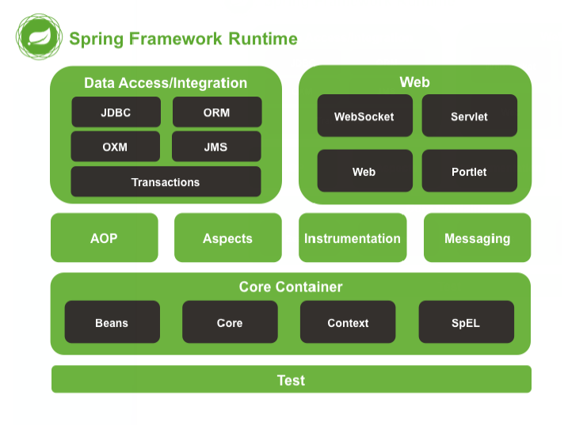

# Spring

## 一、Spring概述

#### 1. Spring简介

> Spring是分层的Java SE/EE应用 full-stack 轻量级开源框架. 以==IOC(Inverse of Control : 控制反转)==和==AOP(Aspect Oriented Programming : 面向切面编程)==为核心. 提供了展示层SpringMVC和持久层Spring JDBC以及业务层事务管理等众多的企业级应用技术, 还能整合开源世界众多著名的第三方框架和类库, 逐渐成为使用最多的Java EE企业应用开源框架.


#### 2. Spring的优势

1. 方便解耦, 简化开发---IOC
2. AOP编程的支持
3. 声明式事务支持
4. 方便程序测试
5. 方便集成各种优秀框架
6. 降低Java EE API使用难度
7. Java源码学习典范


#### 3. Spring体系结构



## 二、Spring--IOC

#### 1. 耦合与解耦

> 耦合: 程序间的依赖关系. 如类之间的依赖关系、方法之间的依赖关系
>
> 解耦: 降低程序之间的依赖关系

##### 1.1 耦合和解耦案例:

```java
/*
    在JDBC操作中, 第一步加载驱动有两种写法
    第一种存在耦合现象, 当对应jar包没有导入时, 程序编译都无法通过
    第二种在jar包没有导入时, 程序虽然无法正常使用, 但是编译可以通过, 只是在运行时会抛出异常
    在实际开发中, 我们的程序应该做到, 编译期不依赖, 运行时才依赖 
*/

//第一种
DriverManager.registerDriver(new com.mysql.jdbc.Driver());

//第二种
Class.forName("com.mysql.jdbc.Driver")
```


##### 1.2 解耦思路:

1. 通过反射创建对象, 从而避免使用new关键字
2. 通过读取配置文件获取创建对象的全限定类名


##### 1.3 工厂模式解耦:

```java
/*
  版本1:
  创建一个工厂, 工厂通过读取配置文件利用反射技术创建对象实现解耦
  但是, 该工厂模式创建的对象是多例的, 每次创建都是一个新的对象
  多例对象无线程问题, 但是程序效率较低
  单例对象存在线程问题, 但是程序效率较高
  在Web开发中, 通常创建单例对象, 所以该版本还有待优化
*/

public class Factory{
    private static Properties pro;

    static{
        pro = new Properties();
        InputStream in = Factory.class.getClassLoader().getResourceAsStream();
        pro.load(in);
    }

    public static Object getBeanByName(String beanName){
        String className = pro.getProperty(beanName);
        Object obj = Class.forName(className).newInstance();
        return obj;
    }
}
```

```java
/*
  版本2:
  为了解决版本1的问题, 引入容器的概念, 用一个Map集合作为容器, 存储工厂创建的对象, 需要使用对象时, 就从容器中取, 这样每一种对象都是单例的
*/

public class Factory{
    private static Properties pro;
    private Map<String, Object> container;

    static{
        pro = new Properties();
        InputStream in = Factory.class.getClassLoader().getResourceAsStream();
        pro.load(in);
        
        container = new Map<String, Object>;
        Enumberation keys = pro.keys();
        while(keys.hasMoreElements()){
            String key = keys.nextElement().toString();
            String className = pro.getProperty(key);
            Object obj = Class.forName(className).newInstance();
            container.put(key, obj);
        }
    }

    public static Object getBeanByName(String beanName){
        return container.get(beanName);
    }
}
```


#### 2. IOC

> IOC: Inversion of Control, 控制反转. 把创建对象的权力交给框架(工厂), 是框架的重要特征. 它包括DI(Dependency Injection: 依赖注入)和DL(Dependency Lookup: 依赖查找). IOC的作用是减少程序之间的耦合.

##### 2.1 IOC入门案例:

1. 配置文件 bean.xml

```xml
<?xml version="1.0" encoding="UTF-8"?>
<beans xmlns="http://www.springframework.org/schema/beans"
       xmlns:xsi="http://www.w3.org/2001/XMLSchema-instance"
       xsi:schemaLocation="http://www.springframework.org/schema/beans
       https://www.springframework.org/schema/beans/spring-beans.xsd">

    <!--把对象的创建交给Spring来管理-->
    <bean id="accountSerivice" class="com.dw.service.impl.AccountServiceImpl"></bean>

    <bean id="accountDao" class="com.dw.dao.impl.AccountDaoImpl"></bean>

</beans>
```

2. 使用容器

```java
public class Test{
    public static void main(String[] args){
        //1. 获取核心容器对象
        ApplicationContext ac = new ClassPathXmlApplicationContext("bean.xml");

        //2. 根据id获取Bean对象
        IAccountService service = (IAccountService)ac.getBean("accountService");
        IAccountDao dao = ac.getBean("accountDao", IAccountDao.class)
    }
}
```


##### 2.2 ApplicationContext的三个实现类:

1. ClassPathXmlApplicationContext: 可以加载类路径下的配置文件
2. FileSystemXmlApplicationContext: 可以加载磁盘任意路径的配置文件(有访问权限)
3. AnnotationConfigApplicationContext: 读取注解创建容器


##### 2.3 ApplicationContext与BeanFactory:

BeanFactory接口是ApplicationContext的父接口, 也是最顶层接口

ApplicationContext创建核心容器时, 采用立即创建的方式创建容器里的对象, 即配置文件一读取完就创建所有配置的对象

BeanFactory创建核心容器时, 采用延迟加载的方式创建对象, 在使用到指定对象时, 才创建该对象.

ApplicationContext适合于单例对象形式, BeanFactory适合于多例对象形式.

```java
Resource resource = new ClassPathResource("bean.xml");
BeanFactory factory = new XmlBeanFactory(resource);
IAccountService service = (IAccountService)factory.getBean("accountService");
```


##### 2.4 Bean的细节问题

+ Bean对象三种创建方式

```xml
<!--1. 通过默认构造方法创建, 如果没有默认方法会报错-->
<bean id="accountSerivice" class="com.dw.service.impl.AccountServiceImpl"></bean>

<!--2. 通过工厂的getXXX方法创建一个对象. 比如有一个Factory工厂类, 有一个方法getAccountService(), 它创建一个AccountServiceImpl对象并返回-->
<bean id="factory" class="com.dw.factory.Factory">
<bean id="accountService" factory-bean="factory" factory-methdo="getAccountService">

<!--3. 如果这个getAccountFactory方法是一个静态方法-->
<bean id="accountService" class="com.dw.factory.Factory" factory-method="getAccountService">
```

+ Bean的作用范围

    bean的作用范围通过`<bean>`标签的`scope`属性指定

    1. singleton(默认): 单例的
    2. prototype: 多例的
    3. request: 作用于Web应用的请求范围
    4. session: 作用于Web应用的会话范围
    5. global-session: 作用于集群环境的会话范围.  多个服务器共享一个session, 这个session叫全局session

+ Bean的生命周期

    `<bean>`标签有两个属性, `init-method`和`destroy-method`, 用于指定对象创建时执行的方法和对象销毁时执行的方法

    1. 单例对象的生命周期与容器相同
    2. 多例对象的生命周期:创建: 在需要使用对象时才创建活着: 对象只要在使用过程中就一直活着销毁: 对象长时间不使用, 就会由Java垃圾回收机制销毁
        注意: 容器有一个close方法用以关闭容器, 但是ApplicationContext接口没有, 所以使用接口声明容器对象, 是无法使用close方法的


##### 2.5 Spring依赖注入

> 依赖注入: 创建对象时, 指定成员变量的值

+ 注入数据的三种类型:

    + 基本类型和String类型
    + 其它bean类
    + 复杂类型/集合类型

+ 注入的三种方式:

    1. 构造方法注入

    ```java
    /*
    	<bean>标签内部有一个<constructor-arg>标签, 有以下几个属性:
        1. type: 用于给指定参数类型的参数赋值, 当多个参数同一类型时无法使用
        2. index: 用索引的方式指定参数. 索引从0开始
        3. name: 用构造方法中的参数名称指定参数
        4. value: 用于指定参数的值, 只适用于基本类型和String. Spring会自动转换类型, 如value="10", 如果参数是int型, 则会转化成int型10
        5. ref: 如果参数是一个对象, 则使用ref代替value, 引用其<bean>的id
    */
    
    //eg:创建User对象时, 设置其age属性值为20 (前提是有一个构造方法, 参数是一个int age, 方法里赋值this.age=age)
    <bean id="user" class="com.dw.bean.User">
        <constructor-arg name="age" value="20"></constructor-arg>
    </bean>
    
    //缺点: 只能使用参数个数和类型与配置相吻合的构造方法, 不能再使用其他构造方法了
    ```

    2. set方法注入

    ```java
    /*
        <bean>标签内部有一个<property>标签, 其有三个属性:
        1. name: 需要调用哪个setXxx方法, name的值就是Xxx第一个字母小写后的值, 即xxx
        2. value: 设置的值
        3. ref: 如果值是一个对象, 则使用ref代替value, 引用<bean>的id
    */
    
    //eg: User对象有一个setUserName方法
    <bean id="user" class="com.dw.bean.User">
        <property name="userName" value="David"></property>
    </bean> 
    
    /*
        集合注入:
        <property>或<constructor-arg>标签内部有<list>、<array>、<set>、<map>、<props>标签, 分别对应List集合、数组、set集合...
    */
    
    //注意: <list>、<set>、<array>的写法一样, 且相互兼容. 如用<set>一个list集合赋值, 也是可以的
    <property name="myList">
        <list>
            <value>AAA</value>
            <value>BBB</value>
        </list>
    </property>
    
    //注意: <map>和<props>也可以相互兼容, 用<psops>给map集合赋值, 也是可以的
    <property name="myMap">
        <map>
            <entry key="1" value="AAA"></entry>
            <entry key="2"> <value>BBB</value> </entry>
        <map>
    </property>
    <property name="myProp">
        <props name="myProps">
            <prop key="1">AAA</prop>
            <prop key="2">BBB</prop>
        <props>
    </property>
    
    
    //优点: 对构造函数无限制, 使用默认构造函数也可以赋值
    ```

    3. 注解方式注入(见下)


##### 2.6 注解开发

1. 创建对象

```java
/*
    用该注解修饰的类, Spring会创建其对象并加入容器中
    该注解只有一个属性value, value的值相当于<bean>的id属性, 如果不赋值, 默认为类的类名(首字母变小写)
*/
@Component(value="accountService")

/*
    以下三个注解的作用与用法和@Component一样, 只不过这三个注解可以用来标识三层架构
*/
@Controller    表现层
@Service         业务层
@Repository   持久层


//注意: 使用注解方式还是需要配置文件, 不过xml约束和配置内容有所变化
<?xml version="1.0" encoding="UTF-8"?>
<beans xmlns="http://www.springframework.org/schema/beans"
    xmlns:xsi="http://www.w3.org/2001/XMLSchema-instance"
    xmlns:context="http://www.springframework.org/schema/context"
    xsi:schemaLocation="http://www.springframework.org/schema/beans
        https://www.springframework.org/schema/beans/spring-beans.xsd
        http://www.springframework.org/schema/context
        https://www.springframework.org/schema/context/spring-context.xsd">

    <!--告诉Spring创建容器时, 需要扫描的包-->
    <context:component-scan base-package="com.dw"></context:annotation-config>

</beans>
```

2. 依赖注入

```java
/*
    自动按照类型注入. 
    当容器中只有一个bean对象的类型和要注入的数据类型相匹配时, 注入成功
    当容器中有多个bean对象的类型(都实现同一接口)与要注入的数据类型相匹配时, 比较这些对象在容器中对应的key值, 若key值和需要注入的变量的变量名相同, 则可以注入.
    该注解可以用在成员变量上, 也可以用在方法上
*/
@AutoWired

/*
    按照名称注入, value指定bean的id
    必须和@Autowired一起使用
*/
@Qualifier(value="accountService")

/*
    直接按照bean的id注入, 通过name属性指定id
*/
@Resource(name="accountService")

以上三种注入方法, 只能注入存在于容器中的对象类型, 基本类型和String类型无法注入
集合类型的注入只能通过xml方式配置

/*
    实现基本类型和String类型的注入
    value属性用于指定注入数据的值, 它可以使用Spring的EL表达式 ${表达式}
*/
@Value(value="1")

/*
    使用EL表达式方式, 从外部配置文件中读取数据, 来注入值
    @PropertySource作用位置为配置类, classpath:表示在class路径下寻找配置文件
    读取了配置文件, 就可以使用EL表达式注入数据. 如下面代表注入数值为配置文件中key为name的值
*/
@PropertySource("classpath:config.properties")
public class SpringConfig{...}

@Value("${name}")
public String name;
```

3. 作用范围

```java
/*
    用于指定作用范围, value值指定, 默认为singleton
*/
@Scope(value="singleton")
```

4. 生命周期

```java
/*
    销毁前执行的方法
    注解作用位置: 销毁前执行的方法上
*/
@PreDestroy

/*
    创建时执行的方法
    注解的位置: 创建时执行的方法上
*/
@PostConstruct
```

5. 配置类来代替xml配置文件

```java
/*
    注解配置有一个局限性, 只能在自己写的类上加注解, 对于导入的jar包中的类无法加上注解. 这时可以在xml中配置, 也可以使用配置类来代替xml配置
    @Configuration表示该类是一个配置类, 当该类作为AnnotationConfigApplicaitonContext构造方法的参数时, 该注解可以不写. 当有多个配置类时, 没作为参数的配置类都必须写上该注解(或者@Import)
    @ComponentScan表示容器创建时扫描的包
    @Bean将加了该注解的方法的返回值对象添加到容器中, name属性指定bean的id, 默认为方法名
    @Import添加其他配置类, 这样其他配置类就不用添加@Configuration注解, 或者作为参数传递给构造方法. value是一个数组, 元素是配置类的class对象
    @Import添加的class也可以不是配置类, 此时就是把该class的实例对象添加进容器
*/

@Configuration
@ComponentScan(basePackages={"com.dw"})
@Import(value={otherConfig.class})
public class SpringConfig{

    @Bean(name="queryRunner")
    @Scope("prototype")
    public QueryRunner creatQueryRunner(DataSource dataSource){
        return new QueryRunner(dataSource);
    }

}

此时获取容器对象的方法也发生了改变:
//该构造方法的参数是可变参数, 可以传入多个配置类的class对象
ApplicaionContext ac = AnnotationConfigApplicationContext(SpringConfig.class)
```

总结: 开发人员自己写的代码一般用注解配置比较方便, 导入的jar包中的bean配置一般使用xml配置方式比较方便.


##### 2.6 Spring与Junit整合

问题分析: 

由于开发人员和测试人员是两种不同的角色, 测试人员不一定会Spring, 所以在测试类的测试方法里最好不要出现Spring的代码(如获取ApplicationContext等). 此时将AccountService对象都作为成员变量, 通过依赖注入赋值, 这样测试人员就只用关心功能的问题了. 但是此时在测试类中使用@AutoWired等注解注入依赖是无效的, 因为缺失了加载配置文件的步骤(即创建ApplicationContext对象的步骤). Junit之所以不需要在main方法进行测试, 是因为其集成了一个main方法, 但是该main方法根本不知道我们是否会使用Spring, 因而无法为我们加载Spring的配置文件, 所以需要将Spring和Junit整合在一起, 使用Spring提供的main方法, 这样就可以成功加载配置文件了.

```java
//1. 导入Spring整合Junit的jar包 spring-test.jar

//2. 使用Junit的一个注解将原来的main方法替换掉, 换成Spring提供. 注解作用于测试类@RunWith(SpringJunit4ClassRunner.class)

//3. 告知Spring的运行器, IOC是基于xml的还是注解的, 并说明其位置. 这一步操作就是加载配置的操作.
@ContextConfiguration(classes={SpringConfig,class})
或
@ContextConfiguration(locations={"classpath:bean.xml"})
```

