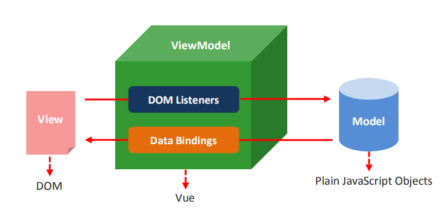
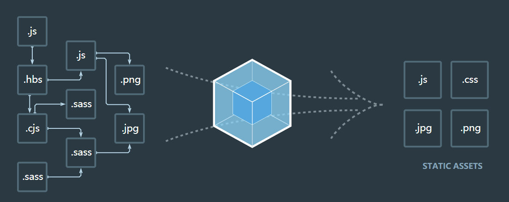
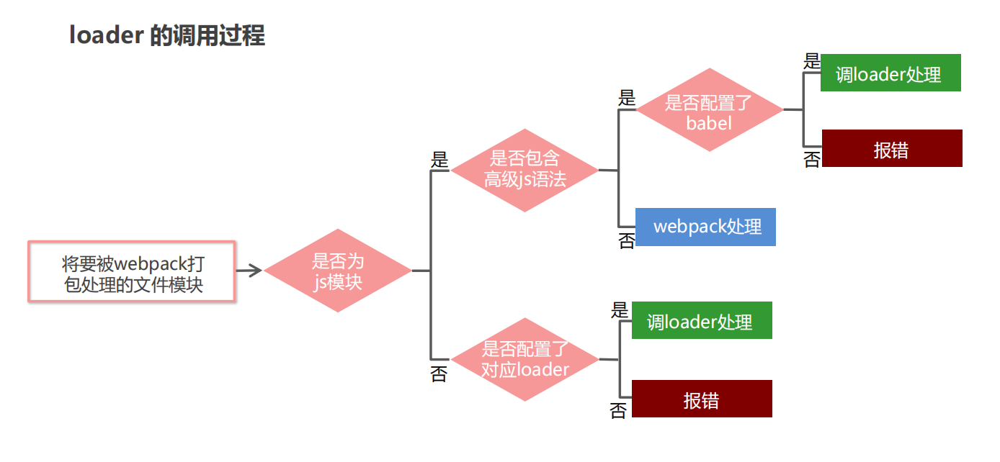
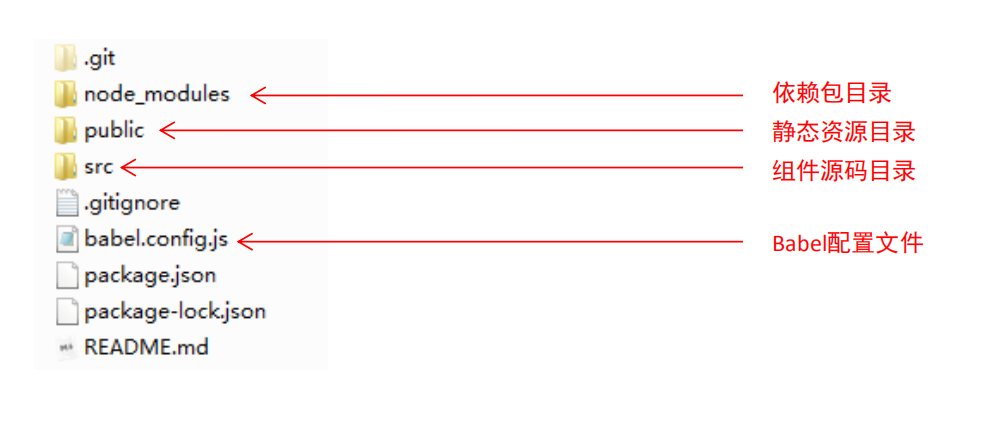
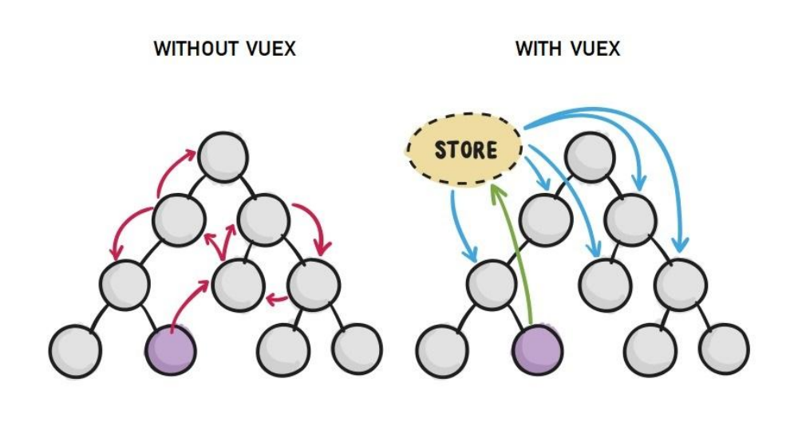

## 一、Vue基础

### 1. Vue简介

> Vue 是一套用于构建用户界面的渐进式框架。与其它大型框架不同的是，Vue 被设计为可以自底向上逐层应用。Vue 的核心库只关注视图层，不仅易于上手，还便于与第三方库或既有项目整合。另一方面，当与现代化的工具链以及各种支持类库结合使用时，Vue 也完全能够为复杂的单页应用提供驱动。

**渐进式:** 声明式渲染→组件系统→客户端路由→集中式状态管理→项目构建


### 2 .Vue特点

+ 易用：熟悉HTML、CSS、JavaScript知识后，可快速上手Vue
+ 灵活：在一个库和一套完整框架之间自如伸缩
+ 高效：20kB运行大小，超快虚拟 DOM


### 3. Vue与JQuery对比

+ 精力集中: 使用Vue可以更集中于数据本身, 而无需操作dom
+ 代码结构: Vue的代码结构更简洁、易读、易于维护
+ 模块化思想
+ 单页面应用
+ 组件复用
+ 性能


### 4. Vue核心概念

+ **模板语法:** 

    使用Vue框架完成的页面需按照其模板语法规则编写, 最后由模板引擎解析为最终的HTML页面

    Vue的工作方式就是 模板+数据-->前端渲染-->静态HTML内容

    Vue的模板与jsp、Theamleaf等模板的作用是一样的, 都是用于渲染成最终的静态HTML内容, 只不过Vue模板是前端渲染而jsp、Theamleaf等是后端渲染。

+ **插值表达式:** {{}}, 表达式内支持运算功能、调用方法

+ **指令:** ==指令本质就是一个自定义属性, 指令的值就是属性的值, 但是这个值已不再是简单的字符串, 而应该把它看成能执行一定功能的代码, 如条件判断、引用变量、对象等。==

    ```html
    <div id="content">
        <!--判断isActive变量是否为true, 如果是则class属性添加active这个值-->
        <p v-bind:class="isActive==true?'active':''">Text</p>
    </div>
    
    <script>
        var vm = new Vue({
        	el: '#content',
        	data: {
        		isActive: true
        	}
        })
    </script>
    ```

+ **数据响应式:** Vue框架是数据响应式的, 即动态改变数据的值会动态同步改变页面对应的值

+ **双向数据绑定:** 

    数据的值会随着用户输入的值动态变化。

    如将输入框的值与实例的一个数据绑定, 那么输入框的值是什么, 绑定的数据的值就是什么。

    如果将该数据的值展示再页面上, 则可以实现页面展示的数据与用户输入的数据动态同步。

+ **MVVM思想:**

    

+ **事件修饰符**: 对事件的触发条件进行限制

+ **声明式编程:** 使用Vue模板, 模板结构和最终页面显示效果基本一致, 这对于开发人员来说更加友好。

+ **实例:** `new Vue()`

+ **生命周期:** 

    


## 二、前端工程化

### 1. 模块化

#### (1) 模块化概述

传统开发模式中常常会遇到命名冲突、文件依赖等问题。通过模块化能够很好的解决这些问题。

模块化就是把单独的一个功能封装到一个模块（文件）中，模块之间相互隔离，但是可以通过特定的接口公开内部成员，也可以依赖别的模块。

模块化开发可以方便代码的重用，从而提升开发效率，并且方便后期的维护。

在ES6模块化规范诞生前, Javascript 社区已经尝试并提出了 AMD、CMD、CommonJS 等模块化规范。但是，这些社区提出的模块化标准，还是存在一定的差异性与局限性、并不是浏览器与服务器通用的模块化标准。因此，ES6 语法规范中，在语言层面上定义了 ES6 模块化规范，是浏览器端与服务器端通用的模块化开发规范。

ES6模块化规范中定义:

+ 每个 js 文件都是一个独立的模块
+ 导入模块成员使用 import 关键字
+ 暴露模块成员使用 export 关键字


#### (2) ES6模块化基本语法

**1. 默认导出与默认导入**

```javascript
// 当前文件模块为 m1.js

// 定义私有成员 a 和 c
let a = 10
let c = 20
// 外界访问不到变量 d ,因为它没有被暴露出去
let d = 30

function show() {}

// 将本模块中的私有成员暴露出去，供其它模块使用
// 每个模块只能使用一次export default
export default {
 a,
 c,
 show
}
```

```javascript
// 导入模块成员
import m1 from './m1.js'

// 打印输出的结果为：{ a: 10, c: 20, show: [Function: show] }
console.log(m1);
```

**2. 按需导出与按需导入**

```javascript
// 当前文件模块为 m1.js

// 向外按需导出变量 s1
export let s1 = 'aaa' 
// 向外按需导出变量 s2
export let s2 = 'ccc'
// 向外按需导出方法 say
export function say = function() {}
```

```javascript
// 导入模块成员
// 可以通过as关键字为导出变量起别名
import { s1, s2 as ss2, say } from './m1.js'

// 按需导入与默认导入可以同时进行
// import m1, { s1, s2 as ss2, say } from './m1.js'

console.log(s1) // 打印输出 aaa
console.log(ss2) // 打印输出 ccc
console.log(say) // 打印输出 [Function: say]
```

**3. 直接导入并执行模块代码**

```javascript
// 当前文件模块为 m2.js

// 在当前模块中执行一个 for 循环操作
for(let i = 0; i < 3; i++) {
 console.log(i)
}
```

```javascript
// 导入后会执行m2.js的代码
import './m2.js'
import '../css/main.css'
```


### 2. webpack

#### (1) 概述

webpack 是一个流行的前端项目构建工具(打包工具), 可以解决当前 web 开发中所面临的困境。

webpack 提供了友好的**模块化支持，以及代码压缩混淆、处理 js 兼容问题、性能优化**等强大的功能，从而让程序员把工作的重心放到具体的功能实现上，提高了开发效率和项目的可维护性。

目前绝大多数企业中的前端项目，都是基于 webpack 进行打包构建的。

**webpack更适合构建单页面应用而非多页面应用。**




#### (2) 入门案例

**1. 安装webpack**

`npm install webpack webpack-cli -D`命令, 安装webpack

**Tips: 关于npm install**

+ **-g:** 全局安装, 将包放在 `./node_globals`(自己设置的包存储路径), 可直接通过命令行使用
+ **无选项:** 本地安装, 在执行该npm命令的路径下新建一个`node_modules`目录, 并将包放入其中, 需通过 require() 来引入本地安装的包

+ **-S:** 本地安装, 包名会被注册在package.json的dependencies里面，包在开发环境和生产环境下存在。

+ **-D:** 本地安装, 包名会被注册在package.json的devDependencies里面，包仅在开发环境下存在。

**2. 创建项目**

+ 新建项目空白目录，并运行 `npm init –y` 命令，初始化包管理配置文件 package.json

+ 新建 src 源代码目录, 里面用于存放前端代码

    这里面有一个非常重要的文件`index.js`, 它将作为这个前端项目打包的入口。 

+ 在项目根目录下, 通过`npm install xxx -D/-S`将需要的包导入项目

    如: 通过`npm install jquery -S`下载jquery

    该命令会在执行路径下创建一个`node_modules`目录, 并将包下载到该目录。`node_modules`目录用于存放项目所需要的各种包。

    同时由于-S选项的存在, 包名会被注册在package.json的dependencies中

+ 在项目根目录创建 webpack.config.js 

```js
module.exports = {
	mode: 'development' // mode 用来指定构建模式, 有development和production两种模式
}
```

+ 配置package.json

```就是\
"scripts": {
	"dev": "webpack" // script 节点下的脚本，可以通过 npm run 执行
}
```

**3. 编码**

**4. 通过webpack打包**

`nmp run dev`命令启动webpack进行项目打包


#### (3) 入口与出口

webpack4.X版本默认指定入口为`src/index.js`, 出口为`dist/main.js`, 我们也可以进行手动设置

```javascript
const path = require('path') // 导入 node.js 中专门操作路径的模块
module.exports = {
	entry: path.join(__dirname, './src/index.js'), // 打包入口文件的路径
 	output: {
 		path: path.join(__dirname, './dist'), // 输出文件的存放路径
 		filename: 'bundle.js' // 输出文件的名称
	} 
}
```

入口起点指示 webpack 应该使用哪个模块，来作为构建其内部 依赖图(dependency graph) 的开始。进入入口起点后，webpack 会找出有哪些模块和库是入口起点（直接和间接）依赖的。

所以入口JS文件中需要通过 import 导入项目所需要的各种模块和库, 如`import 'semantic-ui-css/semantic.min.css'`。webpack会根据直接和间接的依赖关系, 将这些库和模块处理并打包。


#### (4) 自动打包

配置自动打包后, 每次修改代码, webpack都会自动打包, 更加方便。

+ `npm install webpack-dev-server –g`命令安装自动打包工具

+ 修改`package.json`

    ```javascript
    "scripts": {
    	"dev": "webpack-dev-server" // script 节点下的脚本，可以通过 npm run 执行
    }
    ```

+ 修改`index.html`的src为`/main.js`, 即引入打包后生成的main.js文件
+ `npm run dev`进行打包
+ 在浏览器通过http://localhost:8080查看

**Tips:**

+ webpack-dev-server 会启动一个实时打包的 http 服务器

+ webpack-dev-server 打包生成的输出文件，默认放到了项目根目录中，而且是虚拟的、看不见的

+ 自动打包可以带上参数

    --open表示打包完成后打开

    --host设置IP地址

    --port设置端口号

    ```json
    "scripts": {
    	"dev": "webpack-dev-server --open --host 127.0.0.1 --port 8888"
    }
    ```


#### (5) 生成预览页面

在配置了自动打包后, localhost首页是一个文件列表, 如果我们希望首页直接是一个html页面, 则需要使用一个插件

+ `npm install html-webpack-plugin –D `安装生成预览页面的插件

+ 修改`webpack.config.js`

    ```javascript
    // 导入生成预览页面的插件，得到一个构造函数
    const HtmlWebpackPlugin = require('html-webpack-plugin')
    const htmlPlugin = new HtmlWebpackPlugin({ // 创建插件的实例对象
    	template: './src/index.html', // 指定要用到的模板文件
    	filename: 'index.html' // 指定生成的文件的名称，该文件存在于内存中，在目录中不显示
    })
    
    //向外暴露配置对象
    module.exports = {
     	plugins: [ htmlPlugin ] // plugins 数组是 webpack 打包期间会用到的一些插件列表
    }
    ```


#### (6) 加载器

在实际开发过程中，webpack 默认只能打包处理以 .js 后缀名结尾的模块，其他非 .js 后缀名结尾的模块, webpack 默认处理不了，需要调用 loader 加载器才可以正常打包，否则会报错！

loader 加载器可以协助 webpack 打包处理特定的文件模块，比如：

+ less-loader 可以打包处理 .less 相关的文件

+ sass-loader 可以打包处理 .scss 相关的文件

+ url-loader 可以打包处理 css 中与 url 路径相关的文件

loader调用过程:



**1. css加载器**

+ `npm install style-loader css-loader -D`安装css加载器

+ 在js文件中引入css文件

    ```java
    import './index.css'
    ```

+ 修改`webpack.config.js`

    ```javascript
    module.exports={
    	module: {
    		rules: [
            	//test用正则表达式指定文件类型, use指定使用的加载器
            	//加载器的顺序是固定的, 多个loader的调用顺序是从后往前调
    			{ test: /\.css$/, use: ['style-loader', 'css-loader'] }
    		]
     	}   
    }
    ```

**2. less**

+ `npm i less-loader less -D `
+ `{ test: /\.less$/, use: ['style-loader', 'css-loader', 'less-loader'] }`

**3. scss(sass)**

+ `npm i sass-loader node-sass -D`
+ `{ test: /\.scss$/, use: ['style-loader', 'css-loader', 'sass-loader'] }`

**4. postCSS自动添加css的兼容前缀**

+ `npm i postcss-loader autoprefixer -D `

+ `postcss.config.js`

    ```javascript
     const autoprefixer = require('autoprefixer') // 导入自动添加前缀的插件
     module.exports = {
     	plugins: [ autoprefixer ] // 挂载插件
     }
    ```

+ `{ test:/\.css$/, use: ['style-loader', 'css-loader', 'postcss-loader'] }`

**5. 图片和字体 **

+ `npm i url-loader file-loader -D `

+ `{ test: /\.jpg|png|gif|bmp|ttf|eot|svg|woff|woff2$/, use: 'url-loader?limit=16940'}`

    ?后表示该加载器的参数, limit用于指定图片大小, 小于指定大小的图片都会被转为base64格式

**6. 高级JS语法**

+ `npm i babel-loader @babel/core @babel/runtime -D`babel转换器

+ `npm i @babel/preset-env @babel/plugin-transform-runtime @babel/plugin-proposal-class-properties –D `babel语法插件

+ `babel.config.js`

    ```javascript
    module.exports = {
    	presets: [ '@babel/preset-env' ],
    	plugins: [ '@babel/plugin-transform-runtime', '@babel/plugin-proposalclass-properties’ ]
    }
    ```

+ ` { test: /\.js$/, use: 'babel-loader', exclude: /node_modules/ }` 排除node_modules的js文件


#### (7) webpack打包发布

package.json

```json
"scripts": {
    "build": "webpack -p"
}
```

执行`npm run build`后, 会在dist目录中生成最终的项目文件。


### 4. Vue单文件组件

传统方式定义Vue组件, 有以下问题:

+ 全局定义的组件必须保证组件的名称不重复

+ 字符串模板缺乏语法高亮，在 HTML 有多行的时候，需要用到丑陋的 \
+ 不支持 CSS 意味着当 HTML 和 JavaScript 组件化时，CSS 明显被遗漏
+  没有构建步骤限制，只能使用 HTML 和 ES5 JavaScript, 而不能使用预处理器（如：Babel）

所以Vue提供了一种解决方案, 使用Vue单文件组件, **一个组件对应一个.vue文件**

#### (1) 单文件组件语法

`component.vue`

```vue
<template>
	<!-- 这里用于定义Vue组件的模板内容 -->
</template>
 
<script>
	// 这里用于定义Vue组件的业务逻辑
 	export default {
 		data: () => { return {} }, // 私有数据
 		methods: {} // 处理函数,
    	components: {}, //组件
        //...
 	}
</script>

<style scoped>
	//用于定义组件样式, scoped关键字防止组件间样式冲突 
</style>
```


#### (2) webpack vue 加载器

+ `npm i vue-loader vue-template-compiler -D`

+ `webpack.config.js`

    ```javascript
    const VueLoaderPlugin = require('vue-loader/lib/plugin')
    module.exports = {
        module: {
     		rules: [
     			{ test: /\.vue$/, loader: 'vue-loader' }
     		]
     	},
    	plugins: [
    		 new VueLoaderPlugin() // 请确保引入这个插件！
        ] 
    }
    ```


#### (3) 在webpack项目中使用vue

+ `npm install vue –S`

+ ```javascript
    // 1. 导入 Vue 构造函数
    import Vue from 'vue'
    // 2. 导入组件, 导入后可以通过<component>引用
    import App from './App.vue'
    
    const vm = new Vue({
     	// 3. 指定 vm 实例要控制的页面区域
     	el: '#app',
     	// 4. 通过 render 函数，把指定的组件渲染到 el 区域中。通过import导入的Vue实例只支持该方式渲染组件, 不支持components方式的设置
     	render: h => h(App)
    })
    ```


### 5. Vue脚手架

Vue 脚手架用于快速生成 Vue 项目基础架构

#### (1) 安装

安装命令: `npm install -g @vue/cli`


#### (2) 使用

+ 命令行交互方式: ` vue create my-project`
+ 图形界面方式: `vue ui`


#### (3) 项目结构



**Tips:** 

+ Vue-cli创建的项目模板src根目录有一个`main.js`和`app.vue`, 其中`main.js`就是打包入口, `app.vue`可以当作一个导航页面组件, 通过vue-router路由到对应内容。`main.js`中需要创建一个Vue实例, 导入对应的router和store, 并挂载`public/index.html`中的`#app`元素, 将`app.vue`组件渲染到`#app`元素内
+ Vue-cli 4.x版本没有单独的`webpack.config.js`, 如需进行webpack相关配置, 可以在`vue.config.js`中配置

+ 放置在 `public` 目录下或通过绝对路径被引用的资源将会直接被拷贝，而不会经过 webpack 的处理。


#### (4) Vue-cli配置

+ 方式一: 在`package.json`中配置(不推荐, package.json主要用于包的配置信息, 为了便于维护可以新建一个配置文件)

    ```json
    "vue": {
    	"devServer": {
    		"port": "8888",
    		"open" : true
    	}
    }
    ```

+ 方式二: 新建一个配置文件`vue.config.js`, 具体可配置项参考官方文档。

    ```javascript
     // vue.config.js
     module.exports = {
     	devServer: {
     		port: 8888,
            open: true
     	},
        //解决build项目后, file://协议无法找到相关资源
        publicPath: './'
 }
    ```
    


### 6. Vuex

传统的Vue组件之间进行数据共享, 是通过属性绑定和事件绑定的方式, 当数据量很大时, 这种数据共享方式会变得非常复杂繁琐。使用Vuex组件可以很好的解决该问题。

Vuex 是实现组件全局状态（数据）管理的一种机制，可以方便的实现组件之间数据的共享。使用Vuex有如下好处:

+ 能够在 vuex 中集中管理共享的数据，易于开发和后期维护
+ 能够高效地实现组件之间的数据共享，提高开发效率
+ 存储在 vuex 中的数据都是响应式的，能够实时保持数据与页面的同步



#### (1) Vuex基本使用

+ `npm install vuex -S`

+ 导入

    ```javascript
    import Vue from 'vue'
    import Vuex from 'vuex'
    Vue.use(Vuex)
    ```

+ 创建store对象

    ```javascript
    const store = new Vuex.Store({
    	// state 中存放的就是全局共享的数据
     	state: { count: 0 },
        mutations: {方法对象},
        actions: {方法对象},
        getters: {方法对象}
    })
    ```

+ 将store对象添加到实例中

    ```java
    new Vue({
    	el: '#app',
     	render: h => h(app),
     	router,
     	store
    })
    ```


#### (2) Vuex核心概念

+ **state:** 提供唯一的公共数据源，所有共享的数据都要统一放到 Store 的 State 中进行存储。

    组件访问state中的数据的两种方式:

    + `this.$store.state.全局数据名称`

    + 把全局数据当作组件的一个计算属性

        ```javascript
        import { mapState } from 'vuex'
        
        //计算属性
        computed: {
            //此时count就相当于该组件的一个计算属性
        	...mapState(['count'])
        }
        ```

+ **mutations:**  用于定义变更共享数据的方法, 也可用于定义一般的方法。

    变更共享数据的三种方式:

    + 通过`this.$store.state.全局数据名称`直接修改(不推荐)

    + mutations方式

        ```javascript
        // 定义 Mutations
        const store = new Vuex.Store({
        	state: {
         		count: 0
         	},
         	mutations: {
         		add(state) {
         			state.count++;
        		},
                //带参数方法(第一个固定是state)
                addN(state, n) {
                    state.count += n;
                }
        	}
        })
        
        //在对应组件中, 通过this.$store.commit()调用mutations中定义的方法
        methods: {
        	handle1() {
         		this.$store.commit('add');
                //带参数版本
                this.$store.commit('addN', 3);
         	}
        }
        ```

    + 把mutations的方法当作组件的一个方法

        ```javascript
        import { mapMutations } from 'vuex'
        
        //在组件的方法中添加mutations的方法
        methods: {
        	...mapMutations(['add', 'addN'])
        }
        ```

+ **actions:** mutations的方法如果是异步任务, 那么无法修改到共享数据的值, 异步任务需要放在actions中处理, 但是actions并不直接更改数据, 它还是调用了mutations中的方法。

    actions可以用于定义变更共享数据的异步方法, 也可以定义一般的异步方法。

    使用actions的两种方式:

    + `this.$store.dispatch()`

        ```javascript
        // 定义 Actions
        const store = new Vuex.Store({
        	mutations: {
         		addN(state, step) {
         			state.count += step
         		}
         	},
         	actions: {
         		addNAsync(context, step) {
         			setTimeout(() => {
         				context.commit('addN', step)
         			}, 1000)
        	 	} 
         	}
        })
        
        // 在组件中通过this.$store.dispatch()调用actions的方法
        methods: {
        	handle() {
         		this.$store.dispatch('addNAsync', 5)
         	}
        }
        ```

    + 把actions的方法注册到组件的methods中

        ```javascript
        import { mapActions } from 'vuex'
        
        methods: {
        	...mapActions(['addASync', 'addNASync'])
        }
        ```

+ **getters:** getters 可以对共享数据进行加工处理形成新的数据(不会改变原数据的值)，类似 Vue 的计算属性。当共享数据发生变化时, getters中的数据也发生响应变化。

    getters数据的两种使用方式:

    + `this.$store.getters.名称`

        ```javascript
        // 定义 Getter
        const store = new Vuex.Store({
         	state: {
         		count: 0
         	},
         	getters: {
         		showNum: state => {
         			return '当前最新的数量是【'+ state.count +'】'
         		}
         	}
        })
        
        //在组件中可以直接通过this.$store.getters.名称引用
        <h1>{{this.$store.getters.showNum}}</h1>
        ```

    + 将getters的数据当作组件的计算属性

        ```javascript
        import { mapGetters } from 'vuex'
        
        computed: {
        	...mapGetters(['showNum'])
        }
        
        //在组件中可以当作计算属性直接引用
        <h1>{{showNum}}</h1>
        ```

        